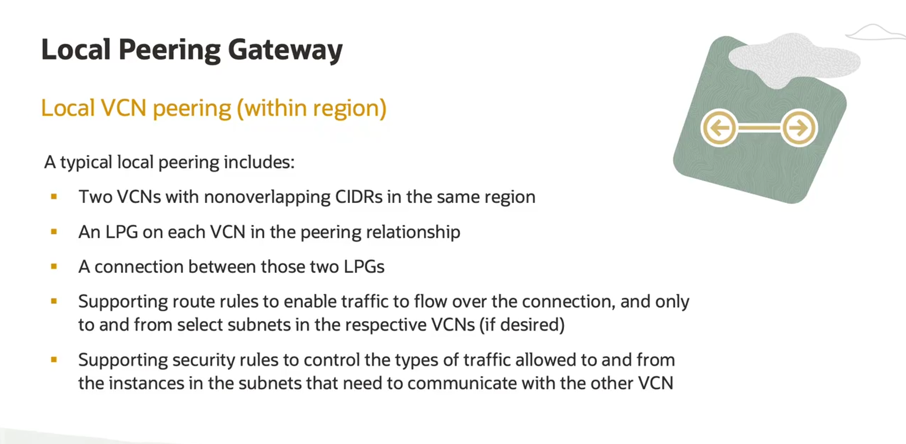

# Peering de Virtual Cloud Network (VCN)

**Peering** é o processo de estabelecer uma conexão lógica entre duas VCNs para permitir que seus recursos se comuniquem usando endereços IP privados.

## Tipos de Peering

Existem dois tipos de peering no OCI:

1.  **Local Peering (Peering Local):**
    * **Quando usar:** Quando ambas as VCNs residem na **mesma região**.

2.  **Remote Peering (Peering Remoto):**
    * **Quando usar:** Quando as VCNs residem em **regiões diferentes**.

## Local VCN Peering (Mesma Região)

Para conectar duas VCNs na mesma região, você precisa dos seguintes componentes e configurações:

1.  **VCNs com CIDRs Não Sobrepostos:** Se os blocos CIDR das VCNs se sobrepuserem, o peering falhará e o OCI retornará um erro.

2.  **Local Peering Gateway (LPG):**
    * É necessário um LPG em **cada VCN** que participa da relação de peering.
    * A relação é de **um para um**. Se uma VCN "hub" precisa se conectar a duas outras VCNs "spoke", a VCN "hub" precisará de **dois** LPGs, um para cada conexão.

3.  **Conexão (Connection):**
    * Depois de criar os LPGs, você deve estabelecer explicitamente uma conexão entre eles para "ligá-los".

4.  **Regras de Rota (Route Rules):**
    * Você precisa adicionar regras de rota em cada VCN, direcionando o tráfego destinado à outra VCN para o respectivo LPG.

5.  **Regras de Segurança (Security Rules):**
    * Você deve adicionar regras nas Security Lists ou Network Security Groups para permitir o tráfego específico (protocolos e portas) que você deseja que flua entre as VCNs.

**Importante:** As VCNs conectadas por peering não precisam pertencer à mesma conta (tenancy) do OCI.

## Remote VCN Peering (Regiões Diferentes)

O processo é muito semelhante ao peering local, com uma diferença fundamental no gateway utilizado.

1.  **Dynamic Routing Gateway (DRG):**
    * Em vez de um LPG, o Remote Peering utiliza um **Dynamic Routing Gateway (DRG)**.
    * É necessário um DRG em **cada VCN** que participa da conexão.
    * A conexão de peering remoto é configurada como um "anexo" (attachment) no DRG.

2.  **Backbone da Oracle:**
    * A conexão de peering remoto utiliza a rede de backbone global de alta velocidade da Oracle para conectar as duas regiões.

3.  **Outros Requisitos:**
    * Assim como no peering local, você ainda precisa de VCNs com **CIDRs não sobrepostos**, **regras de rota** apontando para o DRG e **regras de segurança** para permitir o tráfego.

## Alternativa ao Local Peering: DRG com Múltiplos Anexos

Existe uma solução alternativa para conectar VCNs que estão na mesma região, sem usar LPGs.

* **Como funciona:**
    1.  Crie um **único Dynamic Routing Gateway (DRG)**.
    2.  Anexe as duas (ou mais) VCNs a este mesmo DRG.
    3.  Configure as tabelas de rota dentro do DRG para rotear o tráfego entre os anexos das VCNs.
* **Resultado:** O DRG atua como um hub central de roteamento para o tráfego entre as VCNs conectadas, tudo dentro da mesma região.

