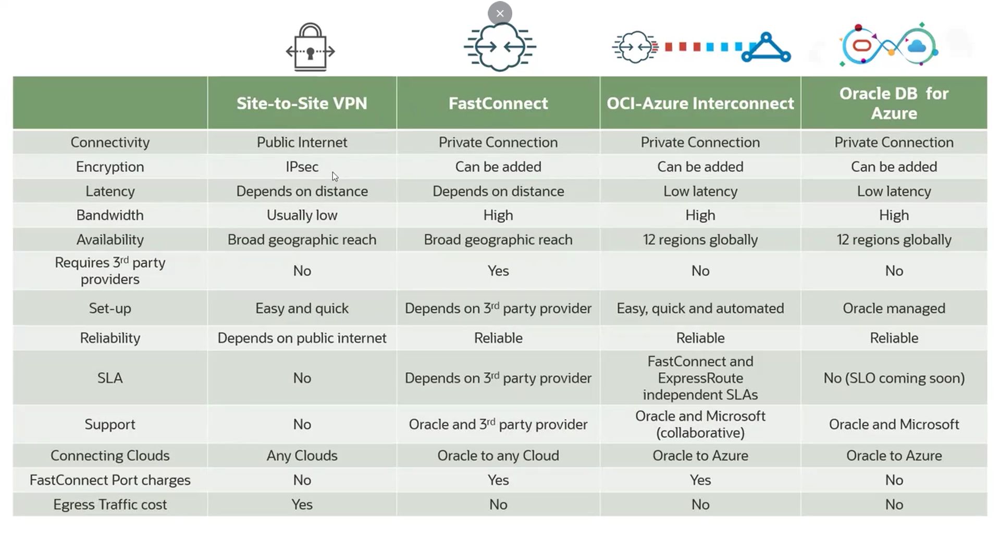

# Conectividade de Rede Multicloud com OCI

## Visão Geral das Opções de Conectividade

1.  **Site-to-Site VPN:** Conexão criptografada sobre a internet pública.
2.  **FastConnect (via Parceiros):** Conexão privada e dedicada através de um parceiro de interconexão.
3.  **OCI to Azure Interconnect:** Conexão privada e direta entre OCI e Azure, construída sobre FastConnect e ExpressRoute.
4.  **Oracle Database Service for Azure:** Um serviço de banco de dados que, por baixo dos panos, utiliza o OCI to Azure Interconnect.

## Site-to-Site VPN

* **Como funciona:** Utiliza o serviço nativo de VPN do OCI para criar túneis IPSec seguros sobre a **internet pública** para se conectar aos serviços de VPN nativos de outros provedores (Azure, AWS, GCP).
* **Documentação:** O OCI fornece documentação com instruções passo a passo para configurar a VPN Site-to-Site com os principais provedores de nuvem.
* **Desvantagens:**
    * **Latência e Largura de Banda:** Como utiliza a internet pública, o desempenho **não é consistente** e está fora do seu controle.
    * **SLA:** Não há um Acordo de Nível de Serviço (SLA) para a conexão, pois depende da internet.

## FastConnect via Parceiros

* **Como funciona:** Utiliza uma conexão privada e dedicada através de um parceiro de interconexão de terceiros, como **AT&T Netbond, Megaport, Colt, Equinix, Singtel, Telefonica**, entre outros.
* **Processo de Configuração:** Requer configuração em três locais: no console do OCI, no console do parceiro FastConnect e no console do outro provedor de nuvem (AWS, GCP, etc.).
* **Caso de Uso para Azure:** Esta é a abordagem a ser usada se você precisar se conectar a uma região do Azure que **não** faz parte das 12 regiões que possuem interconexão direta com o OCI.
* **Vantagens:**
    * **Desempenho:** Oferece **latência consistente, taxa de transferência previsível e largura de banda fixa**.
    * **Segurança:** A conexão é privada. A criptografia (como MACsec) é opcional, pois muitos clientes consideram a conexão privada segura o suficiente.
* **Tipos de Peering:** Suporta **Private Peering** (para conectar VCNs a redes privadas em outras nuvens) e **Public Peering** (para acessar serviços públicos, como o Oracle Services Network, através do link FastConnect).

### Exemplos de Conexão com Parceiros:
* **OCI para AWS via Colt:** Conecta o DRG do OCI ao Direct Connect Gateway (ou Virtual Gateway) da AWS.
* **OCI para GCP via Equinix:** Conecta o DRG do OCI ao Cloud Router do GCP.
* **OCI para AWS via Megaport:** Conecta o DRG do OCI ao Virtual Gateway da AWS.

## OCI to Azure Interconnect

* **Como funciona:** É uma parceria direta entre Oracle e Microsoft que estabelece uma conexão privada e de baixa latência entre os data centers do OCI e do Azure, **sem a necessidade de um parceiro intermediário**.
* **Tecnologia:** A conexão é construída sobre **Oracle FastConnect** e **Microsoft Azure ExpressRoute**.
* **Disponibilidade:** Disponível em 12 regiões globais (e em expansão).
* **Suporte:** O suporte é colaborativo. Você pode abrir um chamado com a Oracle ou com a Microsoft, e qualquer uma das empresas fornecerá suporte de ponta a ponta para a conexão.

