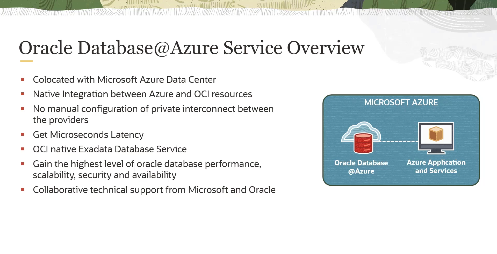

# Arquitetura do Oracle Database@Azure

Para viabilizar o serviço Oracle Database@Azure, a Oracle implementou uma arquitetura que estende sua infraestrutura para dentro dos data centers do Azure.

* **Conceito de "Child Sites":** Cada região do OCI possui Domínios de Disponibilidade (ADs). Esses ADs podem ter "child sites" (sites filhos) que atuam como extensões.
* **OCI Pods:** Para o serviço Database@Azure, esses "child sites" são construídos fisicamente **dentro dos data centers do Azure**. Esses "sites filhos" são chamados de **OCI Pods**.
* **Extensão de uma Região OCI:** Cada OCI Pod está conectado e atua como uma extensão da região OCI mais próxima (em termos de distância física e de rede).

### O que há dentro de um OCI Pod?

É crucial entender que um OCI Pod **não é uma infraestrutura inferior ou diferente**. Ele contém exatamente o mesmo hardware e software de uma região OCI padrão:

* **Mesma Infraestrutura:**
    * Gen2 Network Stack
    * Off-box Virtualization
    * Rede RDMA (essencial para o desempenho do Exadata)
* **Mesma Pilha de Serviços:**
    * OCI Virtual Networking (VCNs, etc.)
    * OCI Exadata Service
    * OCI Autonomous Database Service
* **Mesmos Controles Operacionais:**
    * Atualizações de segurança, patches e implantações são realizados da mesma forma que em uma região OCI padrão.
    * Os controles de segurança e operação são idênticos.

## Conectividade de Rede

A integração de rede é o que traz a baixa latência para o desempenho do serviço.

* **Mapeamento Virtual:**
    1.  Quando um cliente cria um cluster de banco de dados, um **endereço IP privado** é alocado na sub-rede da **VNet do Azure** do cliente.
    2.  Nos bastidores, uma **VNIC** (placa de rede virtual) correspondente é criada em uma VCN privada dentro do **OCI Pod**.
    3.  É criado um **mapeamento virtual** direto entre o IP/NIC no Azure e a VNIC no OCI.

* **Link Direto e Privado:**
    * A Oracle e a Microsoft estabeleceram uma **conexão de rede direta, privada e local** entre a rede do Azure e a rede do OCI Pod, tudo dentro do **mesmo data center físico**.
    * Quando uma aplicação na VNet do Azure se conecta ao banco de dados usando o IP privado, os pacotes são roteados através deste link local para o gateway de borda do OCI Pod.
    * A pilha de rede do OCI recebe os pacotes e os encaminha diretamente para a instância Exadata.

* **Resultado:**
    * **Latência Ultra Baixa:** A comunicação entre a aplicação no Azure e o banco de dados no OCI Pod tem latência de microssegundos.
    * **Segurança:** O tráfego de rede **nunca sai do data center do Azure**.

### Fluxo de Provisionamento (Control Plane)

O processo de criação de recursos é integrado, mas envolve ambos os planos de controle (Azure e OCI).

1.  **Início no Portal do Azure:** O cliente utiliza o portal ou as APIs do Azure para iniciar a criação de uma instância Exadata.
2.  **Azure Resource Manager (ARM):** As chamadas de API do portal são recebidas pelo ARM, o plano de controle padrão do Azure.
3.  **Oracle Resource Provider:** O ARM encaminha as chamadas para o **Resource Provider do Oracle Database@Azure**. Este componente atua como um tradutor e é hospedado em uma região OCI padrão (não no Pod).
4.  **Validação e Tradução:** O Resource Provider realiza a validação de identidade, autenticação e autorização. Em seguida, ele traduz a solicitação do formato Azure para o formato OCI.
5.  **Plano de Controle do OCI:** Finalmente, o Resource Provider invoca as APIs do plano de controle do OCI.
6.  **Criação do Recurso:** O plano de controle do OCI executa as ações necessárias para criar e gerenciar a instância Exadata dentro do OCI Pod no data center do Azure.

### Identidade e Permissões no Oracle Database@Azure

#### Permissões no Azure Marketplace

Para adquirir e gerenciar o serviço Oracle Database@Azure, que é transacionado através do Azure Marketplace, são necessárias permissões específicas no Azure, controladas pelo **RBAC (Role-Based Access Control)**.

### Permissões para Compra

As permissões variam dependendo do acordo comercial da sua organização com a Microsoft.

* **Microsoft Customer Agreement (MCA):**
    * **Para aceitar a oferta (privada):** `Billing account owner` ou `Contributor`.
    * **Para comprar/assinar:** `Subscription owner` ou `Contributor`.

* **Enterprise Agreement (EA):**
    * **Para aceitar a oferta (privada):** `Enterprise administrator`.
    * **Para comprar/assinar:** `Subscription owner` ou `Contributor`.

É possível também definir políticas no Azure para habilitar ou desabilitar a compra de produtos no Marketplace.

#### Grupos e Funções (Roles) para Gerenciamento do Serviço

O gerenciamento do serviço utiliza um modelo de permissões que envolve tanto o Azure quanto o OCI.

##### Funções e Grupos no Azure

Existem duas funções (roles) principais no Azure para administrar o serviço:

1.  **Oracle Database at Azure Exa Infra Administrator:**
    * **Finalidade:** Para administradores que precisam gerenciar **todos** os recursos do serviço (infraestrutura Exadata, clusters, etc.) no Azure.

2.  **Oracle Database at Azure VM Cluster Administrator:**
    * **Finalidade:** Para administradores que precisam gerenciar apenas os recursos de **VM Cluster** no Azure.

*Nota: Existem outros quatro grupos no Azure que são replicados para o OCI durante o processo (opcional) de federação de identidade.*

##### Grupos no OCI

No lado do OCI, são criados quatro grupos para gerenciar as ações relacionadas ao banco de dados:

1.  **`db-family`:** Grupo para gerenciar as ações da família de banco de dados (criar, iniciar, parar, etc.).
2.  **`db-family-readers`:** Grupo para apenas ler (visualizar) os recursos da família de banco de dados.
3.  **`container-database`:** Grupo para gerenciar ações específicas de Container Databases (CDBs).
4.  **`pluggable-database`:** Grupo para gerenciar ações específicas de Pluggable Databases (PDBs).

