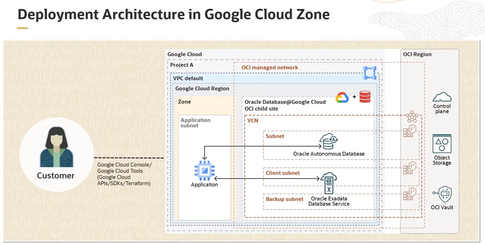

# Oracle Database@Google Cloud

## Arquitetura Física: OCI dentro do Data Center do Google

Para entender como o serviço funciona, temos que conhecer a arquitetura física subjacente, que se baseia em um modelo de "site pai" e "site filho".

* **Estruturas de Nuvem:**
    * **OCI:** Uma Região OCI é composta por um ou mais data centers chamados **Availability Domains (ADs)**.
    * **Google Cloud:** Uma Região Google Cloud é composta por três ou mais data centers isolados chamados **Zones**. As Zones do GCP são equivalentes aos ADs do OCI.

* **OCI Child Site (Site Filho):**
    * O serviço Oracle Database@Google Cloud é fisicamente implantado em um **"OCI child site"**.
    * Este "child site" é uma extensão da infraestrutura OCI que reside **dentro de uma Zone em um data center do Google Cloud**.

* **OCI Parent Site (Site Pai):**
    * Cada "child site" é conectado à sua **região OCI relacionada** (o "parent site") através de uma rede dedicada, redundante e gerenciada internamente pela Oracle.
    * Essa conexão é análoga à rede de altíssima velocidade que interliga os ADs dentro de uma região OCI padrão.

## Conectividade e Fluxo de Dados

Existem duas conexões de rede distintas e cruciais nesta arquitetura:

### 1. Conexão entre o "Child Site" e o "Parent Site" (OCI <-> OCI)

Esta conexão é usada para o gerenciamento e operações do serviço pela Oracle.

* **Operações de Control Plane (Plano de Controle):**
    * Gerenciamento da infraestrutura (patching, monitoramento, manutenção) pela equipe de operações da Oracle.
    * Fluxos de trabalho de provisionamento e controle iniciados pelo Resource Provider.
* **Operações de Data Plane (Plano de Dados):**
    * Backups automáticos para o **OCI Object Storage** na região "parent".
    * Acesso ao **OCI Vault** para gerenciamento de chaves de criptografia.

### 2. Conexão entre o "Child Site" e a Rede Google Cloud (OCI <-> GCP)

Esta é a conexão que a aplicação do cliente utiliza.

* **Conexão Direta e Local:** O "child site" do OCI e a infraestrutura de rede do Google Cloud são conectados por **hardware de rede redundante e direto**, tudo dentro do mesmo data center físico.
* **Fluxo de Tráfego da Aplicação:** O tráfego da sua aplicação na VPC do Google para o banco de dados Oracle **nunca sai do data center do Google**, garantindo latência ultra baixa e segurança.

## Componentes e Pré-requisitos

* **Rede Interna do "Child Site":**
    * O serviço utiliza uma **VCN gerenciada pelo OCI** dentro do "child site".
    * Para o **Exadata Database Service**, são criadas duas sub-redes (cliente e backup).
    * Para o **Autonomous Database**, é criada uma sub-rede.

* **Pré-requisitos no Google Cloud:**
    * Um **Google Cloud Project** para organizar os recursos.
    * Uma **Virtual Private Cloud (VPC)** onde as aplicações residirão e se conectarão ao serviço de banco de dados.

    