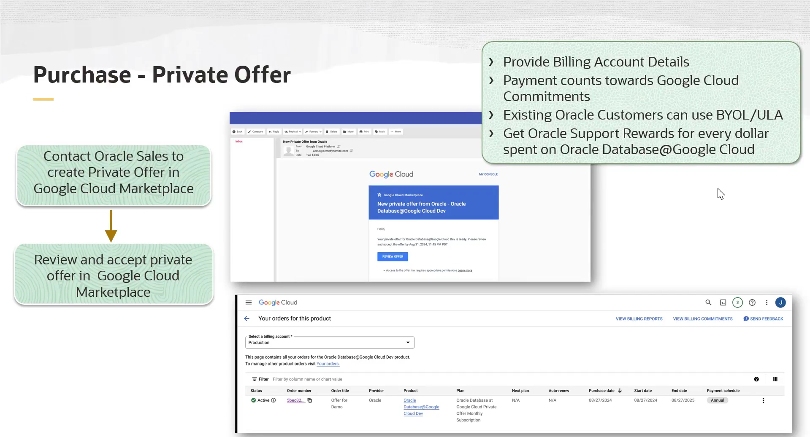
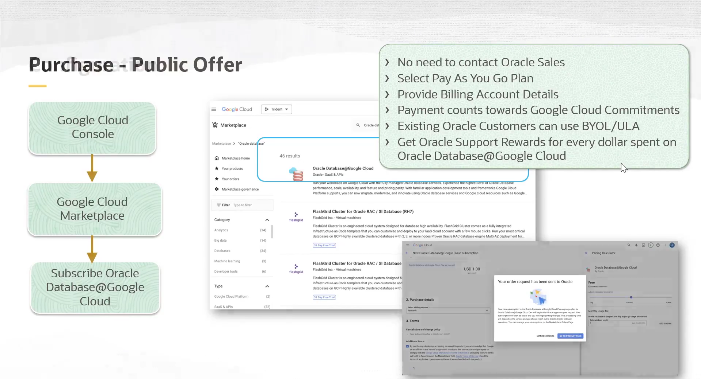

# Onboarding do Oracle Database@Google Cloud

Onboarding é o processo inicial e obrigatório que habilita seu ambiente a utilizar o serviço Oracle Database@Google Cloud. O fluxo consiste em duas etapas principais: **Compra** e **Configuração**.

## Pré-requisitos

Antes de iniciar, garanta que os seguintes pré-requisitos sejam atendidos:

1.  **Privilégios de Usuário:** O indivíduo que realiza o onboarding deve ter as funções (roles) apropriadas tanto no Google Cloud quanto no OCI para cada tarefa (compra, vinculação de contas, federação de identidade, etc.). Por exemplo, para a compra, é necessária a função de `Project owner` ou `Contributor`.
2.  **Google Cloud Project:** É necessário ter um projeto no Google Cloud que será usado para organizar todos os recursos de banco de dados provisionados.
3.  **Google Cloud Billing Account:** Você deve especificar a conta de faturamento do Google Cloud que será usada para cobrar pelo uso do serviço. O faturamento é unificado e simplificado, sendo pago diretamente através do Google.
4.  **Conta OCI:** Você precisa de uma conta OCI que será vinculada à sua conta do Google Cloud.
5.  **Região Pareada:** A conta OCI deve estar inscrita (subscribed) na região OCI que é pareada com a região do Google Cloud onde o serviço está disponível.

## Etapa 1: Compra no Google Cloud Marketplace

O serviço é adquirido através do Google Cloud Marketplace, com duas opções de oferta.

### Oferta 1: Private Offer 
* **Serviços Disponíveis:** Permite provisionar tanto o **Oracle Autonomous Database** quanto o **Oracle Exadata Database Service**.
* **Fluxo de Compra:**
    1.  Contate o representante de vendas da Oracle para negociar um contrato.
    2.  A equipe de vendas da Oracle criará uma oferta privada para você no Marketplace.
    3.  Você receberá uma notificação para revisar e aceitar a oferta no Google Cloud Marketplace.
    4.  Após a aprovação da Oracle, o pedido aparecerá como "Ativo" no console do Google Cloud.
* **Benefícios Comerciais:**
    * O pagamento conta para o seu compromisso de gastos com o Google Cloud.
    * Suporta **BYOL** (Bring Your Own License) e **ULA** (Unlimited License Agreements).
    * Acumula **Oracle Support Rewards**.
* **Vinculação de Contas:** Permite vincular a um OCI account **existente** ou criar um **novo**.

### Oferta 2: Public Offer (Pay-As-You-Go)
* **Serviços Disponíveis:** Permite provisionar **apenas o Oracle Autonomous Database**.
* **Fluxo de Compra:**
    1.  O processo é simplificado e não requer contato com a equipe de vendas.
    2.  No Google Cloud Console, selecione o produto Oracle Database@Google Cloud e clique em "Subscribe".
    3.  Revise os termos, forneça os detalhes da conta de faturamento e aceite a oferta.
* **Benefícios Comerciais:** Os mesmos benefícios (BYOL, ULA, Support Rewards) da oferta privada são aplicáveis.
* **Vinculação de Contas:** **Exige a criação de uma nova conta OCI**. Não é possível usar uma conta OCI existente com esta oferta.

## Etapa 2: Configuração 

Após a conclusão da compra, siga estas etapas de configuração:

1.  **Vincular Contas (Account Linking):**
    * Vincule sua conta do Google Cloud a uma conta OCI (nova ou existente, dependendo da oferta comprada).
    * Esta vinculação é o que permite provisionar os bancos de dados no OCI e automatiza a aplicação de atualizações.

2.  **Registrar no My Oracle Support (MOS):**
    * É necessário se registrar no MOS para receber suporte técnico para os serviços de banco de dados.

3.  **Atribuir Permissões:**
    * Use o **Google Cloud RBAC** para atribuir as funções apropriadas aos usuários da sua organização, definindo quem pode gerenciar os recursos do Oracle Database@Google Cloud.

4.  **Federação de Identidade (Opcional, mas Recomendado):**
    * Configure a federação entre sua conta OCI e sua conta Google Cloud.
    * **Benefício:** Permite que os usuários façam login no console do OCI diretamente a partir do console do Google Cloud, usando suas credenciais do Google (SSO), o que simplifica o acesso para as poucas tarefas de gerenciamento que precisam ser feitas no OCI.