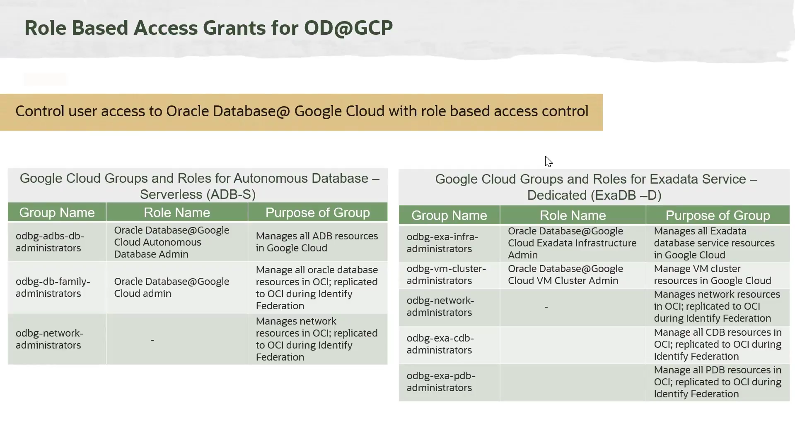

# Provisionamento de Bancos de Dados no Oracle Database@Google Cloud

Após a conclusão do onboarding, você pode começar a provisionar os serviços de banco de dados: **Autonomous Database Serverless** e **Exadata Database Service**.

## Pré-requisitos

Antes de iniciar o provisionamento, é crucial garantir que as permissões e a configuração de rede estejam corretas.

### 1. Permissões (Grupos e Funções no Google Cloud)

É necessário criar grupos no Google Cloud Console e atribuir as funções (roles) predefinidas pela Oracle para conceder os privilégios corretos aos usuários.

* **Para Autonomous Database Serverless:**
    * `odbg-adbs-db-administrators`: Para administradores do Autonomous Database.
    * `odbg-network-administrators`: Para gerenciar recursos de rede.
    * *(Consulte a documentação para a lista completa).*

* **Para Exadata Database Service:**
    * `odbg-exa-infra-administrators`: Para administrar a infraestrutura Exadata.
    * `odbg-vm-cluster-administrators`: Para administrar os clusters de VM.
    * `odbg-exa-cdb-administrators`: Para administrar os Container Databases.
    * *(Consulte a documentação para a lista completa).*

*Nota: Se a Federação de Identidade foi configurada, esses grupos são replicados para o OCI, simplificando as permissões.*

### 2. Rede (Networking)

* **Google Cloud VPC:** É necessário ter uma VPC pré-criada.
* **CIDR Não Sobreposto:** Os blocos CIDR das sub-redes usadas para os serviços de banco de dados não devem se sobrepor a nenhum outro CIDR em uso na VPC para evitar problemas de roteamento.
* **Tamanho Mínimo da Sub-rede:**
    * **Autonomous Database:** Mínimo de `/27`.
    * **Exadata Database Service:** Recomendado mínimo de `/27` para facilitar futuras expansões.
* **IPs Reservados para Exadata:** Os blocos `100.106.0.0/16` e `100.107.0.0/16` são reservados e não podem ser usados.
* **Requisitos de IP para Exadata:**
    * **Client Subnet:** 4 IPs por VM + 3 IPs para SCAN. (Mínimo de 11 IPs para um cluster de 2 VMs).
    * **Backup Subnet:** 3 IPs por VM. (Mínimo de 6 IPs para um cluster de 2 VMs).

## Processo de Provisionamento

### 1. Provisionando o Autonomous Database Serverless (no Google Console)

O processo é inteiramente realizado no console do Google Cloud.

1.  **Detalhes da Instância:** Forneça um ID e nome de exibição únicos, e selecione a região (não pode ser alterada depois).
2.  **Configuração:**
    * **Workload Type:** Transactional, Analytical, JSON ou APEX.
    * **License Type:** License Included ou BYOL.
    * **Recursos:** Escolha o número de ECPUs (2 a 512) e o tamanho do armazenamento (1 a 384 TB). Opcionalmente, habilite o auto-scaling.
3.  **Rede (Networking):**
    * Forneça o CIDR da sub-rede (mínimo /27).
    * Defina um prefixo de hostname para o IP privado.
4.  **Outras Configurações:** Defina a política de retenção de backup (1 a 60 dias), credenciais do admin, character sets, e-mails de notificação, etc.
5.  Clique em **Create** para iniciar o provisionamento.

### 2. Provisionando o Exadata Database Service (Processo em Duas Etapas)

Este provisionamento requer ações em ambos os consoles.

#### **Etapa A: Provisionar Infraestrutura e Cluster (no Google Console)**

1.  **Provisionar a Infraestrutura Exadata:**
    * Forneça nomes, região e configuração da máquina (modelo, nº de servidores de BD e armazenamento).
    * Configure a janela e o método de manutenção (rolling/non-rolling).
2.  **Provisionar o Cluster de VMs Exadata:**
    * Realizado sobre a infraestrutura criada anteriormente.
    * Forneça nomes, versão do Grid Infrastructure e configuração do cluster (nº de OCPUs por VM, memória, armazenamento local e utilizável do Exadata).
    * **Networking:** Selecione a VPC e forneça os CIDRs para as sub-redes de cliente e backup.
    * Forneça a chave SSH, tipo de licença, fuso horário, etc.
    * Clique em **Create** para iniciar a criação do cluster.

#### **Etapa B: Provisionar Bancos de Dados (no OCI Console)**

1.  **Navegar para o OCI:** Na página de detalhes do VM Cluster no Google Console, clique no link **"MANAGE IN OCI"**. Se a federação de identidade estiver configurada, o login será automático.
2.  **Criar Database Home:** No console do OCI, crie um Database Home com a versão desejada do Oracle Database.
3.  **Criar Container Database (CDB):** Crie um CDB utilizando o Database Home criado.
4.  **Criar Pluggable Databases (PDBs):** Provisione um ou mais PDBs dentro do CDB.
