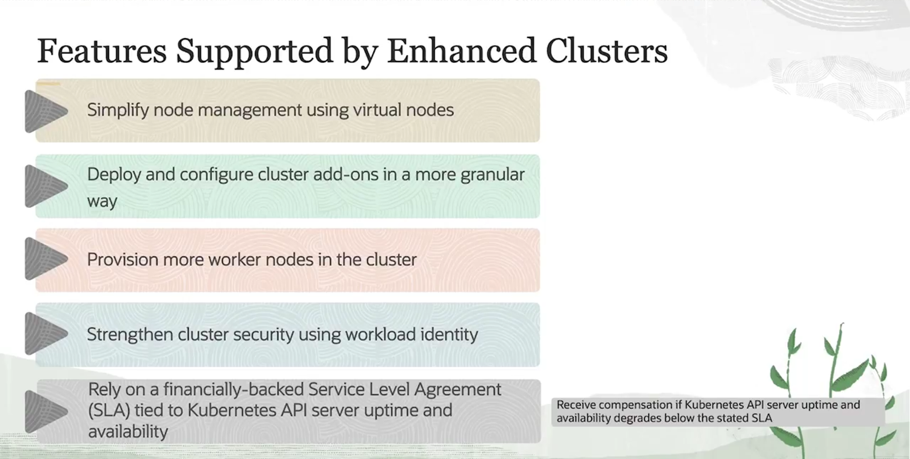
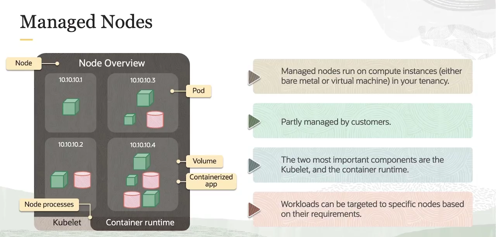

= Tipos de Cluster no OKE: Basic vs. Enhanced
:toc:
:icons: font

== Visão Geral dos Tipos de Cluster

Ao criar um novo cluster com o OCI Container Engine for Kubernetes (OKE), é necessário especificar um dos seguintes tipos de cluster.

*`Basic Clusters`*::
Suportam toda a funcionalidade principal do Kubernetes e do OKE. Os Basic Clusters vêm com um *SLO (Service Level Objective)*, mas não um SLA (Service Level Agreement) com compensação financeira. Isso significa que a Oracle garante um certo nível de disponibilidade, mas não há compensação monetária se esse nível não for atingido.

*`Enhanced Clusters`*::
Suportam todos os recursos disponíveis, incluindo funcionalidades exclusivas não presentes nos clusters Basic, além de um SLA com compensação financeira.

== Funcionalidades Exclusivas dos Enhanced Clusters

Os Enhanced Clusters oferecem um conjunto de funcionalidades avançadas para simplificar o gerenciamento, aumentar a escalabilidade e fortalecer a segurança.

* *Virtual Nodes:*
** Simplificam significativamente o gerenciamento da infraestrutura do cluster. A responsabilidade de escalar, atualizar ou solucionar problemas nos worker nodes é removida, permitindo que as equipes se concentrem nas aplicações. É uma solução ideal para clusters grandes que exigem atualizações ou scaling frequentes.

* *Gerenciamento Granular de Add-ons:*
** Permite o deploy e a configuração de add-ons de forma granular. É possível gerenciar tanto add-ons essenciais (como `CoreDNS` e `kube-proxy`) quanto um portfólio crescente de add-ons opcionais (como o `Kubernetes Dashboard`). O usuário tem controle completo sobre quais add-ons instalar, suas versões específicas e a opção de aderir ou não às atualizações automáticas da Oracle.

* *Maior Escalabilidade de Nós (Worker Nodes):*
** Permite provisionar um número maior de worker nodes em um único cluster. Isso possibilita o deploy de cargas de trabalho maiores no mesmo cluster, o que pode levar a uma melhor utilização de recursos e menor sobrecarga operacional.

* *Segurança Aprimorada com Workload Identity:*
** Fortalece a segurança do cluster ao permitir a definição de políticas de OCI IAM que autorizam Pods específicos a fazer chamadas de API da OCI e acessar recursos. Ao vincular as políticas a _Kubernetes Service Accounts_ associadas aos Pods, as aplicações podem acessar diretamente as APIs da OCI com base nas permissões concedidas. Todas as chamadas de API feitas por workloads do Kubernetes são rastreadas automaticamente pelo OCI Audit.

* *SLA com Compensação Financeira:*
** Garante um Acordo de Nível de Serviço (SLA) com compensação financeira, atrelado ao uptime e à disponibilidade do Kubernetes API Server. Isso fornece um nível extra de garantia de que o cluster será altamente disponível e performático.

== Tabela Comparativa de Funcionalidades

A tabela abaixo resume as principais diferenças entre os dois tipos de cluster.

[options="header", cols="3,1,1"]
|===
| Funcionalidade | Basic Cluster | Enhanced Cluster

| Funcionalidade Core Kubernetes
| icon:check[]
| icon:check[]

| Virtual Node Pools
| icon:times[]
| icon:check[]

| Gerenciamento Granular de Add-ons
| icon:times[]
| icon:check[]

| Workload Identity
| icon:times[]
| icon:check[]

| Maior Número de Worker Nodes
| icon:times[]
| icon:check[]

| SLA com Compensação Financeira
| icon:times[]
| icon:check[]
|===

== Pontos de Atenção na Criação de Clusters

Existem diferenças no comportamento padrão ao criar clusters Basic ou Enhanced, dependendo da ferramenta utilizada.

* *Criação via Console:*
** Por padrão, um novo cluster é criado como *Enhanced*. A opção de criar um cluster *Basic* só é apresentada se nenhuma funcionalidade _enhanced_ for selecionada durante o processo de criação.

* *Criação via CLI ou API:*
** Por padrão, um novo cluster é criado como *Basic*, a menos que o tipo *Enhanced* seja explicitamente especificado na chamada.

* *Flexibilidade Futura:*
** Criar um novo cluster como *Enhanced* desde o início (mesmo sem selecionar funcionalidades avançadas) facilita a adição dessas funcionalidades posteriormente.

[IMPORTANT]
====
.Regra de Upgrade e Downgrade
* É possível fazer upgrade de um cluster `Basic` para `Enhanced` a qualquer momento.
* *Não é possível* fazer downgrade de um cluster `Enhanced` para `Basic`.
====