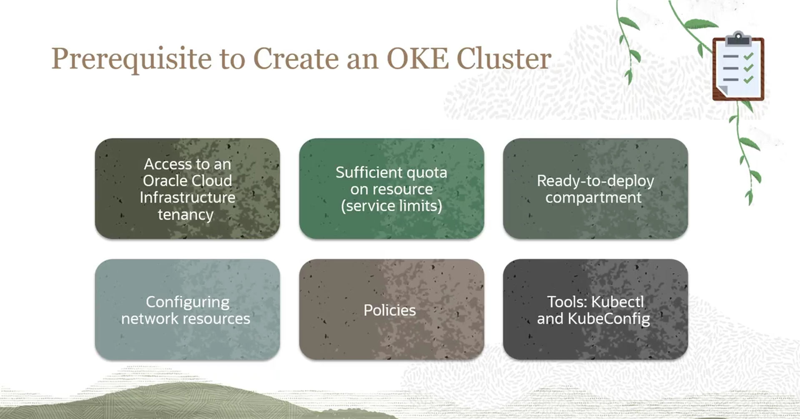
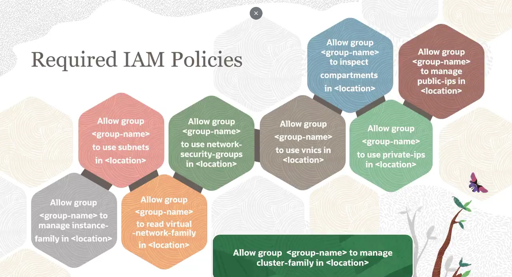
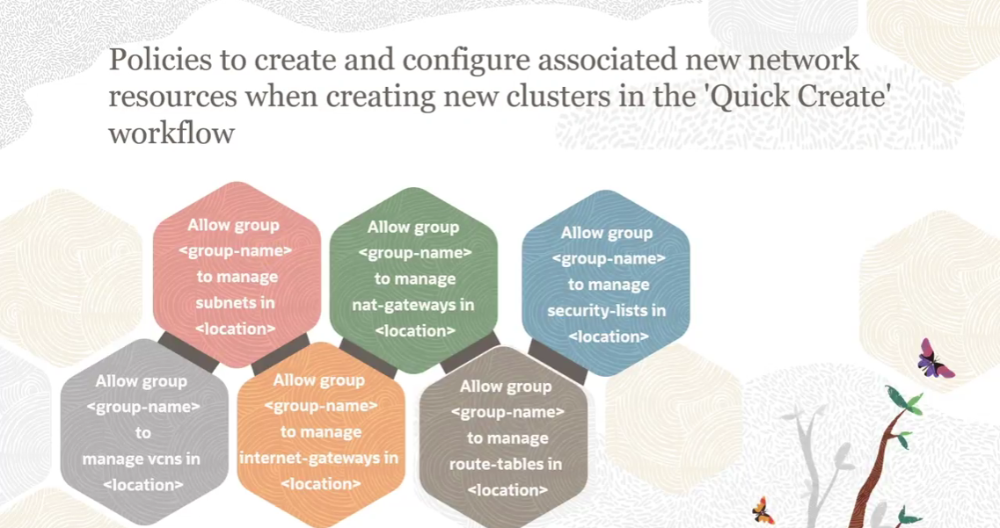
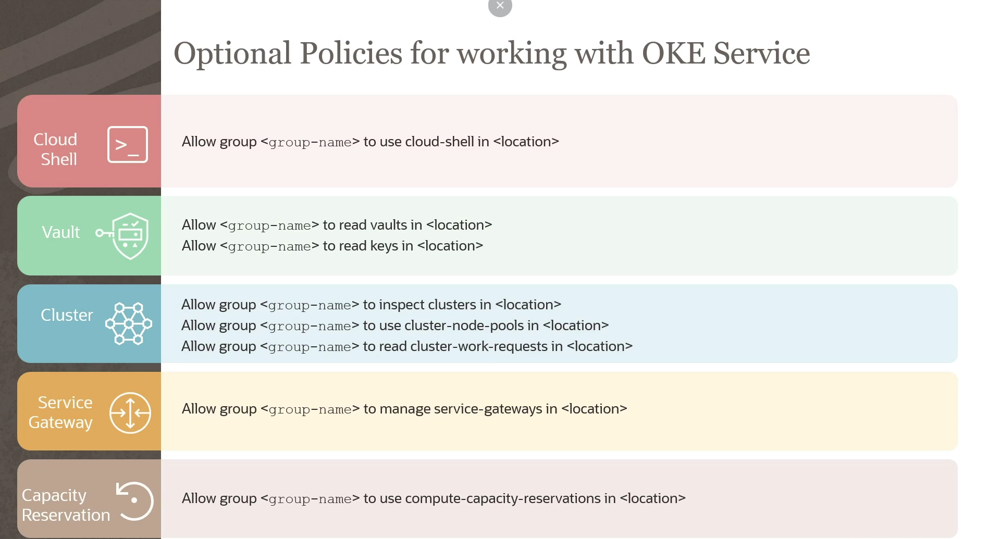

= Guia de Preparação do Ambiente OKE: Pré-requisitos e Políticas de IAM
:toc:
:icons: font

== Visão Geral dos Pré-requisitos

Para criar um cluster no OCI Container Engine for Kubernetes (OKE), é necessário atender a uma série de pré-requisitos fundamentais que garantem a correta alocação de recursos, configuração de rede e permissões de acesso.

Os pré-requisitos essenciais são:
. Acesso a uma Tenancy OCI.
. Quotas suficientes nos recursos de infraestrutura (Limites de Serviço).
. Um Compartment dedicado para a implantação.
. Recursos de rede devidamente configurados.
. Políticas de IAM (Identity and Access Management) apropriadas.
. Ferramentas cliente para acesso ao cluster.

== Tenancy e Limites de Serviço (Quotas)

=== Acesso à Tenancy OCI

O primeiro e mais fundamental requisito é o acesso a uma tenancy do Oracle Cloud Infrastructure. A tenancy é a sua conta na Oracle Cloud e serve como a fundação para a criação de todos os recursos. O serviço OKE está disponível em todas as regiões da OCI.

=== Quotas de Recursos (Service Limits)

É crucial garantir que a tenancy possua quotas suficientes para os diferentes tipos de recursos que um cluster OKE consumirá.

*`Compute Instances`*::
A quota necessária depende do Compute Shape (tipo de VM) escolhido para os worker nodes. Para um cluster de alta disponibilidade em uma região com três Domínios de Disponibilidade (ADs), são necessárias no mínimo três instâncias de compute, uma em cada AD.

*`Block Volume`*::
Se houver a intenção de utilizar Kubernetes Persistent Volumes, é necessário garantir que haja quota suficiente de Block Volume em cada AD para atender às requisições dos Persistent Volume Claims (PVCs). Cada PVC deve solicitar um mínimo de 50 GB.

*`Load Balancer`*::
Para expor serviços do cluster à internet através do tipo `LoadBalancer`, é preciso haver quota disponível para a criação de Load Balancers na região.

*`VCN e Subnets`*::
A tenancy deve ter quota para a criação dos recursos de VCN (Virtual Cloud Network) e Subnets que o cluster utilizará.

== Compartment e Recursos de Rede

=== Estrutura de Compartments

É necessário um compartment para hospedar os recursos de rede e o próprio cluster OKE. Embora seja possível utilizar o root compartment, a melhor prática é criar compartments dedicados.

[TIP]
====
Se múltiplas equipes forem criar clusters, é aconselhável criar um compartment dedicado para cada equipe. Isso garante uma melhor organização, simplifica o gerenciamento de permissões e o controle de custos.
====

=== Configuração de Rede

Os seguintes recursos de rede devem ser configurados corretamente na região onde o cluster será criado:
* Virtual Cloud Network (VCN)
* Subnets
* Internet Gateways
* Route Tables
* Security Lists

Ao criar um novo cluster, o OKE oferece duas opções:
. Criar e configurar automaticamente esses recursos de rede.
. Utilizar recursos de rede existentes que já foram previamente configurados.

[TIP]
====
A melhor prática é optar por subnets regionais, pois isso facilita a implementação de estratégias de failover entre Domínios de Disponibilidade.
====

== Ferramentas de Acesso ao Cluster

Para interagir e realizar operações em um cluster Kubernetes, as seguintes ferramentas e configurações são necessárias do lado do cliente:

* *Kubernetes CLI (`kubectl`):*
** É a principal ferramenta de linha de comando para interagir com o cluster. Pode-se utilizar a versão já instalada no OCI Cloud Shell ou realizar uma instalação local.

* *Arquivo `kubeconfig`:*
** Um arquivo de configuração que contém os detalhes de acesso ao cluster (endereço do servidor, usuário, credenciais).

[IMPORTANT]
====
Cada usuário deve configurar seu próprio arquivo `kubeconfig`. Não é possível acessar um cluster utilizando o arquivo `kubeconfig` de outro usuário.
====

* *Permissões Apropriadas:*
** Além das ferramentas, o usuário deve ter as permissões de IAM necessárias para interagir efetivamente com os recursos do cluster.

== Políticas de Acesso (IAM): Visão Geral

O controle de acesso no OKE é gerenciado primariamente pelo serviço OCI IAM.

* *Grupo de Administradores:* Quando uma tenancy é criada, um grupo `Administrators` é estabelecido automaticamente. Membros deste grupo possuem permissões amplas e podem realizar todas as operações no OKE sem a necessidade de políticas adicionais.
* *Grupos Customizados:* Para usuários que não são administradores, é necessário criar políticas de IAM específicas que concedam as permissões necessárias para operar o OKE. Essas políticas podem ser aplicadas no nível da tenancy ou em compartments individuais.
* *Cenários Específicos:* Políticas adicionais são necessárias para cenários como o uso de Virtual Nodes ou a criptografia de volumes com chaves do serviço OCI Vault.
* *Kubernetes RBAC:* Além do IAM, o *RBAC (Role-Based Access Control)* do Kubernetes pode ser utilizado para um controle de acesso ainda mais granular, aplicando permissões para usuários em recursos específicos *dentro* do cluster (via Roles e ClusterRoles).

== Políticas de IAM Requeridas para Operações de Cluster

Para que um grupo de usuários possa criar, atualizar e excluir clusters e node pools, as seguintes permissões são necessárias.

=== Permissões Mínimas para Usuários
[source,text]
----
Allow group <group_name> to manage instance-family in <location>
Allow group <group_name> to use subnets in <location>
Allow group <group_name> to read virtual-network-family in <location>
Allow group <group_name> to use network-security-groups in <location>
Allow group <group_name> to use vnics in <location>
Allow group <group_name> to inspect compartments in <location>
Allow group <group_name> to use private-ips in <location>
Allow group <group_name> to manage public-ips in <location>
----

[NOTE]
====
Os placeholders `<group_name>` e `<location>` devem ser substituídos pelo nome do grupo de usuários e pela localização (seja `tenancy` ou `compartment <compartment_name>`) onde a política será aplicada.
====

=== Política "Catch-All" para Recursos de Cluster

Como alternativa, uma única política pode conceder privilégios de administrador sobre todos os recursos relacionados a clusters.
[source,text]
----
Allow group <group_name> to manage cluster-family in <location>
----

=== Políticas Condicionais

A necessidade de certas políticas depende da configuração de rede do cluster.
* *Clusters VCN-Native:* A política `use private-ips` é sempre necessária. A política `manage public-ips` só é necessária se o cluster for configurado com um endereço de IP público para o endpoint da API.
* *Clusters com Endpoint Público em Tenancy Oracle:* Requerem as políticas `use vnics`, `use private-ips` e `manage public-ips`.

== Políticas para Criação Automática de Rede (Quick Create)

Para permitir que um grupo crie um cluster usando o workflow "Quick Create" (onde o OKE cria e configura os recursos de rede automaticamente), as seguintes permissões de gerenciamento devem ser concedidas:
[source,text]
----
Allow group <group_name> to manage vcns in <location>
Allow group <group_name> to manage subnets in <location>
Allow group <group_name> to manage internet-gateways in <location>
Allow group <group_name> to manage nat-gateways in <location>
Allow group <group_name> to manage route-tables in <location>
Allow group <group_name> to manage security-lists in <location>
----

== Políticas de IAM Opcionais

Políticas adicionais podem ser configuradas para habilitar funcionalidades específicas.

*`Acesso ao Cloud Shell`*::
Permite que um grupo de usuários acesse clusters utilizando o OCI Cloud Shell.
[source,text]
----
Allow group <group_name> to use cloud-shell in tenancy
----

*`Integração com OCI Vault`*::
Permite que um grupo selecione chaves de criptografia mestras do serviço Vault ao criar e modificar clusters.
[source,text]
----
Allow group <group_name> to read vaults in <location>
Allow group <group_name> to read keys in <location>
----

*`Permissões Granulares de Cluster`*::
Concede permissões mais restritas, como apenas inspecionar clusters ou utilizar node pools.
[source,text]
----
Allow group <group_name> to inspect clusters in <location>
Allow group <group_name> to use cluster-node-pools in <location>
Allow group <group_name> to read cluster-work-requests in <location>
----

*`Gerenciamento de Service Gateways`*::
Permite que um grupo crie um Service Gateway para que os worker nodes acessem outros recursos OCI na mesma região sem exposição à internet pública.
[source,text]
----
Allow group <group_name> to manage service-gateways in <location>
----

*`Uso de Reservas de Capacidade`*::
Permite que usuários utilizem reservas de capacidade de computação para os clusters.
[source,text]
----
Allow group <group_name> to use compute-capacity-reservations in <location>
----

