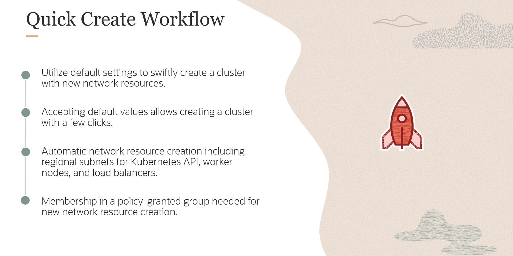
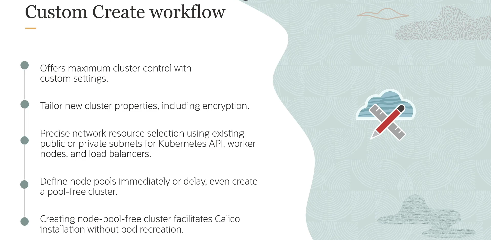

= Métodos de Criação de Clusters no OKE
:toc:
:icons: font

== Workflows de Criação via Console

A criação de um cluster OKE pode ser realizada através de diferentes workflows no Console da OCI, cada um adequado a diferentes necessidades de implantação. As duas abordagens principais são o *Quick Create* e o *Custom Create*.

=== Quick Create Workflow

Este método é projetado para uma implantação rápida, utilizando configurações padrão para iniciar um cluster com poucos cliques.

.Características Principais:
* *Objetivo:* Implantação expedita com configurações padrão.
* *Recursos de Rede:* Cria e configura automaticamente os recursos de rede necessários, incluindo:
** Uma VCN.
** Subnets regionais para o endpoint da API do Kubernetes, para os worker nodes e para os load balancers.
* *Configuração de Subnets:* A subnet regional do load balancer é sempre pública. É possível especificar se as subnets do endpoint da API e dos worker nodes serão públicas ou privadas.
* *Requisito de Permissão:* O usuário deve pertencer a um grupo com políticas de IAM que permitam a criação automática de todos os recursos de rede necessários.

=== Custom Create Workflow

Este método oferece controle máximo sobre a configuração do novo cluster Kubernetes, permitindo a personalização de todas as propriedades.

.Características Principais:
* *Controle Total:* Permite customizar detalhadamente as propriedades do cluster, incluindo opções de criptografia.
* *Recursos de Rede Existentes:* Oferece a precisão para especificar recursos de rede já existentes, com a escolha de subnets públicas ou privadas para o endpoint da API, worker nodes e load balancers.
* *Flexibilidade de Node Pools:* É possível definir node pools imediatamente durante a criação do cluster ou adiar este passo, criando um cluster sem node pools e adicionando-os posteriormente.

[TIP]
====
A criação de um cluster inicialmente sem node pools é uma prática recomendada em cenários específicos, como ao planejar a instalação de um provedor de política de rede (Network Policy Provider) como o Calico. Instalar o Calico antes de criar os node pools evita a necessidade de recriar os Pods após a instalação estar completa.
====

== Métodos de Criação Programática e Automação

Além dos workflows do Console, o OKE oferece opções avançadas para a criação de clusters de forma programática e automatizada.

=== CLI e API

* *OCI CLI:* A Interface de Linha de Comando da OCI oferece opções completas para configurar e gerenciar recursos do OKE.
* *OCI API:* A API REST do OKE pode ser utilizada para criar clusters. A documentação oficial detalha a operação `CreateCluster` e seu uso através de diversos SDKs (Java, Python, etc.).

=== Infrastructure as Code (IaC): Terraform e Resource Manager

* *OCI Resource Manager:* Permite a criação de clusters através de stacks do Resource Manager, que é o serviço de Terraform gerenciado da OCI.
* *Módulos Terraform da Oracle:* No GitHub, a Oracle disponibiliza módulos Terraform oficiais para o OKE. Estes módulos simplificam e padronizam a configuração de clusters, economizando tempo e esforço e garantindo implantações consistentes e repetíveis.

