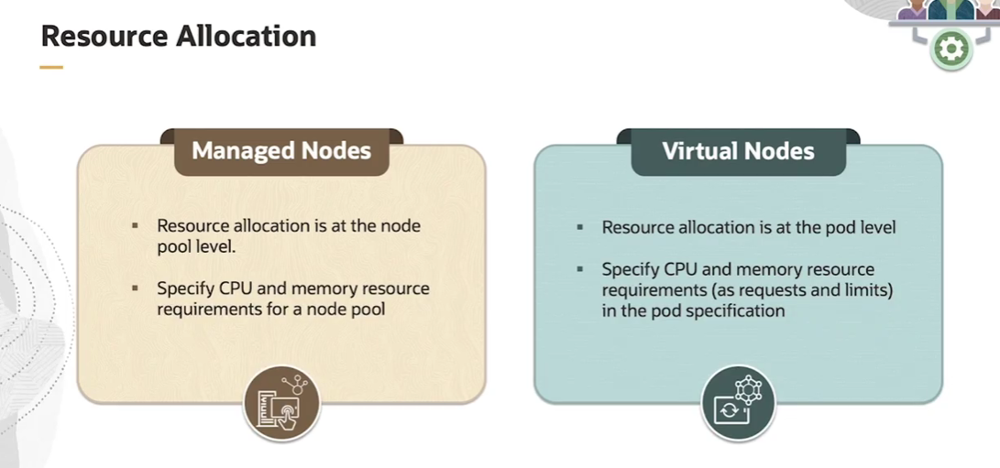
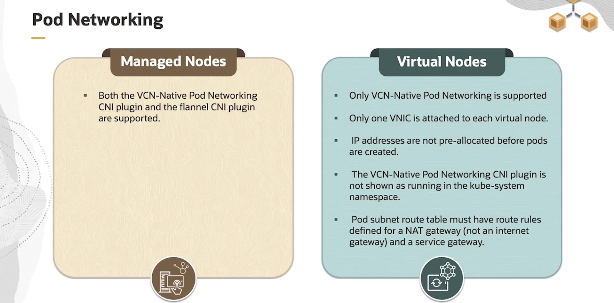
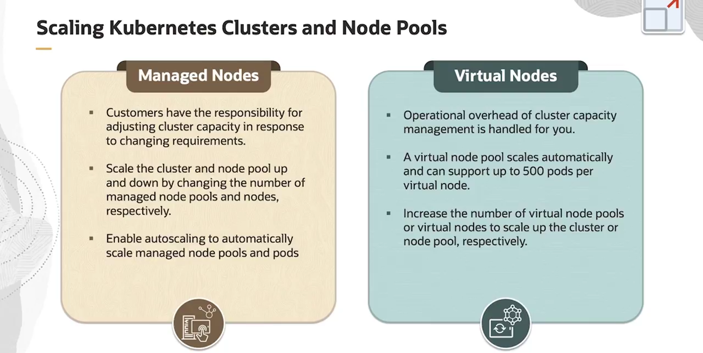

= Comparativo Detalhado: Virtual Nodes vs. Managed Nodes no OKE
:toc:
:icons: font

== Visão Geral da Escolha de Nós

Ao criar um node pool com o OCI Container Engine for Kubernetes (OKE), é necessário especificar o tipo de nós como *Managed Nodes* ou *Virtual Nodes*. A escolha entre os dois tipos implica diferenças significativas em gerenciamento, alocação de recursos, rede, escalabilidade e preços.

Este documento detalha essas diferenças para auxiliar na tomada de decisão informada, que melhor atenda às necessidades de aplicações e cargas de trabalho específicas.

== Tabela Comparativa Detalhada

[options="header", cols="1,2,2"]
|===
| Critério | Managed Nodes | Virtual Nodes

| *Gerenciamento*
| *Responsabilidade do Cliente:*
* O cliente é responsável por gerenciar os nós.
* O cliente realiza os upgrades do Kubernetes nos nós.
* O cliente gerencia a capacidade do cluster (adicionar/remover nós).
| *Totalmente Gerenciado (Serverless):*
* A Oracle gerencia a infraestrutura dos nós.
* Upgrades de Kubernetes e patches de segurança são aplicados automaticamente pela Oracle.

| *Disponibilidade*
| Podem ser criados em clusters do tipo *Basic* e *Enhanced*.
| Podem ser criados *apenas* em clusters do tipo *Enhanced*.

| *Alocação de Recursos*
| No nível do *Node Pool*.
* O cliente especifica os requisitos de CPU e memória para o pool de nós (ou seja, para a instância de Compute).
| No nível do *Pod*.
* O cliente especifica os requisitos de CPU e memória (`requests` e `limits`) na especificação do Pod.

| *Load Balancing*
| O balanceamento de carga ocorre entre os *worker nodes* (`node-ip:nodeport`).
| O balanceamento de carga ocorre entre os *Pods* (`pod-ip:nodeport`).
* A gestão de Security Lists para o Load Balancer deve ser configurada manualmente pelo cliente.

| *Rede de Pods (Pod Networking)*
| Suporta ambos os plugins CNI:
* *VCN-Native Pod Networking*
* *flannel*
| Suporta *apenas* o plugin *VCN-Native Pod Networking*.
* Apenas uma VNIC é anexada a cada nó virtual.
* O plugin CNI não aparece como em execução no namespace `kube-system`.
* As tabelas de rota da subnet dos Pods devem ter regras definidas para um NAT Gateway e um Service Gateway.

| *Escalabilidade*
| *Responsabilidade do Cliente:*
* O cliente ajusta a capacidade do cluster alterando o número de nós.
* Opcionalmente, pode-se habilitar o *Cluster Autoscaler* para escalar os node pools e Pods automaticamente.
| *Gerenciada pela OCI:*
* A sobrecarga operacional do gerenciamento de capacidade é tratada pela Oracle.
* Um virtual node pool escala automaticamente e pode suportar até *500 Pods por nó*.
* O cliente pode escalar o cluster aumentando o número de nós virtuais.

| *Preços (Pricing)*
| O cliente paga pelas *instâncias de Compute* que compõem os nós, independentemente da utilização.
| O cliente paga pelos *recursos exatos de CPU e memória consumidos por cada Pod* (modelo pay-per-use).
|===

image::images/image35.png[alt="Diagrama Comparativo Managed vs. Virtual Nodes", title="Diagrama Comparativo Managed vs. Virtual Nodes"]

