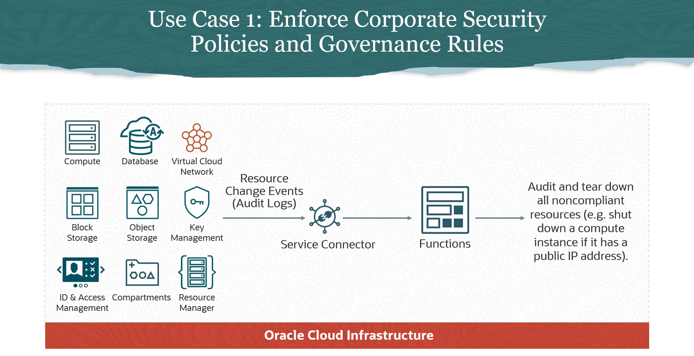
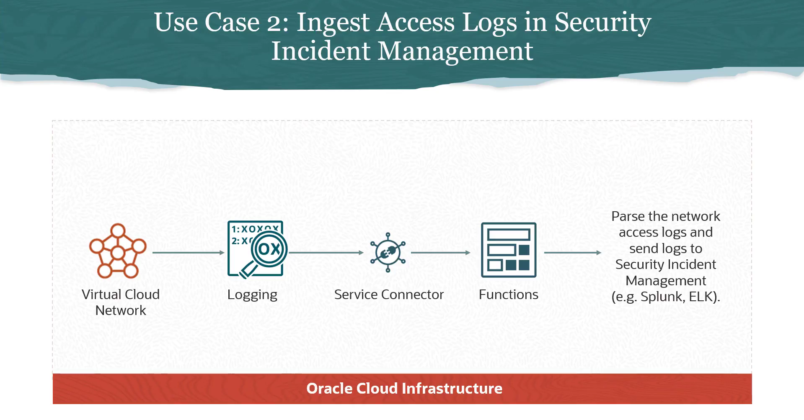
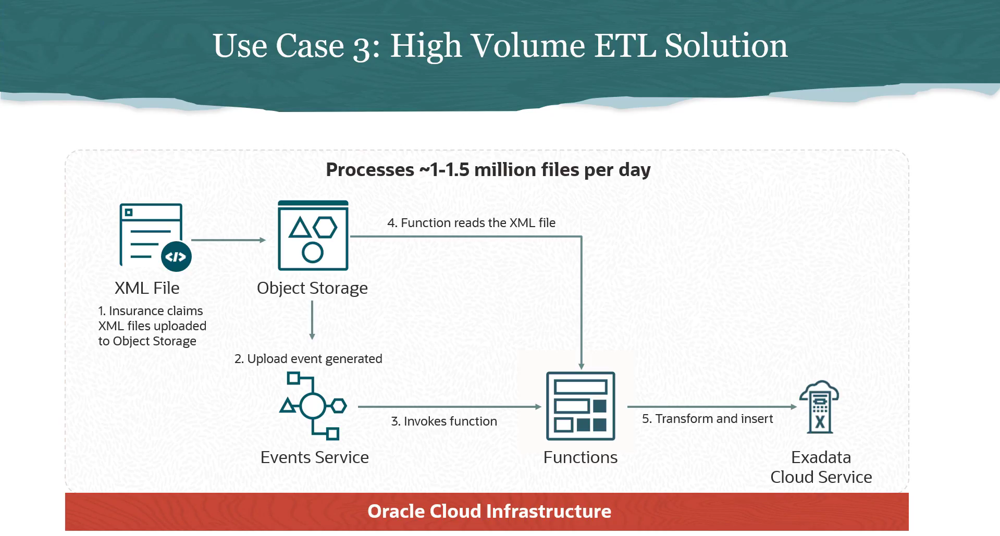
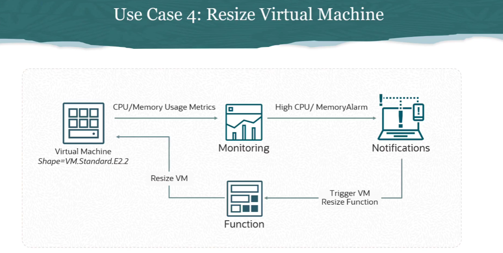

= Casos de Uso do Oracle Functions
:toc:
:icons: font

== Categorias de Casos de Uso

A premissa fundamental dos casos de uso de serverless é a execução de código em resposta a um evento. Estes casos de uso podem ser agrupados em várias categorias principais.

*Governança Orientada a Eventos*::
Cenários que envolvem a automação de regras de governança e segurança. Por exemplo, utilizar um evento de um log de auditoria (audit log) ou de um log de fluxo de rede (network flow log) para disparar uma função que lê, filtra e encaminha esses logs para um sistema de gerenciamento de incidentes de segurança (SIEM), como o Splunk.

*Backends para APIs Web e Mobile*::
Utilização de um API Gateway como fachada para uma função que implementa a lógica de backend de uma API REST. O API Gateway expõe a função como um endpoint REST seguro e gerenciável para os usuários.

*Processamento de Arquivos e Streams em Tempo Real*::
Eventos gerados pelo upload de dados em um bucket do Object Storage ou pela chegada de dados em um serviço de streaming (compatível com Kafka) disparam uma função. A função então processa esses dados, realizando ações como análise e armazenamento em um Autonomous Database.

*Outras Áreas*::
As funções também encontram aplicações em Machine Learning, automação de tarefas de DevOps, e outras áreas que se beneficiam de execuções de código sob demanda e orientadas a eventos.

== Exemplos de Casos de Uso Detalhados

A seguir, são apresentados quatro cenários específicos que ilustram a aplicação prática do Oracle Functions.

=== 1. Aplicação de Políticas de Segurança com Audit Logs

Recursos da OCI (Compute, Databases, etc.) geram eventos de alteração que são registrados nos Audit Logs. É possível utilizar esta auditoria para aplicar políticas de segurança de forma automática.

.Fluxo de Execução:
. Um evento de alteração de recurso é gerado (ex: criação de uma instância de Compute).
. O evento é capturado pelo *OCI Audit*.
. Um *Service Connector* é configurado para monitorar os Audit Logs e, ao identificar um evento específico (ex: criação de VM com IP público), invoca uma função.
. A *Função* é executada, analisa os detalhes do evento e toma uma ação corretiva, como desligar ou terminar a instância de Compute que não está em conformidade com a política de segurança.

=== 2. Encaminhamento de Logs de Rede para um SIEM

Uma Virtual Cloud Network (VCN) pode ser configurada para enviar logs de acesso à rede para o serviço *OCI Logging*. Estes logs podem ser processados e enviados para análise externa.

.Fluxo de Execução:
. A VCN gera logs de fluxo de rede, que são enviados para o *OCI Logging*.
. Um *Service Connector* é configurado com o Logging como fonte (_source_) e o Functions como alvo (_target_).
. A *Função* é invocada com os dados do log.
. O código da função analisa (parse) os logs, formata-os conforme necessário e os envia para um sistema SIEM de terceiros, como Splunk, ELK Stack, etc.

=== 3. Processamento de Arquivos do Object Storage

Este cenário envolve o processamento de dados ETL (Extract, Transform, Load) acionado pelo upload de arquivos (muitos arquivos).

.Fluxo de Execução:
. Arquivos (ex: XML de sinistros de seguros) são enviados para um bucket do *Object Storage*.
. O evento de upload de objeto dispara uma *Event Rule* configurada para invocar uma função.
. A *Função* é executada, lê o conteúdo do arquivo XML, transforma os dados e os insere em um Oracle Database (ex: Exadata Cloud Service).
. O serviço de Functions escala horizontalmente para processar múltiplos uploads de arquivos em paralelo de forma eficiente.

=== 4. Auto-scaling de VMs com Base em Alarmes

É possível criar automações que ajustam a infraestrutura dinamicamente com base em métricas de performance.

.Fluxo de Execução:
. Uma Máquina Virtual (VM) envia métricas de uso de CPU e memória para o serviço *OCI Monitoring*.
. Um *Alarme* é configurado no Monitoring para ser disparado quando o uso de CPU ou memória ultrapassar um limiar definido.
. Quando o alarme é disparado, ele envia uma mensagem para um tópico do *OCI Notifications*.
. Uma *Função* está inscrita neste tópico de notificação e é invocada.
. O código da função redimensiona a VM para o próximo _shape_ disponível (ex: de `VM.Standard.E2.1` para `VM.Standard.E2.2`), garantindo a utilização ótima dos recursos.

