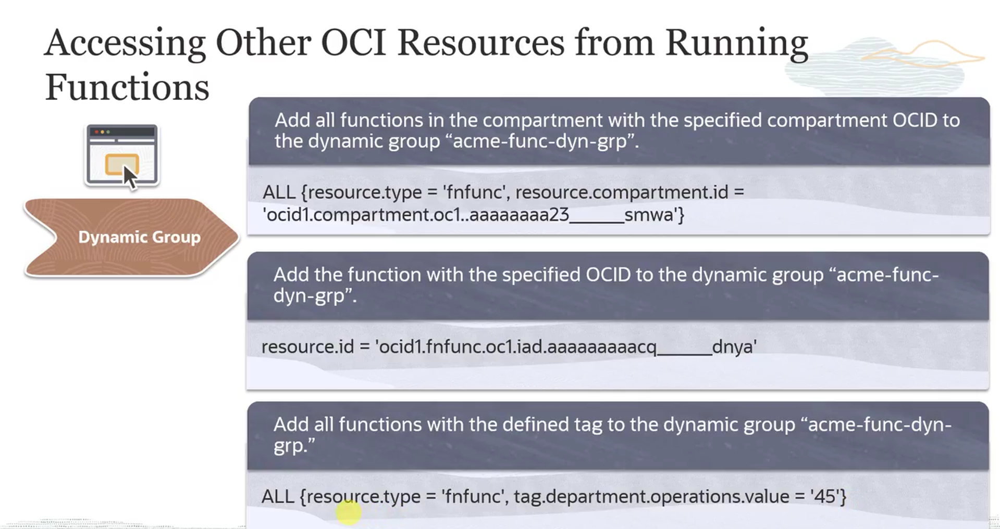
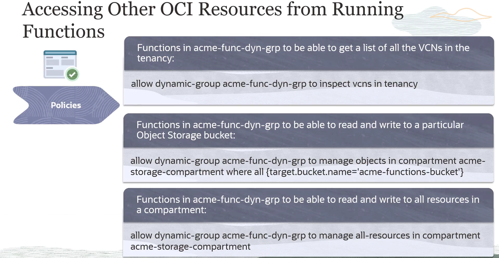
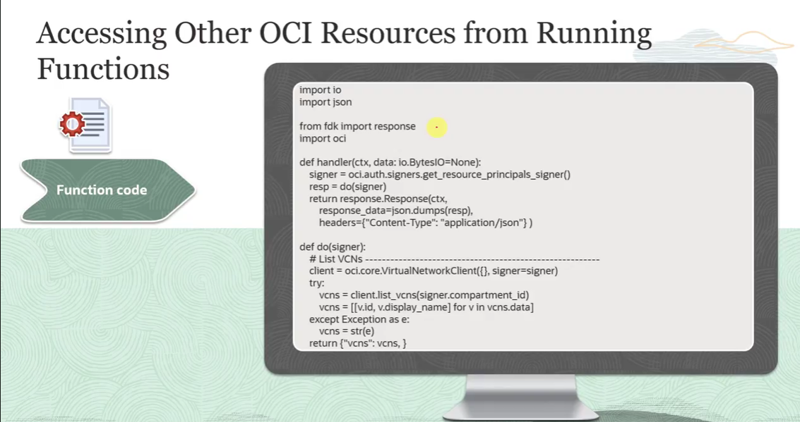

= Integração do OCI Functions com Outros Serviços
:toc:
:icons: font

== Visão Geral do Ecossistema de Integração

O Oracle Functions é projetado para se integrar perfeitamente com o ecossistema de serviços da OCI. O fluxo de trabalho de uma função envolve interações com serviços upstream (que a disparam), downstream (que ela consome) e de observabilidade.

.Fases de Interação de uma Função:
. *Upstream (Triggers):*
** Funções podem ser disparadas automaticamente por serviços como o *Event Service* e o *API Gateway*, ou manualmente via *OCI CLI* e *SDKs*.

. *Execução:*
** Uma vez disparada, a plataforma OCI Functions baixa a imagem Docker correspondente do *OCI Registry (OCIR)* e a executa como um contêiner.

. *Downstream (Serviços Consumidos):*
** Durante a execução, a função pode interagir com uma vasta gama de serviços OCI, como *Object Storage*, *Autonomous Database*, *Compute*, *Secrets*, e recursos de *Networking*.

. *Observabilidade:*
** Todos os logs, métricas e traces gerados durante a execução são enviados automaticamente para os serviços *OCI Logging*, *Monitoring* e *Application Performance Monitoring (APM)*, respectivamente.

== Habilitando o Acesso a Outros Recursos OCI

Para que uma função em execução possa acessar outros recursos da OCI, é necessário seguir um processo de três etapas para configurar as permissões de forma segura.

=== Passo 1: Criar um Dynamic Group para as Funções

Um Dynamic Group permite agrupar "atores" da OCI (como instâncias ou funções) para que políticas de IAM possam ser aplicadas a eles. A regra de correspondência define quais recursos pertencem ao grupo.

.Exemplos de Regras para Dynamic Groups:
* *Para todas as funções em um compartment específico:*
+
[source,text]
----
ALL {resource.type = 'fn_function', resource.compartment.id = '<compartment_ocid>'}
----
+
* *Para uma função específica (por OCID):*
+
[source,text]
----
resource.id = '<function_ocid>'
----
+
* *Para todas as funções com uma tag específica:*
+
[source,text]
----
ALL {resource.type = 'fn_function', tag.<tag_namespace>.<tag_key>.value = '<tag_value>'}
----

=== Passo 2: Criar Políticas de IAM para o Dynamic Group

Após criar o Dynamic Group, cria-se uma política de IAM que concede ao grupo (e, por consequência, às funções que ele contém) as permissões necessárias para acessar outros recursos.

.Exemplos de Políticas:
* *Para listar todas as VCNs na tenancy:*
+
[source,text]
----
Allow dynamic-group <dynamic_group_name> to inspect vcns in tenancy
----
+
* *Para ler e escrever em um bucket específico do Object Storage:*
+
[source,text]
----
Allow dynamic-group <dynamic_group_name> to manage objects in compartment <compartment_name> where target.bucket.name = '<bucket_name>'
----
+
* *Para gerenciar todos os recursos em um compartment:*
+
[source,text]
----
Allow dynamic-group <dynamic_group_name> to manage all-resources in compartment <compartment_name>
----

=== Passo 3: Utilizar o Resource Principal Provider no Código (Functional Code)

Este é o mecanismo que permite que a função se autentique com outros serviços OCI de dentro de seu ambiente de execução.

* *`Resource Principal Provider`*:
** Utiliza um *Resource Provider Session Token (RPST)* para autenticar a função. Este token garante que a função possa acessar de forma segura apenas os recursos permitidos pelas políticas associadas ao seu Dynamic Group.
* *Cache do Token*:
** O estado do RPST é mantido em cache por 15 minutos. Isso significa que quaisquer alterações em políticas ou na composição do Dynamic Group podem levar até 15 minutos para se tornarem efetivas.
* *Implementação via OCI SDK*:
** A maneira recomendada de implementação é utilizar o Resource Principal Provider incluído no OCI SDK. Para linguagens não suportadas, provedores customizados podem ser escritos utilizando variáveis de ambiente.

== Exemplo Prático: Código Python com Resource Principal

O código a seguir demonstra como utilizar o Resource Principal Provider com o OCI SDK para Python para obter uma lista de VCNs.

=== Código Completo
[source,python]
----
import io
import json
from fdk import response
import oci

def handler(ctx, data: io.BytesIO=None):
    signer = oci.auth.signers.get_resource_principals_signer()
    resp = do(signer)
    return response.Response(
        ctx, response_data=json.dumps(resp),
        headers={"Content-Type": "application/json"}
    )

def do(signer):
    client = oci.core.VirtualNetworkClient({}, signer=signer)
    try:
        # Chama a API para listar VCNs no compartment da função
        vcns = client.list_vcns(signer.compartment_id)
        # Formata a resposta
        result = [{"id": str(vcn.id), "displayName": str(vcn.display_name)} for vcn in vcns.data]
    except Exception as e:
        result = {"error": str(e)}
    return {"vcns": result}
----

=== Análise do Código

*`handler(ctx, data)`*::
O ponto de entrada principal da função, chamado a cada invocação.

*`oci.auth.signers.get_resource_principals_signer()`*::
Esta é a linha chave. Ela obtém o "signer" do Resource Principal, que é o objeto de autenticação que utilizará o RPST para assinar as requisições de API para outros serviços OCI.

*`do(signer)`*::
A função que contém a lógica de negócio. Recebe o `signer` como argumento.

*`oci.core.VirtualNetworkClient({}, signer=signer)`*::
Cria uma instância do cliente do serviço de Networking (`VirtualNetworkClient`) a partir do OCI SDK, utilizando o `signer` do Resource Principal para autenticação.

*`client.list_vcns(signer.compartment_id)`*::
Chama o método `list_vcns` do SDK, passando o OCID do compartment (obtido a partir do `signer`) para listar as VCNs naquele compartment específico.

*`try/except`*::
Um bloco para tratamento de exceções, garantindo que, se ocorrer um erro na chamada da API (ex: por falta de permissão), a função retorne uma mensagem de erro em vez de falhar abruptamente.

