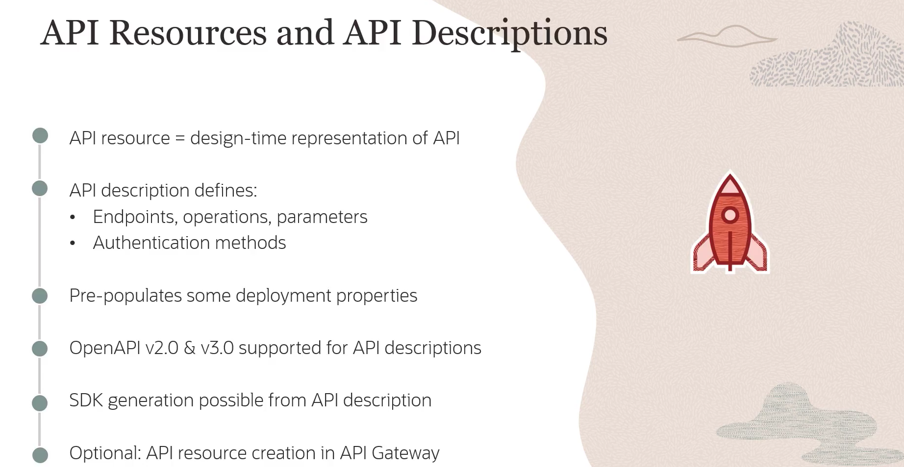
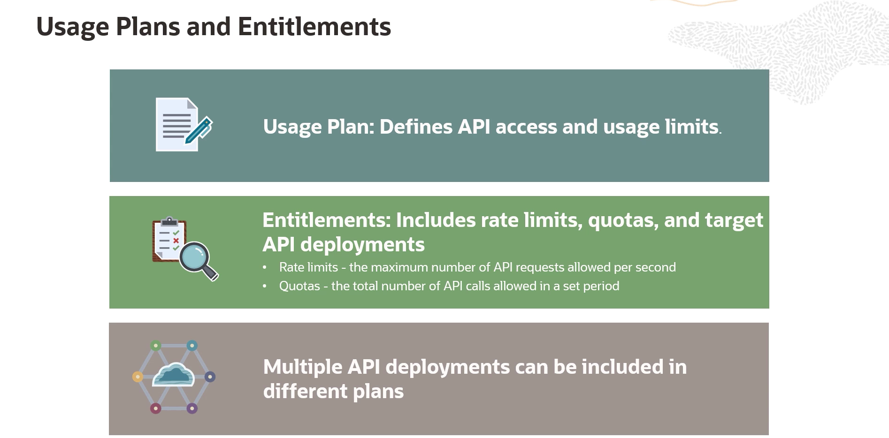
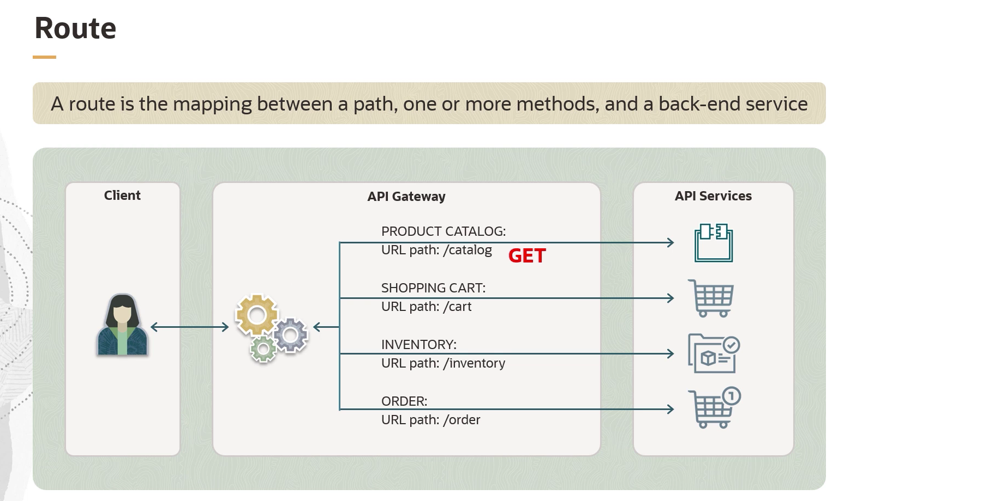
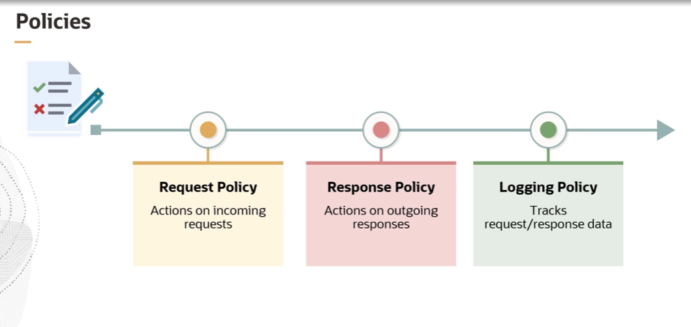

= Visão Geral do API Gateway
:toc:
:icons: font

== O Papel da API na Arquitetura Moderna

== Como Funciona um API Gateway

Um API Gateway atua como um hub central, ou um "controlador de tráfego", para todas as requisições de API direcionadas a uma aplicação. Em vez de os clientes (como aplicações web ou mobile) contatarem diretamente os microsserviços de backend, todas as requisições passam primeiro pelo gateway.

O gateway realiza uma série de tarefas de processamento ("heavy lifting") antes de encaminhar a requisição ao serviço apropriado.

.Responsabilidades Principais de um API Gateway:
*Segurança (Security)*::
Garante que a requisição seja tratada de forma segura, verificando credenciais (autenticação), aplicando políticas de segurança e autorização.

*Roteamento (Routing)*::
Encaminha a requisição para o microsserviço correto. Se necessário, pode converter a requisição para um formato que o serviço de backend entenda.

*Balanceamento de Carga (Load Balancing)*::
Distribui as requisições de forma equilibrada entre as múltiplas instâncias de um serviço para garantir que o sistema continue operando de forma suave e sem sobrecargas.

*Gerenciamento de Cache (Caching)*::
Pode armazenar em cache respostas de requisições frequentes, acelerando o tempo de resposta e reduzindo a carga nos serviços de backend.

*Controle de Taxa (Rate Limiting)*::
Aplica políticas que controlam o número de requisições que um cliente pode fazer em um determinado período, prevenindo que um único cliente sobrecarregue o sistema e garantindo acesso justo aos recursos.

Após realizar estas tarefas, o API Gateway encaminha a requisição ao serviço de backend apropriado, que processa a requisição e retorna a resposta através do mesmo gateway para o cliente.

== Benefícios do Uso de um API Gateway

A implementação de um API Gateway é um pilar em arquiteturas modernas e distribuídas, oferecendo inúmeros benefícios.

*Segurança e Privacidade Aprimoradas*::
Aumenta a segurança ao ocultar detalhes sensíveis da infraestrutura interna, como versionamento e informações de descoberta de serviço (_service discovery_). Centraliza a autenticação, garantindo que apenas usuários autorizados acessem os serviços.

*Gerenciamento Centralizado*::
Fornece um ponto único de entrada para todas as chamadas de API, o que confere visibilidade centralizada do tráfego e simplifica enormemente o gerenciamento e o monitoramento das APIs.

*Melhor Observabilidade*::
Contribui para uma melhor observabilidade das APIs, ajudando a rastrear a performance e o uso, o que é crucial para a manutenção de uma operação estável.

*Aumento de Produtividade e Redução de Latência*::
Ao gerenciar eficientemente as requisições e balancear a carga, o gateway acelera os tempos de resposta. Ao abstrair e otimizar esses processos, a complexidade é reduzida, permitindo que as equipes se concentrem em criar e melhorar a lógica de negócio.

*Simplificação da Entrega de Serviços*::
Garante uma experiência de usuário transparente ao lidar com as complexidades do backend de forma eficaz.

*Facilitação de Faturamento (Billing)*::
Para APIs que são monetizadas, o gateway fornece insights precisos sobre o tráfego e o uso, tornando o faturamento mais transparente e gerenciável.

*Suporte a Aplicações Legadas*::
Atua como uma ponte para sistemas mais antigos que não foram projetados para lidar com um alto volume de chamadas de API, estendendo a funcionalidade desses sistemas e permitindo sua integração em arquiteturas modernas.

== Conceitos Fundamentais de Deploy

Para utilizar o serviço de API Gateway, é essencial compreender os seus componentes e conceitos fundamentais.

*`API Deployment`*::
Para que o API Gateway possa processar requisições, a API deve ser implantada (deployed) no gateway. Este processo cria um recurso de *API Deployment* com propriedades específicas. Múltiplas APIs podem ser implantadas em um único gateway.

*`API Deployment Specification`*::
Ao criar um API Deployment, é necessário definir uma especificação. Esta especificação descreve os recursos de backend, as rotas e os métodos que a API pode executar. Pode ser criada de várias formas:
* Através de diálogos no Console da OCI.
* Utilizando um editor JSON.
* A partir de um arquivo de descrição de API, como um arquivo *OpenAPI*.
* A especificação também pode incluir políticas de requisição e resposta.

image::images/image59.png[alt="Conceitos de Deploy de API", title="Conceitos de Deploy de API"]

== Recursos Opcionais de Design-Time

O serviço oferece recursos opcionais que auxiliam no design e na documentação da API, otimizando o processo de deploy.

*`API Resource`*::
Representa a API durante o tempo de design. Define aspectos como endpoints disponíveis, operações, parâmetros de entrada/saída e métodos de autenticação.

*`API Description`*::
Um arquivo de descrição de API (nos formatos OpenAPI 2.0 ou 3.0) pode ser associado a um API Resource.
[NOTE]
====
Criar um API Resource com uma API Description é *opcional*. No entanto, se fornecido, ele pode pré-popular automaticamente as propriedades da API Deployment Specification, otimizando o processo. A partir do arquivo de descrição, também é possível gerar um SDK para a API.
====

== Componentes da Arquitetura

*`Frontend`*::
O ponto de entrada para as requisições. Pode ser um *frontend público*, que expõe a API através de um IP público, ou um *frontend privado*, que restringe o acesso a uma VCN através de um endpoint privado.

*`Backend`*::
O destino para onde o gateway roteia as requisições. Pode ser um endpoint privado dentro de uma VCN ou um serviço da OCI como o *OCI Functions*, permitindo a execução de aplicações serverless por trás das APIs.

image::images/image61.png[alt="Componentes da Arquitetura", title="Componentes da Arquitetura"]

== Papéis no Ecossistema de APIs

Existem três papéis principais no ciclo de vida de uma API gerenciada pelo gateway.

*`API Provider (Provedor)`*::
O indivíduo ou equipe responsável por projetar, entregar e operar as APIs. Interage com ferramentas como o Console da OCI, CLI e Terraform.

*`API Consumer (Consumidor)`*::
Tipicamente um cliente do provedor de API. Constrói aplicações ou serviços (chamados *API Clients*) que invocam as APIs em tempo de execução.

*`End User (Usuário Final)`*::
O cliente final do consumidor da API. Interage com a API indiretamente através do API Client e geralmente não tem conhecimento da existência da API.

== Planos de Uso e Titularidades (Usage Plans and Entitlements)

O API Gateway permite gerenciar e monitorar o uso de APIs através de Planos de Uso e Assinantes.

=== Usage Plans e Entitlements

* *`Usage Plan`*: Um recurso que agrupa um ou mais *`Entitlements`* (titularidades).
* *`Entitlement`*: Cada titularidade dentro de um plano especifica:
** *Rate Limit:* O número máximo de requisições de API permitidas por segundo.
** *Quota:* O número total de chamadas de API permitidas em um determinado período (de um minuto a um mês).
** *Target API Deployments:** As implantações de API que os assinantes do plano têm o direito de acessar.

=== Subscribers

* *`Subscriber`*: Um recurso que representa um cliente (API Consumer) e define a quais Usage Plans seus API Clients têm acesso. Cada Subscriber inclui:
** Nomes e tokens de clientes para identificar os API Clients.
** Os Usage Plans que eles assinam.

[IMPORTANT]
====
Os tokens de cliente definidos nos Subscribers servem *apenas para fins de medição e relatório* nos Planos de Uso. Eles não são utilizados para autenticação ou autorização de clientes.
====

== Rotas e Políticas

=== Rotas (Routes)

Uma rota conecta um caminho específico (ex: `/catalog`), um ou mais métodos HTTP (ex: `GET`) e um serviço de backend. As rotas são configuradas na API Deployment Specification e organizam o fluxo de requisições e respostas.

=== Políticas (Policies)

Políticas controlam como as requisições e respostas são tratadas pelo gateway.
* *`Request Policy`:* Define ações a serem executadas em uma requisição *antes* de ser enviada ao backend.
* *`Response Policy`:* Define ações a serem executadas em uma resposta *antes* de ser enviada de volta ao cliente.
* *`Logging Policy`:* Captura dados sobre requisições, respostas e seu processamento no gateway.

As políticas podem ser aplicadas globalmente a todas as rotas ou a rotas específicas e servem para:
* Limitar o número de requisições enviadas aos backends.
* Habilitar suporte a CORS.
* Gerenciar autenticação e autorização.
* Validar ou modificar requisições e respostas.
* Garantir que os deployments sejam elegíveis para inclusão em Usage Plans.

[IMPORTANT]
====
As políticas do API Gateway são distintas das políticas de IAM, que são usadas para controlar o acesso aos próprios recursos da OCI.
====