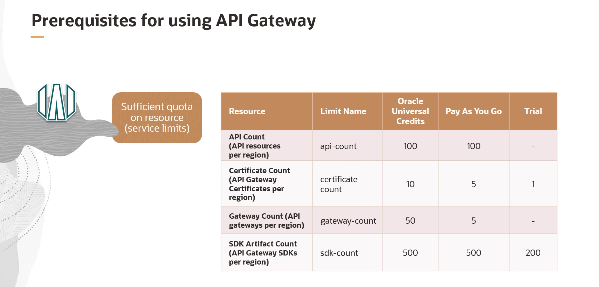

= Pré-requisitos para a Utilização do OCI API Gateway
:toc:
:icons: font

== Visão Geral dos Pré-requisitos

Antes de utilizar o serviço de API Gateway no Oracle Cloud Infrastructure, é fundamental garantir que certos pré-requisitos de infraestrutura e permissões estejam configurados. Estas etapas estabelecem a base para a implantação e o gerenciamento eficaz de APIs.

Os pré-requisitos essenciais são:
* Acesso à Tenancy e Quotas de Serviço
* Estrutura de Compartments
* Configuração de Recursos de Rede
* Definição de Políticas de IAM

== Tenancy e Limites de Serviço (Quotas)

=== Acesso à Tenancy

É necessário ter acesso a uma tenancy do Oracle Cloud Infrastructure que esteja subscrita a uma ou mais regiões onde o serviço de API Gateway está disponível. A disponibilidade por região pode ser verificada na documentação oficial da Oracle.

=== Quotas de Recursos (Service Limits)

A tenancy deve possuir quotas suficientes para os recursos relacionados ao API Gateway. É crucial verificar os limites de serviço para evitar interrupções nos deployments. Caso os limites atuais estejam próximos de serem atingidos, pode ser necessário solicitar um aumento de quota. A documentação oficial detalha os limites específicos para os diferentes tipos de conta (Universal Credits, Pay As You Go, Trial).

== Estrutura de Compartments

É necessário um compartment para conter tanto os recursos de rede quanto os recursos relacionados ao API Gateway (como os próprios gateways e os API deployments).

* *Flexibilidade:* É possível utilizar o mesmo compartment para ambos os tipos de recursos ou criar compartments separados para uma maior segregação.
* *Melhor Prática:* Se múltiplas equipes forem trabalhar com API Gateways, é uma boa prática criar um compartment separado para cada equipe para garantir uma gestão organizada e um controle de acesso granular.

== Configuração de Rede

Uma configuração de rede adequada é um dos pré-requisitos mais críticos para o funcionamento do API Gateway.

=== VCN e Subnets

É necessário um compartimento para possuir os recursos de rede. Se ainda não existir, deve ser criado para gerenciar os componentes necessários, como Virtual Cloud Networks (VCNs), subnets públicas ou privadas, Route Tables, Internet Gateways e Security Lists.

[IMPORTANT]
====
Os API Gateways são sempre criados em *subnets regionais* para garantir alta disponibilidade.
====

=== Regras de Segurança (Security Lists/NSGs)

O API Gateway utiliza a porta *443* para comunicação HTTPS. Por padrão, esta porta não é aberta. É necessário configurar uma *regra de ingresso (ingress rule) do tipo stateful* na Security List ou no Network Security Group (NSG) da subnet para permitir o tráfego de entrada na porta TCP 443.

=== Roteamento e Resolução DNS

A VCN deve ser configurada com as opções de DHCP e regras de rota corretas para permitir que o API Gateway se conecte aos seus serviços de backend.

* *Backends na Internet Pública:*
** A VCN deve ter um *Internet Gateway* anexado.
** As DHCP Options devem estar configuradas para usar o *Internet and VCN Resolver* fornecido pela Oracle para mapear os hostnames públicos especificados na API para seus respectivos endereços IP.

* *Backends em Redes Privadas:*
** Para backends em redes on-premises conectadas via FastConnect ou VPN, é necessário configurar um *resolvedor DNS customizado* nas DHCP Options para a resolução de hostnames privados.

== Políticas de Acesso (IAM)

O grupo de usuários que irá criar e gerenciar os API Gateways deve ter as permissões apropriadas.

* *Grupo de Administradores:* Usuários no grupo `Administrators` da tenancy já possuem todas as permissões necessárias.
* *Grupos Customizados:* Para outros grupos, políticas de IAM devem ser criadas para conceder as permissões necessárias sobre os recursos de rede e de API Gateway.

[IMPORTANT]
====
Além das permissões para os usuários, é crucial definir políticas que permitam ao *próprio serviço de API Gateway* acessar seus recursos de backend, como OCI Functions ou outros serviços, para que as requisições possam ser roteadas corretamente.
====