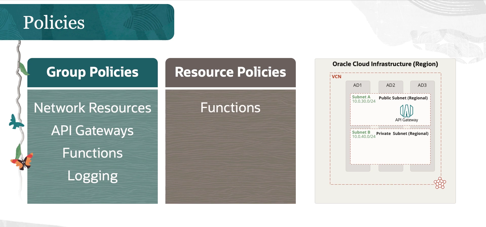

= Guia de Setup da Tenancy para o OCI API Gateway
:toc:
:icons: font

== Visão Geral da Configuração

=== Arquitetura de Alta Disponibilidade

O serviço é projetado com resiliência e failover integrados.
* *Subnets Regionais:* Ao criar um gateway, utiliza-se sempre uma subnet regional.
* *Failover Automático:* O serviço provisiona automaticamente uma instância ativa e uma de failover.
** Em regiões com múltiplos Domínios de Disponibilidade (ADs), as instâncias são criadas em ADs separados.
** Em regiões com um único AD, as instâncias são provisionadas em Domínios de Falha (FDs) separados.
O processo de failover em caso de interrupção é totalmente transparente para o usuário.

== Passo a Passo da Configuração

O processo de configuração da tenancy envolve a criação de recursos de rede e a definição de políticas de IAM.

=== 1. Criação da Virtual Cloud Network (VCN)

O API Gateway opera dentro de uma VCN. A maneira mais simples de criar uma rede é através do "VCN Wizard" no Console da OCI.

.Passos para Criação da VCN via Wizard:
. No Console da OCI, navegue para *Networking -> Virtual Cloud Networks*.
. Certifique-se de estar no *compartment* correto.
. Clique em *Start VCN Wizard* para criar uma VCN com conectividade à internet.
. Forneça um nome para a VCN e confirme o compartment. Os blocos CIDR para a VCN e subnets serão preenchidos automaticamente.
. Clique em *Create* para provisionar os recursos.

O wizard criará um conjunto de recursos de rede essenciais, incluindo uma subnet pública, uma subnet privada, Internet Gateway, NAT Gateway, Service Gateway e as Security Lists e Route Tables associadas.

=== 2. Configuração da Security List

Um passo crítico e frequentemente esquecido é a configuração da Security List para permitir o tráfego de entrada para o gateway. A OCI segue um modelo seguro por padrão, o que significa que todas as portas são bloqueadas até que sejam explicitamente liberadas.

[IMPORTANT]
====
Se a regra de ingresso (ingress rule) para a porta 443 não for adicionada, o API Gateway não responderá a requisições externas, aparentando não estar funcional.
====

.Configurando a Regra de Ingresso para HTTPS:
. Na página de detalhes da VCN criada, acesse a *Security List* associada à subnet onde o gateway será implantado (ex: a subnet pública).
. Clique em *Add Ingress Rules*.
. Configure a regra com os seguintes parâmetros:
** *Stateless:* Deixe desmarcado para uma regra _stateful_.
** *Source Type:* `CIDR`
** *Source CIDR:* `0.0.0.0/0` (para permitir tráfego da internet).
** *IP Protocol:* `TCP`
** *Destination Port Range:* `443`
** *Description:* Adicione uma descrição clara, como "HTTPS traffic for API Gateway".
. Clique em *Add Ingress Rule*.

=== 3. Configuração das Políticas de IAM

O acesso na OCI segue o princípio do menor privilégio. As permissões devem ser concedidas explicitamente através de políticas de IAM aplicadas a grupos de usuários.

==== Políticas para Acesso de Recurso a Recurso

Para cenários de APIs serverless, onde o API Gateway precisa invocar OCI Functions, uma política deve ser criada para permitir essa interação.

.Exemplo de Política: Gateway invocando Functions
[source,text]
----
Allow any-user to use functions-family in compartment <compartment_name> where ALL {request.principal.type = 'ApiGateway', request.resource.compartment.id = '<gateway_compartment_ocid>'}
----
* *Explicação:* Esta política permite que *qualquer usuário* (incluindo o próprio serviço) utilize recursos de `functions-family` (invoque funções) no compartment especificado, *apenas se* a requisição for originada por um principal do tipo `ApiGateway` que reside no compartment do gateway. Isso concede permissão ao gateway, e não a usuários humanos.

==== Políticas para Acesso de Usuários (Grupos)

Os usuários que desenvolvem e gerenciam APIs devem ser adicionados a grupos, e as políticas devem ser aplicadas a esses grupos. A prática recomendada é criar políticas distintas para diferentes ambientes (ex: Desenvolvimento, QA, Produção).

.Exemplo de Segmentação de Permissões:
* *Desenvolvimento:* O grupo `API-Developers` pode ter permissão para `manage` (gerenciar) todos os recursos de rede, functions e api-gateway dentro do compartment de Desenvolvimento.
* *QA (Quality Assurance):* No compartment de QA, o grupo `API-Testers` pode ter permissão para `manage` os recursos, enquanto o grupo `API-Developers` pode ter apenas permissão para `read` (visualizar), impedindo alterações diretas no ambiente de testes.

=== 4. Criação do Recurso de API Gateway

Com a rede e as políticas configuradas, o último passo é criar o gateway.

.Passos para Criação do Gateway:
. No Console da OCI, navegue para *Developer Services -> API Management -> Gateways*.
. Certifique-se de estar no *compartment* correto.
. Clique em *Create Gateway*.
. Preencha os detalhes:
** *Name:* Um nome para o gateway.
** *Type:* `Public` ou `Private`. Selecione `Public` para obter um endereço acessível pela internet.
** *Compartment:* O compartment onde o gateway será criado.
** *Virtual Cloud Network:* A VCN criada anteriormente.
** *Subnet:* A subnet regional (pública ou privada) onde o gateway será implantado.
. Clique em *Create*.

Após o provisionamento, o gateway estará pronto para receber API deployments.
