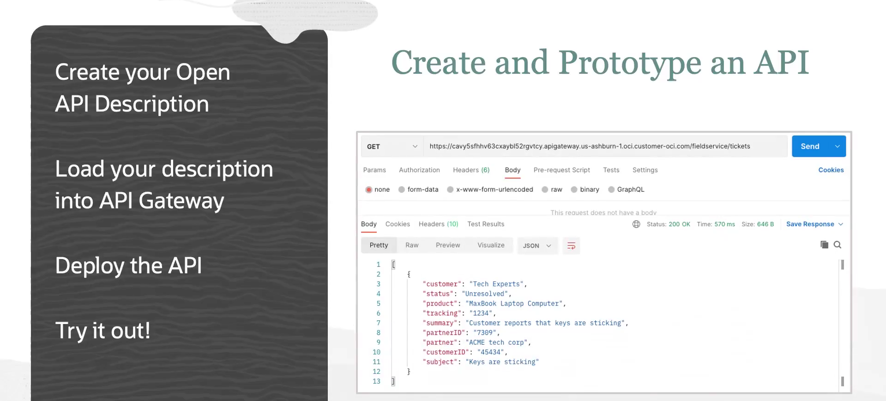

= Prototipagem de APIs no OCI Gateway com Stock Responses
:toc:
:icons: font

== O Fluxo de Trabalho de Prototipagem

Um elemento chave na criação de APIs é a capacidade de prototipar. O OCI API Gateway facilita este processo através do uso de descrições de API e um tipo de backend chamado *Stock Response* (resposta mock/estática).

Este fluxo de trabalho permite que uma API seja projetada e disponibilizada para consumo antes mesmo que o serviço de backend real seja implementado.

.Etapas do Processo de Prototipagem:
. *Criar uma Descrição OpenAPI:*
Define-se o contrato da API (endpoints, métodos, parâmetros, exemplos de resposta) em um arquivo de especificação OpenAPI (anteriormente conhecido como Swagger).

. *Carregar a Descrição no API Gateway:*
O arquivo de descrição é carregado no serviço de API Gateway para criar um recurso do tipo "API".

. *Implantar a API como uma _Stock Response_:*
O API Gateway utiliza os exemplos (`example`) contidos na descrição OpenAPI para criar automaticamente um deployment que retorna uma resposta estática (mock).

. *Testar o Protótipo:*
O endpoint do gateway se torna ativo e pode ser testado por clientes de API, validando o contrato e o comportamento esperado.

[NOTE]
====
.Benefício Principal: Desenvolvimento Paralelo
Este método é extremamente útil para permitir que equipes de frontend e backend trabalhem em paralelo. A equipe de frontend pode desenvolver suas aplicações consumindo o endpoint mock do API Gateway, enquanto a equipe de backend implementa o serviço real. Uma vez que o backend esteja pronto, o deployment no gateway é simplesmente atualizado para apontar para o novo serviço, sem alterar o contrato da API.
====

== Passo a Passo da Implementação

A seguir, são detalhados os passos para criar, implantar e testar uma API prototipada no OCI API Gateway.

=== 1. Design da Descrição OpenAPI

O primeiro passo é criar a descrição da API utilizando a especificação OpenAPI (versões 2.0 e 3.0 são suportadas).
* *Ferramentas:* Podem ser utilizadas diversas ferramentas, como o *Swagger Editor*, para criar a definição em formato YAML ou JSON.
* *Conteúdo:* O arquivo deve conter a definição dos serviços, como os paths (ex: `/tickets`), os métodos HTTP (`GET`, `POST`), os parâmetros requeridos e, crucialmente, os dados de exemplo (`example`) para as respostas.

=== 2. Criação do Recurso "API" no Console

O arquivo de descrição OpenAPI é utilizado para criar um recurso "API" no serviço de API Gateway.
. No Console da OCI, navegue para *Developer Services -> API Management -> APIs*.
. Selecione o compartment desejado e clique em *Create API*.
. Escolha a opção para carregar um novo arquivo (`Upload an existing API file`).
. Forneça um nome para a API e selecione o arquivo de descrição OpenAPI.
. Ao criar, o API Gateway realiza duas ações:
** Valida o arquivo para garantir que ele está sintaticamente correto.
** Gera uma especificação de deployment pré-populada a partir da descrição.

=== 3. Criação do API Deployment

Com o recurso "API" criado, o próximo passo é implantá-lo em um gateway.
. Na página de detalhes do recurso "API", clique em *Deploy*.
. Configure o deployment:
** *Gateway:* Selecione o gateway de destino.
** *Name:* Dê um nome ao deployment.
** *Path Prefix:* Defina um prefixo para o caminho da API (ex: `/fs/v1`).
** *Policies (Opcional):* Configure políticas. Para testes com clientes web, uma política de CORS pode ser necessária.
[source,text]
----
// Exemplo de política CORS para permitir todos os testes
Allowed Origins: *
Allowed Methods: *
Allowed Headers: X-API-Key (ou outros headers customizados)
----
** *Routes:* Na tela seguinte, revise as rotas. O API Gateway automaticamente criará as rotas a partir do arquivo OpenAPI e as configurará com um backend do tipo *Stock Response*, utilizando os dados de `example` da especificação como corpo da resposta.
. Clique em *Create* para iniciar o processo de deployment.

=== 4. Teste do Endpoint Mock

Após o deployment estar no estado "Active" (geralmente em 30 segundos ou menos), o endpoint estará disponível para testes.
* *Endpoint:* O endpoint completo pode ser copiado da página de detalhes do deployment.
* *Ferramentas de Teste:* O endpoint pode ser invocado por qualquer cliente de API, como:
** A interface de teste do Swagger Editor/UI (após popular os campos `host` e `basePath` com o endpoint do gateway).
** Um comando `curl` no terminal.
** Clientes de API como Postman.

.Exemplo de teste com `curl`:
[source,bash]
----
# O X-API-Key é incluído para satisfazer a definição da API, mas não é validado neste estágio
curl -X GET "https://<gateway-endpoint>/fs/v1/tickets" -H "X-API-Key: 12345"
----

Para esse conteúdo eu acho interessante voltar no curso e rever todo o processo de criação da VCN e delegação das polices, além dos testes de rede e segurança (para o API Gateway) - módulo 5 "Creaing an API".