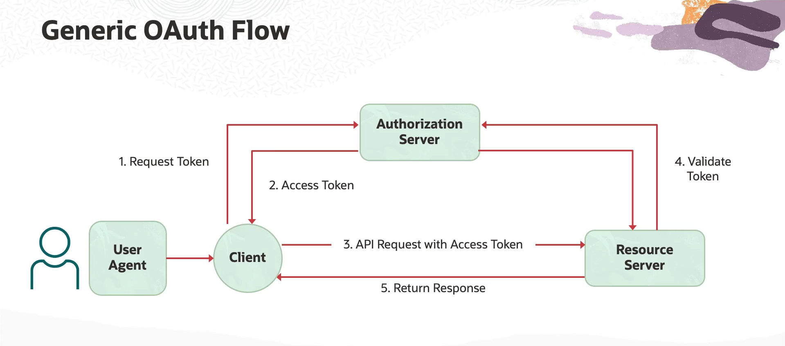

= Autorização de Requisições no OCI API Gateway com JWT e OAuth 2.0
:toc:
:icons: font

== O Fluxo de Autorização OAuth 2.0

A autorização de requisições em APIs modernas frequentemente utiliza o fluxo padrão do OAuth 2.0, que envolve a validação de tokens de acesso, como os JSON Web Tokens (JWT).

.Etapas do Fluxo de Autorização:
. O *Cliente* (ex: uma aplicação web ou mobile) solicita um token de acesso a um *Servidor de Autorização* (ex: Oracle Identity Cloud Service - IDCS, Auth0, Okta).
. O Servidor de Autorização, após validar as credenciais do cliente (e/ou do usuário), retorna um *Token de Acesso* (JWT).
. O Cliente envia a requisição à API, incluindo o Token de Acesso (geralmente no header `Authorization`).
. O *API Gateway* (atuando como Servidor de Recurso) intercepta a requisição. Ele valida a legitimidade do token (assinatura, emissor, público) e verifica se o token contém os _scopes_ (permissões) necessários para a operação solicitada.
. Se a validação for bem-sucedida, o gateway encaminha a requisição ao serviço de backend, que a processa e retorna a resposta ao cliente através do gateway.

== Passo a Passo da Configuração no OCI API Gateway

A seguir, são detalhados os passos para configurar a autorização baseada em JWT em um API Deployment existente no OCI API Gateway.

=== 1. Adicionar uma Política de Autenticação

A configuração da autorização começa com a definição de uma política de autenticação no nível do API Deployment.
. No Console da OCI, navegue para *Developer Services -> API Management -> Gateways*.
. Selecione o gateway desejado e, em seguida, o *Deployment* a ser protegido.
. Clique em *Edit* e, no menu de navegação esquerdo, selecione *Authentication* sob "API Request Policies".

O serviço oferece duas opções de autenticação:
* *JWT Validation:* Uma política nativa para validar tokens JWT padrão.
* *Custom Function:* Permite o uso de uma OCI Function como um autorizador customizado, ideal para validar qualquer outro tipo de token ou lógica de negócio.

Para este guia, será utilizada a opção *JWT Validation*.

=== 2. Configurar a Validação de JWT

A configuração da política de validação de JWT requer a especificação de como o token será recebido e como ele será validado.

* *Localização do Token:*
** *Token Location:* `Header`
** *Header Name:* `Authorization`
** *Authentication Scheme:* `Bearer` (padrão para tokens JWT)

* *Validação do Token:*
** *`Allowed Issuers (Emissores Permitidos)`:* O valor do campo `iss` (issuer) dentro do JWT. Este valor deve corresponder exatamente ao emissor do token.
** *`Allowed Audiences (Públicos Permitidos)`:* O valor do campo `aud` (audience) dentro do JWT. A audiência representa o destinatário pretendido do token (neste caso, a API que está sendo protegida).
** *`Public Keys (Chaves Públicas)`:* Para validar a assinatura do token e garantir que ele não foi adulterado, o gateway precisa da chave pública do Servidor de Autorização. A melhor prática é usar a opção *Remote JWKS* e fornecer a URI do _JSON Web Key Set_ (JWKS) do provedor de identidade. O gateway buscará a chave pública dinamicamente a partir desta URI.

[TIP]
====
Ferramentas online como `jwt.io` podem ser usadas para decodificar um token JWT de exemplo e extrair facilmente os valores das claims `iss` e `aud`.
====

=== 3. Configurar a Autorização da Rota

Após configurar a autenticação no nível do deployment, é necessário definir as regras de autorização para cada rota específica.

. Na mesma tela de edição do Deployment, navegue para *Routes*.
. Selecione a rota que deseja proteger (ex: `GET /tickets`) e clique em *Edit*.
. Na seção *Route Request Policies*, uma opção de *Authorization* estará disponível.
. Selecione o tipo de autorização. As opções incluem:
** *`Anonymous`*: Nenhum token é necessário.
** *`Authentication Only`*: Um token válido é necessário, mas nenhum _scope_ específico é verificado.
** *`Any of the allowed scopes`*: Um token válido é necessário *e* ele deve conter pelo menos um dos _scopes_ especificados.
. Para um controle granular, selecione *`Any of the allowed scopes`* e adicione os scopes necessários para aquela rota (ex: `fieldservice:read`).

=== 4. Testar o Endpoint Seguro

Após salvar as alterações, o deployment será atualizado e a política entrará em vigor.

. *Requisição sem Token:*
** Uma requisição ao endpoint sem um token de autorização resultará em um erro `401 Unauthorized`.

. *Requisição com Token Válido:*
** Uma requisição ao endpoint que inclua um `Authorization: Bearer <token>` válido, e cujo token contenha o scope necessário (`fieldservice:read`), será bem-sucedida e retornará a resposta do backend.

.Exemplo de requisição bem-sucedida com `curl`:
[source,bash]
----
curl -X GET "https://<gateway-endpoint>/fs/v1/tickets" \
-H "Authorization: Bearer <seu-jwt-valido-aqui>"
----

[IMPORTANT]
====
Se um cliente autenticado com um token válido tentar acessar uma rota para a qual ele não possui o scope necessário (ex: tentar usar um token com scope de `read` em uma rota que exige `write`), o gateway rejeitará a requisição, garantindo a aplicação do princípio do menor privilégio.
====

=== Anotações Adicionais

Esse módulo 5 inteiro está sendo praticamente uma demo de como montar todo o fluxo de uma API, desde a criação do gateway, até a autorização de requisições, passando por todas as etapas de teste e validação. Sinceramente nem vale tanto a pena anotar as coisas desse módulo, visto que a prática vale muito mais que essas anotações. De qualquer forma, estou anotando tudo para manter um track das coisas que estou fazendo, mas acho válido cada um que for tentar a prova, fazer manualmente todos os passos das demos.

