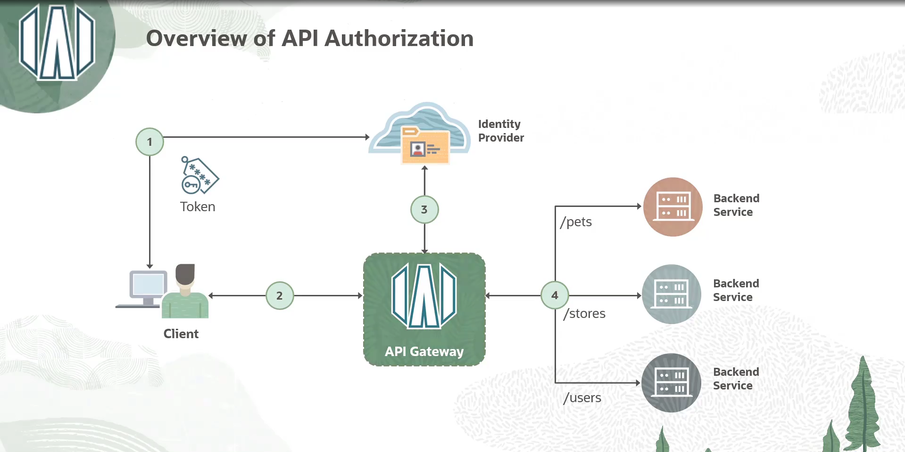
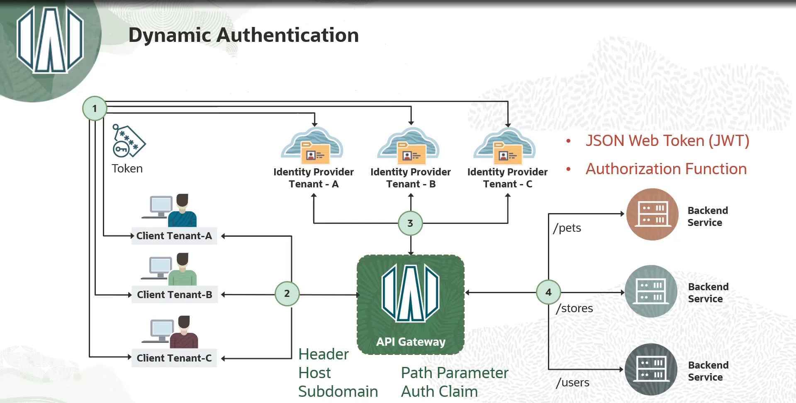
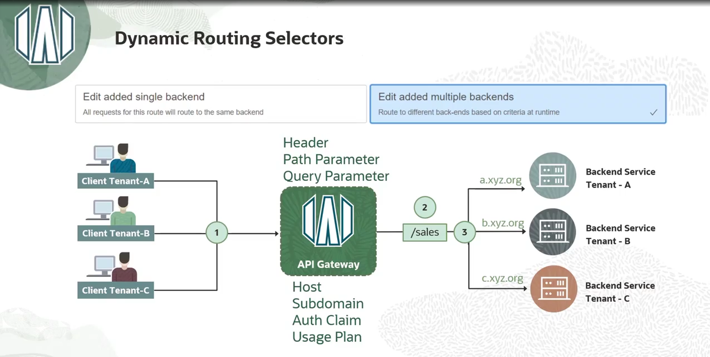

= Autenticação Dinâmica no OCI API Gateway para Arquiteturas Multi-Tenant
:toc:
:icons: font

== O Modelo Padrão: Autenticação com Provedor Único

O padrão básico de autenticação e autorização com o API Gateway segue um fluxo de três etapas:

. O *Cliente* se autentica com um *Provedor de Identidade* (ex: OCI IAM, Okta) e recebe um token de autorização.
. O *Cliente* invoca a API exposta pelo gateway, apresentando o token.
. O *API Gateway* valida o token com o Provedor de Identidade. Se o token for válido e contiver os _scopes_ apropriados, o gateway encaminha a requisição para o serviço de backend.

[IMPORTANT]
====
Neste modelo, a relação de confiança entre o gateway e o provedor de identidade é configurada no nível do *API Deployment*. Isso significa que cada deployment está associado a um único provedor de identidade. Este modelo funciona bem para a maioria dos casos de uso, onde todos os clientes são provisionados no mesmo provedor.
====

== A Solução para Multi-Tenancy: Autenticação Dinâmica

O desafio surge em cenários multi-tenant, onde cada inquilino (_tenant_) pode utilizar um provedor de identidade separado. A solução para este cenário é a *autenticação dinâmica*.

=== O Conceito

Com a autenticação dinâmica, o gateway pode selecionar o provedor de identidade apropriado em tempo de execução, com base em informações da requisição do cliente. O fluxo é similar, mas com uma etapa adicional de decisão no gateway:

. O Cliente se autentica com seu provedor de identidade escolhido e recebe um token.
. O Cliente invoca a API com o token.
. O Gateway recebe a requisição, realiza uma consulta com base em um elemento da requisição para determinar qual provedor de identidade usar, e então valida o token com o provedor selecionado.

[IMPORTANT]
====
Neste modelo, a relação de confiança entre o gateway e o provedor de identidade é configurada no nível do *API Deployment*. Isso significa que cada deployment está associado a um único provedor de identidade. Este modelo funciona bem para a maioria dos casos de uso, onde todos os clientes são provisionados no mesmo provedor.
====

=== Chaves de Seleção (Selection Keys)

O gateway pode usar vários elementos da requisição para selecionar a política de autenticação correta:
* *Request Header* (ex: `X-Tenant-ID`)
* *Host* ou Subdomínio
* *Parâmetro de Caminho* (Path Parameter)
* *Parâmetro de Consulta* (Query Parameter)
* *Claim do Token de Autorização*

=== Casos de Uso

Além de cenários multi-tenant, esta funcionalidade é útil para outros casos de uso, como a migração de usuários entre provedores de identidade (ex: usuários "trial" em um provedor e usuários "pagos" em outro), sem a necessidade de alterar a API.

== Configuração no Console da OCI

A configuração da autenticação dinâmica é realizada na página de edição de um API Deployment, na seção *Authentication*.

. *Seleção do Tipo de Autenticação:*
** O usuário escolhe entre *`Single Authentication`* (o modelo padrão) e *`Dynamic Authentication`* (o modelo multi-provedor).

. *Configurando a Autenticação Dinâmica:*
.. *`Selecionar a Chave de Seleção (Selector):`*
+
Primeiro, escolhe-se o elemento da requisição que será usado como chave para selecionar a política (ex: `Host`, `Header`, `Path Parameter`).
+
.. *`Definir as Políticas de Autenticação:`*
+
Em seguida, uma ou mais políticas de autenticação são definidas. Para cada política, configura-se:
+
*** *Nome da Política:* Um identificador para a regra.
*** *Valores Correspondentes (Matching Values):* Uma lista de valores da chave de seleção que acionará esta política (ex: uma lista de hostnames para o seletor `Host`).
*** *Tipo de Autenticação:* Para cada política, escolhe-se o método de validação, que pode ser *`JSON Web Token (JWT)`* ou uma *`Authorizer Function`*.
*** *Configuração Detalhada:* A configuração para o tipo de autenticação escolhido (JWT ou Function) é preenchida, incluindo emissores, públicos, chaves de verificação (para JWT) ou a função autorizadora específica.

[NOTE]
====
.Exemplo de Configuração
Um único API Deployment pode ser configurado com `Host` como seletor. Em seguida, podem ser criadas quatro políticas de autenticação diferentes:

* Uma política para `tenant-a.api.com`, que valida tokens JWT de um provedor *Okta*.
* Uma política para `tenant-b.api.com`, que valida tokens JWT de um provedor *IDCS*.
* Uma política para `tenant-c.api.com`, que utiliza uma *Authorizer Function* customizada.
* Uma política para `internal.api.com`, que também valida tokens JWT, mas de um provedor *Microsoft Active Directory*.
====

Esta abordagem oferece máxima flexibilidade, permitindo que diferentes inquilinos usem diferentes mecanismos de autenticação (JWT ou função customizada) dentro do mesmo API Deployment.