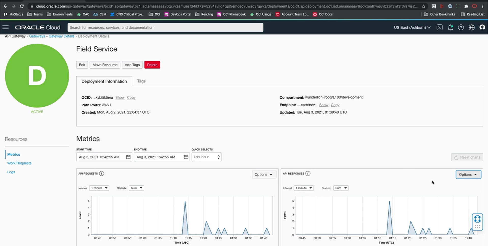
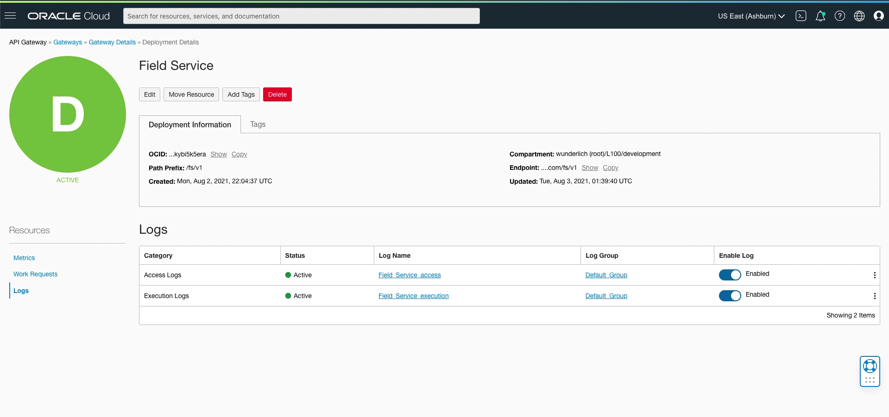
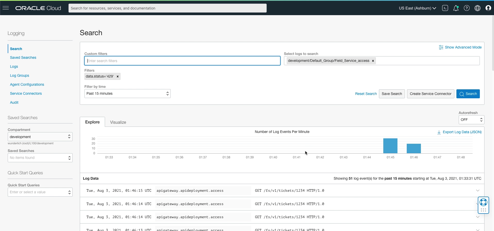

= Monitoramento do API Gateway com Métricas e Logs
:toc:
:icons: font

== Visão Geral da Observabilidade

O OCI API Gateway oferece um conjunto robusto de ferramentas de observabilidade, permitindo o monitoramento de APIs através de três serviços principais:
* *Metrics:* Para visualização de dados de performance em tempo real.
* *Logging Service:* Para acesso a logs detalhados de acesso e execução.
* *Logging Analytics:* Para análises avançadas e criação de dashboards holísticos.

== Métricas Automáticas

Como um componente central da plataforma OCI, o API Gateway se integra nativamente com o serviço de métricas, que é habilitado por padrão.

.Características Principais:
* *Níveis de Granularidade:*
** As métricas podem ser visualizadas no nível agregado do *Gateway* ou de forma isolada para cada *API Deployment*.

* *Integração com a Plataforma:*
** Utiliza o sistema de métricas comum da OCI, fornecendo uma experiência consistente com outros serviços.

* *Análise Avançada:*
** As métricas podem ser exploradas em detalhe no *Metrics Explorer*, permitindo a criação de relatórios e alarmes customizados para monitorar a saúde e a performance das APIs.

== OCI Logging Service

Para uma análise mais profunda do que ocorre em cada requisição, o serviço de Logging da OCI pode ser habilitado em cada API Deployment.

=== Habilitação e Tipos de Log

A habilitação é feita diretamente na página de configuração de um API Deployment. É possível habilitar dois tipos de logs:

*`Access Logs`*::
Registram informações sobre a requisição do cliente à medida que ela chega ao gateway. Contêm dados como o endereço IP de origem, o ID da requisição e o status inicial.

*`Execution Logs`*::
Fornecem detalhes sobre como a requisição foi processada internamente, incluindo a interação com o serviço de backend e a resposta obtida. São essenciais para depurar problemas de integração.

=== Análise de Logs

Uma vez habilitados, os logs são enviados para o OCI Logging Service, onde podem ser consultados e analisados.
* *Visualização:* A interface do Logging Service permite visualizar os logs em tempo real.
* *Pesquisa e Filtragem:* A funcionalidade de *Log Search* permite construir consultas para filtrar logs e encontrar informações específicas, como todas as requisições que resultaram em um determinado código de status.

.Exemplo de Consulta no Log Search:
[source,text]
----
# Busca por todas as requisições que foram rejeitadas por rate limiting (status 429)
search "compartment-ocid/log-ocid" | where data.status = '429'
----

== OCI Logging Analytics para Análise Avançada

Para casos de uso mais avançados que exigem correlação de dados e visualizações ricas, o OCI Logging Analytics é a ferramenta recomendada.

=== Visão Holística e Dashboards

O Logging Analytics permite a ingestão de logs de múltiplas fontes (API Gateway, OCI Functions, VCN Flow Logs, Databases, etc.) e a criação de dashboards holísticos que correlacionam esses dados. Isso proporciona uma visão completa do comportamento da aplicação, não apenas da camada de API.

=== Capacidades de Análise

* *Visualizações Ricas:*
** Permite a criação de dashboards com diversos tipos de widgets, como gráficos de pizza, tabelas e _tree maps_, para visualizar a distribuição de dados de forma intuitiva.

* *Agrupamento e Filtragem Dinâmicos:*
** Facilita a análise interativa dos dados, permitindo agrupar os resultados por diferentes campos (como `log source`, `status`, nome da API) e aplicar filtros dinâmicos.

* *Drill-Down para Investigação:*
** Oferece a capacidade de aprofundar a análise (_drill-down_) em conjuntos de dados específicos. Por exemplo, é possível visualizar um gráfico de todos os status de resposta e, com um clique, investigar apenas os logs correspondentes a um status de erro específico (como `405 - Method Not Allowed`) para identificar a causa raiz do problema.
