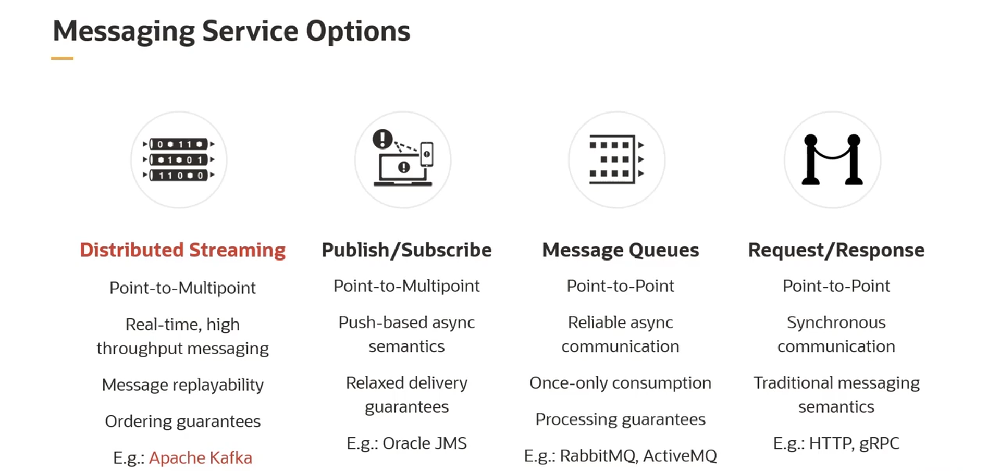
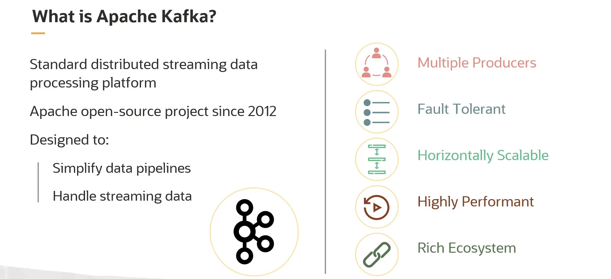
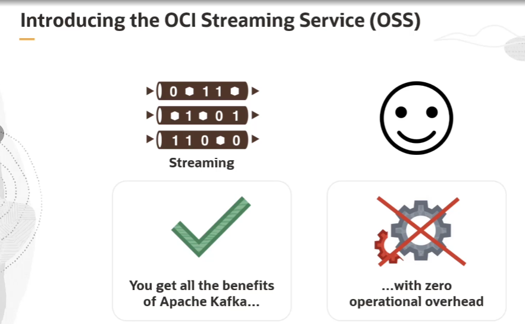
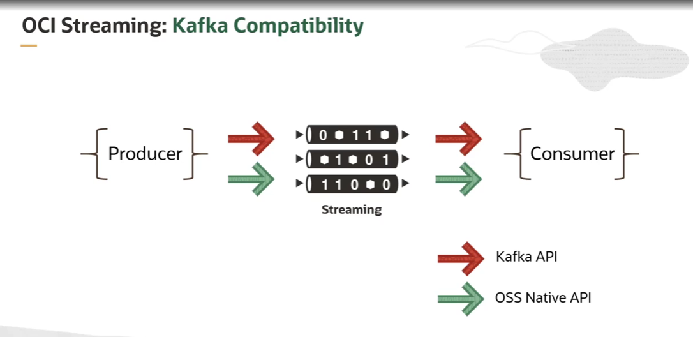
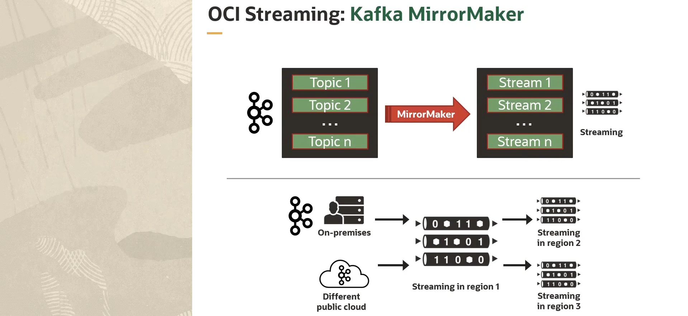

= Visão Geral do OCI Streaming Service
:toc:
:icons: font

== A Necessidade de Mensageria Assíncrona e em Tempo Real

A natureza distribuída das aplicações em nuvem requer uma infraestrutura de mensageria que conecte seus componentes e serviços de forma fracamente acoplada (_loosely coupled_) para maximizar a escalabilidade. Como resultado, modelos de mensageria assíncrona são amplamente utilizados em detrimento de comunicações síncronas tradicionais do tipo requisição-resposta.

=== Padrões de Mensageria

*`Queue (Fila)`*::
Opera como um buffer onde uma mensagem é consumida por um único receptor, mesmo que múltiplos receptores estejam conectados à fila.

*`Topic (Tópico)`*::
Funciona como uma estação de transmissão (broadcast). Mensagens publicadas em um tópico são imediatamente recebidas por todos os seus assinantes.

*`Data Streaming`*::
Uma solução mais avançada para o processamento de dados distribuídos em tempo real. É ideal para sistemas que exigem processamento imediato, como em detecção de fraude em transações financeiras, telemetria de dispositivos IoT e soluções de manutenção em tempo real.

== Apache Kafka e seus Desafios Operacionais

=== Kafka como Padrão de Mercado

O *Apache Kafka* emergiu como o padrão de fato para plataformas de processamento de dados em streaming. Originalmente desenvolvido no LinkedIn em 2011, hoje é uma plataforma completa que permite:
* Armazenar de forma redundante enormes quantidades de dados.
* Suportar uma altíssima taxa de transferência (throughput), na casa de milhões de mensagens por segundo.
* Realizar processamento de stream em tempo real sobre os dados que trafegam pela plataforma.

=== Desafios de uma Instalação Auto-Gerenciada

Apesar de seu poder, a implantação e operação de um cluster Kafka, mesmo em um provedor de nuvem, apresentam desafios operacionais e de gerenciamento significativos:
* Balanceamento de carga de tópicos entre os nós.
* Aplicação de patches nos sistemas operacionais.
* Gerenciamento do Zookeeper (um componente de coordenação essencial para o Kafka).
* Manutenção da alta disponibilidade e replicação.
* Garantia de criptografia de dados em trânsito e em repouso.
* Manuseio de autenticação e autorização de clientes.

== OCI Streaming Service (OSS) como Solução Gerenciada

=== Definição

O *OCI Streaming Service (OSS)* é uma plataforma de streaming de dados distribuída, *serverless*, de nível empresarial e baseada em Kafka. Essencialmente, oferece todos os benefícios do Apache Kafka sem a sobrecarga de gerenciamento.

=== Benefícios Principais

*`Serverless e Facilidade de Operação`*::
Elimina a necessidade de manutenção e aplicação de patches de software. O serviço se integra diretamente com o OCI Monitoring e outros serviços core para facilitar as operações.

*`Custo-Benefício (Pay-per-use)`*::
O faturamento é baseado apenas no uso (dados transferidos), sem cobrança por capacidade provisionada ou custo adicional por transferência de dados.

*`Escalabilidade Elástica e Tolerância a Falhas`*::
A plataforma escala horizontalmente (para cima e para baixo) sob demanda. Possui tolerância a falhas integrada, replicando os dados entre os Domínios de Disponibilidade (Availability Domains) dentro de uma região da OCI.

== Compatibilidade com o Ecossistema Kafka

A principal vantagem do OSS é sua alta compatibilidade com o ecossistema Kafka, oferecendo o melhor dos dois mundos: o poder do Kafka com a simplicidade de um serviço gerenciado.

=== Compatibilidade de API

O OSS é compatível com a maioria das APIs do Kafka. Isso permite que aplicações já existentes, que utilizam clientes Kafka padrão, possam enviar e receber mensagens do serviço de streaming sem a necessidade de reescrever o código. Usuários atuais do Apache Kafka podem, assim, descarregar a complexidade de manter sua própria infraestrutura de Zookeeper e Kafka.

=== Integração com Kafka MirrorMaker

Para estender ainda mais a interoperabilidade, é possível utilizar a ferramenta *Kafka MirrorMaker*. O MirrorMaker permite consumir registros de um tópico em um cluster Kafka de origem e copiá-los para um stream em um cluster de destino no OCI Streaming.

.Casos de Uso do MirrorMaker:
. *Migração para a Nuvem:* Espelhar dados de clusters Kafka on-premises ou em outras nuvens públicas para o OSS.
. *Recuperação de Desastres (DR):* Habilitar a recuperação de desastres entre regiões, replicando dados de streaming de uma região da OCI para outra.

