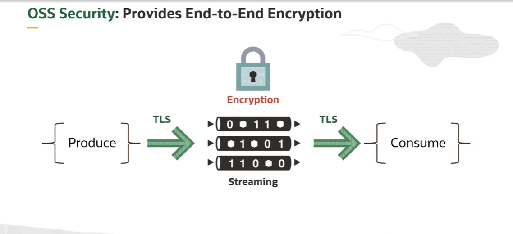
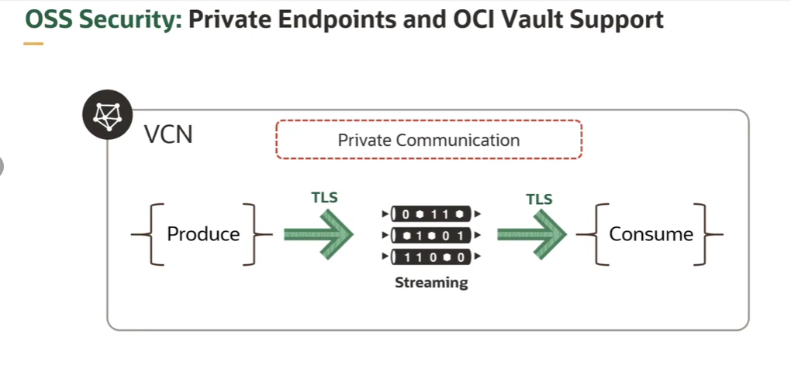
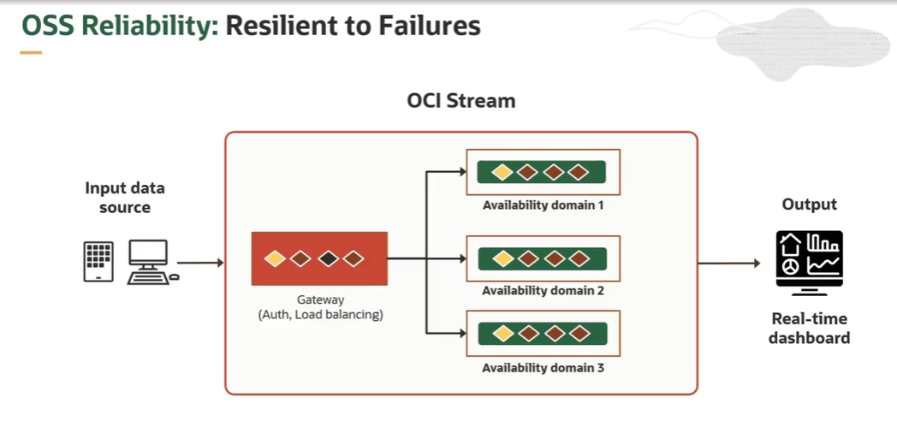
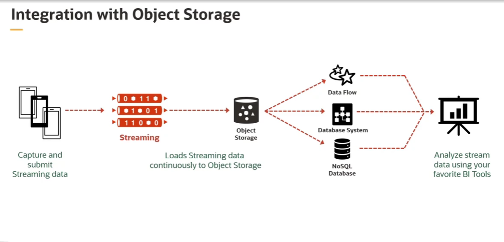
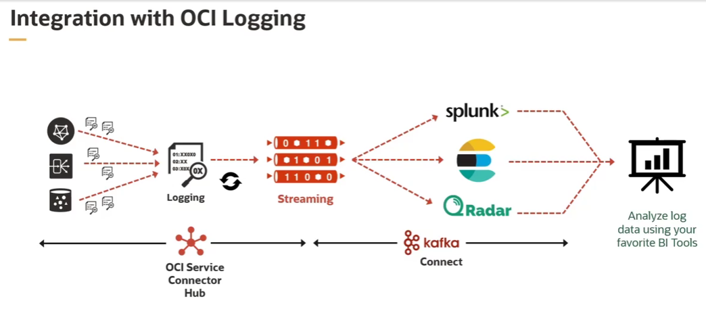
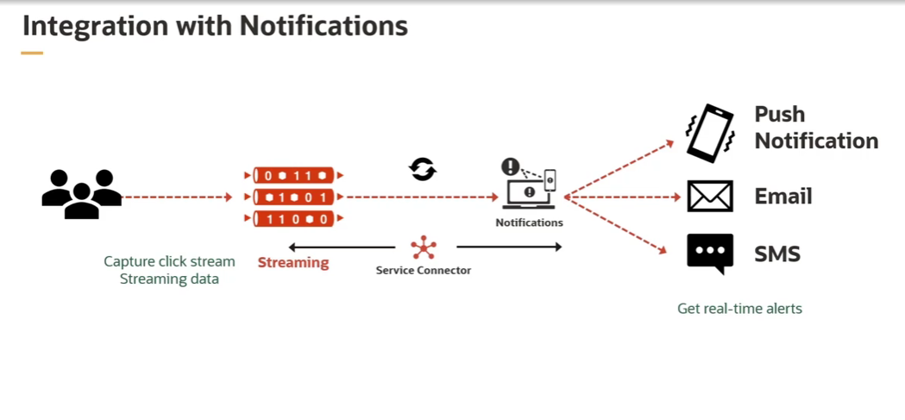
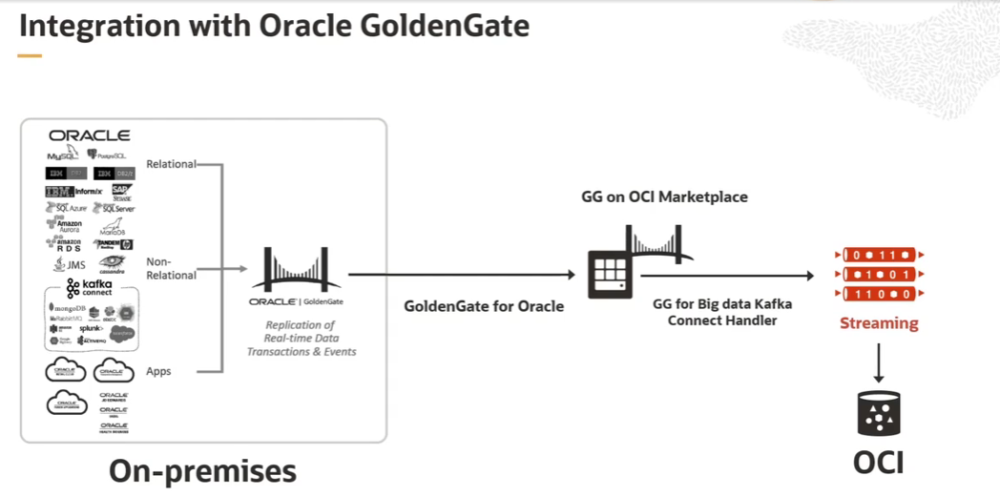

= OCI Streaming Service: Segurança, Confiabilidade e Integrações
:toc:
:icons: font

== Segurança (Security)

O OCI Streaming Service (OSS) é projetado com múltiplas camadas de segurança para proteger os dados em streaming.

.Funcionalidades de Segurança:
* *Criptografia Padrão:*
** Os dados são sempre criptografados, tanto em trânsito quanto em repouso, dentro do OSS. A Oracle gerencia este processo por padrão.

* *Gerenciamento de Chaves com OCI Vault (BYOK):*
** Clientes podem gerenciar suas próprias chaves de criptografia simétricas (AES) através do serviço OCI Vault. As chaves são gerenciadas no nível do _stream pool_, permitindo o uso de chaves diferentes para cada agrupamento lógico de streams.

* *Controle de Acesso com IAM:*
** A integração total com o OCI Identity and Access Management (IAM) permite um controle de acesso granular. Políticas podem ser definidas para controlar desde o provisionamento de streams e partições até quem pode produzir e consumir dados.

* *Autenticação para Clientes Kafka:*
** Usuários de Kafka podem utilizar os endpoints Kafka do OSS e se autenticar com *SASL/PLAIN*, utilizando os Tokens de Autenticação (Auth Tokens) da OCI como senha.

* *Acesso Privado (Private Endpoints):*
** É possível habilitar um endpoint privado para um _stream pool_. Isso garante que todo o tráfego de streaming seja roteado através da rede privada da OCI, sem atravessar a internet pública.

== Confiabilidade e Durabilidade (Reliability and Durability)

Para garantir a durabilidade dos dados e a alta disponibilidade do serviço, o OSS replica os dados de forma síncrona através de Domínios de Disponibilidade (Availability Domains) geograficamente distribuídos dentro de uma região. Esta arquitetura fornece tolerância a falhas e maior durabilidade de forma automática.

[NOTE]
====
O OCI Streaming Service oferece um Acordo de Nível de Serviço (SLA) que garante *99.95%* de disponibilidade.
====

== Capacidades de Integração

O OSS é profundamente integrado com o ecossistema OCI e com ferramentas de terceiros, permitindo a construção de pipelines de dados complexos.

=== Integração com Serviços Nativos da OCI

* *Processamento Serverless em Tempo Real com Oracle Functions:*
** Permite construir pipelines de processamento de dados em tempo real, onde cada partição de um stream pode acionar execuções paralelas de uma função.

* *Carregamento para Data Lakes com OCI Object Storage:*
** Dados de streaming podem ser entregues diretamente ao Object Storage para armazenamento em data lakes e análise posterior, sem a necessidade de escrever código de aplicação. Para casos de uso mais avançados, uma OCI Function pode ser usada para realizar lógicas de ETL (Extract, Transform, Load) nos dados antes de enviá-los ao Object Storage.

* *Streaming de Logs com OCI Logging:*
** Permite capturar e transmitir logs de serviços, aplicações ou auditoria da OCI (disponíveis no OCI Logging Service) para análise em tempo real em outros sistemas.

* *Notificações e Alarmes:*
** Possibilita a construção de pipelines de notificação robustos e de alta vazão, identificando eventos de interesse no stream e reagindo a eles através de alarmes e notificações, sem gerenciar infraestrutura.

=== Integração com On-Premises e Aplicações Oracle

* *Change Data Capture (CDC) com Oracle GoldenGate:*

** Permite transmitir alterações de dados (CDC) de bancos de dados Oracle on-premises ou de aplicações Oracle diretamente para o OSS, utilizando o Oracle GoldenGate for Big Data.

=== O Ecossistema de Conectores

A integração com uma vasta gama de fontes e destinos é facilitada por dois frameworks principais:

* *OCI Service Connector Hub:*
** Um serviço de barramento de mensagens que oferece uma maneira nativa e _out-of-the-box_ de mover dados entre serviços dentro da OCI. É a ferramenta preferencial para integrações diretas entre serviços Oracle.

* *Kafka Connect:*
** Como o OSS é compatível com a API do Kafka, ele pode utilizar todo o ecossistema do *Kafka Connect*. Isso permite a integração com centenas de produtos e sistemas de terceiros através de conectores de origem (source) e de destino (sink) já existentes.
** Os conectores Kafka Connect podem criar tópicos, publicar e consumir mensagens automaticamente, aproveitando a alta vazão e durabilidade do OSS.

image::images/image87.png[alt="Ecossistema de Conectores do OCI Streaming Service", title="Kafka Connect: Ecossistema de Conectores"]

[TIP]
====
O Confluent Hub é o principal repositório onde é possível encontrar um grande número de conectores Kafka de terceiros que podem ser utilizados com o OCI Streaming Service.
====
