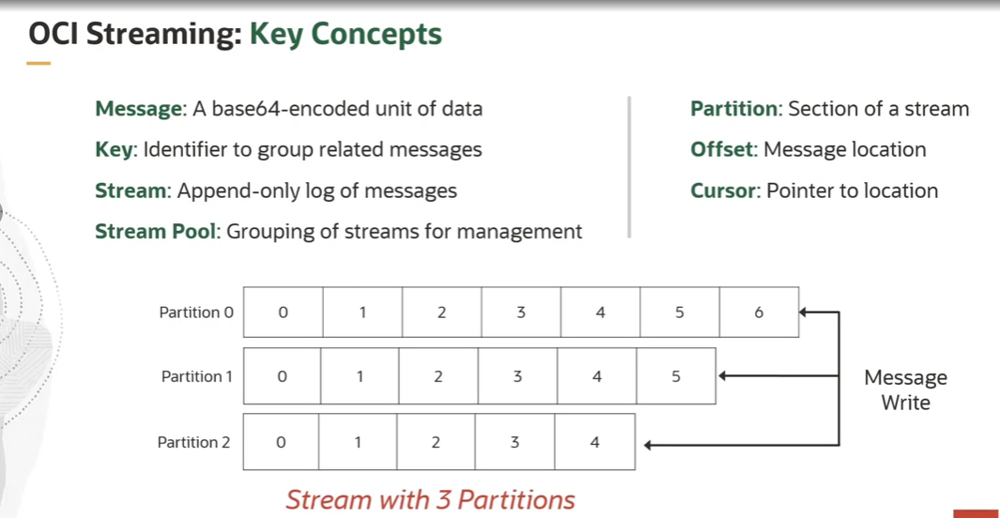
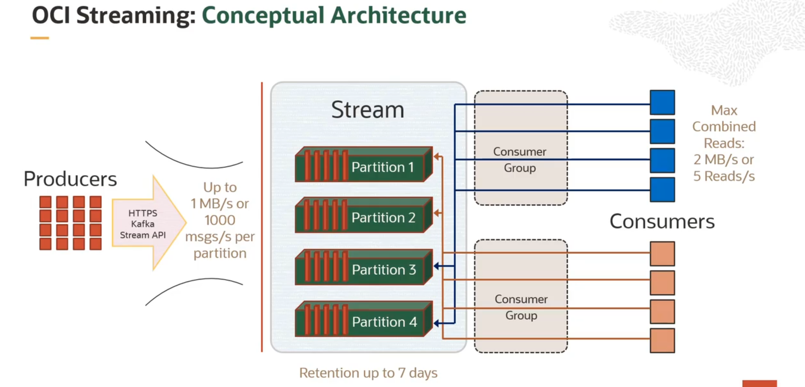
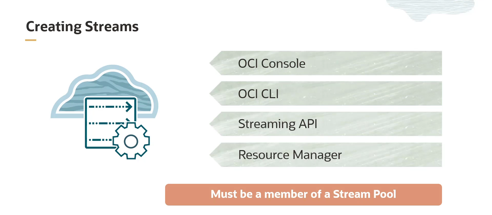
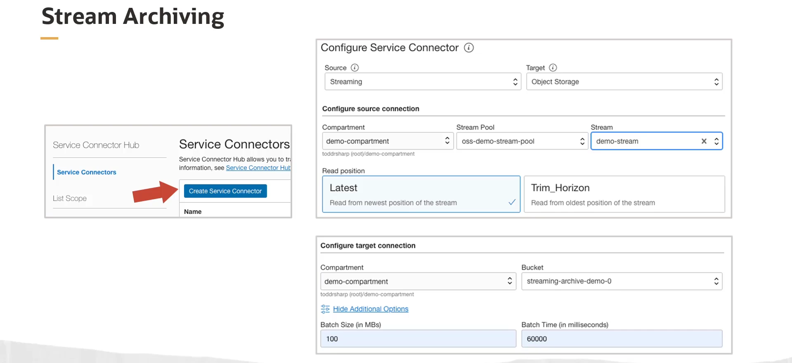

= OCI Streaming Service: Conceitos Fundamentais de Uso
:toc:
:icons: font

== Definições Essenciais

Para utilizar o OCI Streaming Service (OSS) de forma eficaz, é crucial compreender seus conceitos fundamentais.

*`Message`*::
Qualquer unidade de dados codificada em Base64, armazenada em um stream. O serviço é agnóstico em relação ao esquema, aceitando qualquer formato de mensagem (XML, JSON, CSV, GZIP), contanto que produtores e consumidores concordem com o formato.

*`Key`*::
Um identificador utilizado para agrupar mensagens. Mensagens com a mesma chave são sempre escritas na mesma partição, garantindo a ordem de leitura para os consumidores daquela partição.

*`Stream`*::
Um log particionado, _append-only_ (apenas para anexação), de mensagens. Pode ser visto como um conjunto de dados em constante crescimento.

*`Stream Pool`*::
Um agrupamento para organizar e gerenciar streams. Permite o compartilhamento de configurações entre múltiplos streams, como chaves de criptografia customizadas (via OCI Vault) e a configuração de endpoints privados.

*`Partition`*::
Uma seção de um stream. As partições permitem que um único stream seja escalado horizontalmente através de múltiplos servidores, possibilitando que múltiplos produtores escrevam e múltiplos consumidores leiam em paralelo.

*`Offset`*::
Um identificador único para cada mensagem dentro de uma partição. Os consumidores podem iniciar a leitura a partir de um offset específico e fazer "commit" do último offset processado para retomar o trabalho em caso de interrupção.

*`Cursor`*::
Um ponteiro para uma localização em um stream, que pode ser um offset específico, uma partição ou um timestamp.

== O Modelo de Funcionamento

Um *produtor* publica mensagens em um stream, que são distribuídas entre as partições com base na chave da mensagem. As partições permitem que múltiplos *consumidores* leiam o stream em paralelo.

[NOTE]
====
.Consumer Groups
Um *grupo de consumidores* é um conjunto de consumidores que coordenam o consumo de mensagens de todas as partições em um stream. O grupo gerencia o estado (offsets) e fornece balanceamento de carga automático à medida que novos consumidores entram no grupo, e rebalanceamento quando consumidores saem.
====

== Considerações de Design e Limites

* *Retenção de Mensagens:* Máximo de *7 dias*.
* *Tamanho Máximo da Mensagem:* *1 MB*.
* *Throughput por Partição (Input):* Até 1.000 mensagens/segundo, com um total de *1 MB/s*.
* *Throughput por Partição (Output):* Até 5 chamadas de API/segundo, com um total de *2 MB/s*.
* *Limite de Partições:* O padrão é de 5 partições por tenancy (pode ser aumentado via solicitação de serviço).

== Vantagens sobre Kafka Auto-Gerenciado (Recapitulação)

Utilizar o OSS em vez de provisionar um cluster Kafka próprio na OCI oferece vantagens importantes:
* Integrações nativas com muitos serviços OCI.
* Redução de custos administrativos (sem monitoramento e gerenciamento manual).
* Redução de custos de runtime (preços pay-per-use, sem cobrança por capacidade provisionada).
* Mais opções de desenvolvimento (SDKs OCI e APIs Kafka).
* SLA de 99.95% de uptime e tolerância a falhas integrada.
* Facilidade de migração para clusters Kafka existentes.

== Criação e Utilização de Streams

=== Métodos de Criação

Antes de publicar ou consumir mensagens, um stream deve ser criado. Isso pode ser feito de várias maneiras:
* Manualmente no Console da OCI.
* De forma automatizada via OCI Command Line Interface (CLI).
* Programaticamente via API REST.
* Através de automação de infraestrutura como código (IaC) com o Resource Manager (Terraform).

=== Configuração de um Stream

Ao criar um stream, é necessário especificar:
. *Stream Pool:* Se ele pertencerá a um pool existente ou a um novo, criado automaticamente.
. *Nome do Stream:* Deve ser único dentro do pool.
. *Período de Retenção:* Entre 24 horas e 7 dias.
. *Número de Partições:* Baseado nos requisitos de throughput da aplicação. Uma partição funciona como uma unidade base de throughput. Por exemplo, um stream com 10 partições pode alcançar 10 MB/s de input e 20 MB/s de output.

=== Interação via SDKs

A OCI fornece SDKs para diversas linguagens (disponíveis no GitHub) que permitem a interação programática para gerenciar streams, stream pools, configurações do Kafka Connect, e para produzir e consumir mensagens.

== Padrões de Integração com Service Connector Hub

O OCI Service Connector Hub pode ser usado para criar integrações sem código entre o OSS e outros serviços OCI.

=== Arquivamento de Streams no Object Storage

Para cenários que exigem armazenamento de longo prazo ou análise posterior (ex: com Hadoop/Spark), um conector de serviço pode ser configurado para arquivar automaticamente um stream em um bucket do OCI Object Storage.
* *Configuração:* Fonte (`Source`) = Streaming, Alvo (`Target`) = Object Storage.
* *Batching:* O conector pode ser configurado para escrever no bucket quando um certo volume de dados é acumulado (ex: 100 MB) ou após um intervalo de tempo (ex: 60 segundos), o que ocorrer primeiro. 

=== Entrega de Logs para um Stream

Outro cenário é configurar um conector para entregar automaticamente mensagens de log de um serviço para um stream. Por exemplo, pode-se criar um conector que monitora o OCI Logging e envia todas as mensagens de log de "lembrete de manutenção" de qualquer Autonomous Database em um compartimento para um stream específico para processamento.

== Monitoramento e Saúde do Stream

O OSS fornece métricas automaticamente para monitorar a performance e a saúde do serviço.

=== Métricas Disponíveis

As métricas podem ser usadas para:
* Entender a latência entre produção e consumo (produce vs. consume).
* Calcular e validar o custo de uso do serviço.
* Monitorar mudanças no throughput ao longo do tempo.
* Verificar o tempo desde que a última mensagem foi consumida.

=== Indicadores de um Stream Saudável

Um stream saudável tipicamente apresenta:
* Métricas de latência para _put_ e _get_ de mensagens muito baixas.
* Métricas de registros com throttling (_throttled records_) e falhas de mensagens próximas de zero.

=== Uso de Alarmes

Alarmes podem ser configurados sobre as métricas para monitoramento proativo. Por exemplo, um alarme pode ser acionado por um aumento substancial no throughput, indicando que o limite de 1 MB/s por partição está prestes a ser atingido, ou por uma diminuição, que pode indicar um problema com um cliente produtor.

