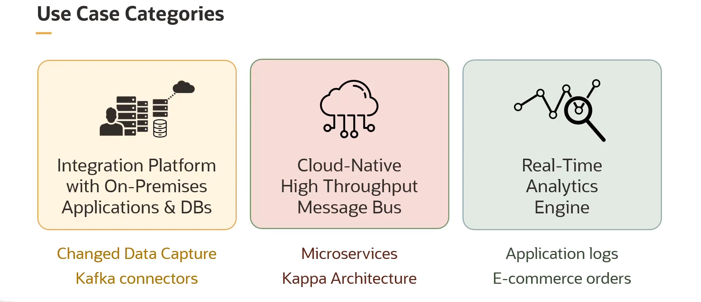
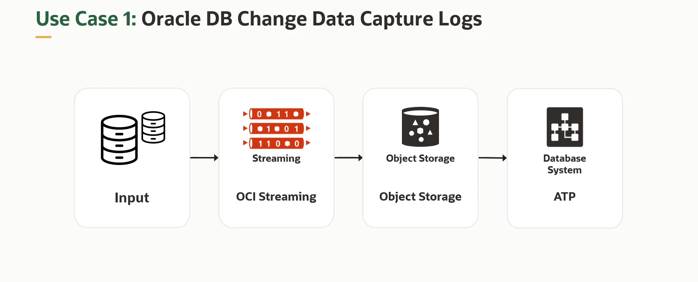
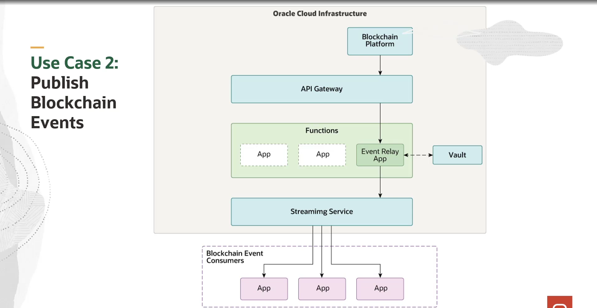
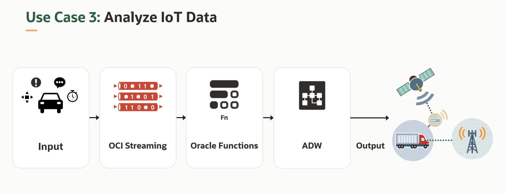
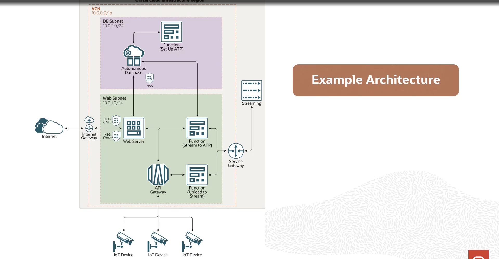
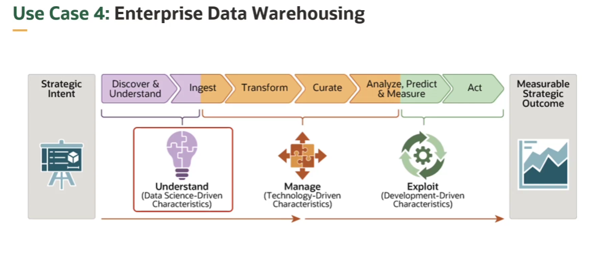
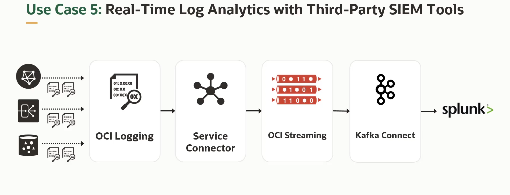
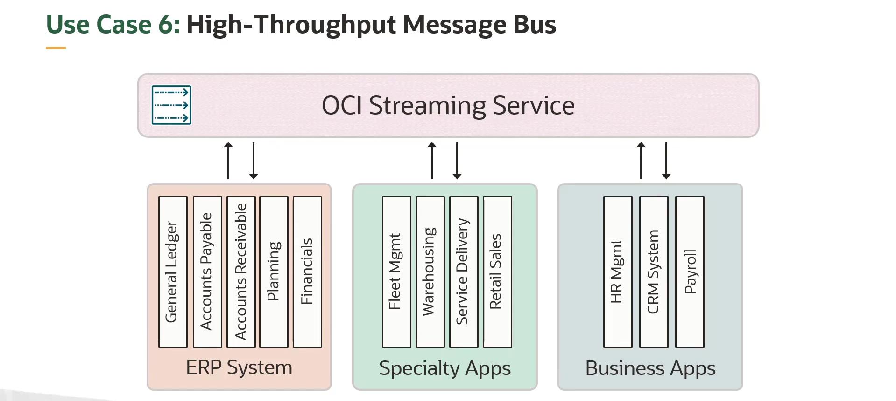

= OCI Streaming Service: Padrões de Uso e Casos de Exemplo
:toc:
:icons: font

== Padrões Gerais de Utilização

O OCI Streaming Service (OSS) pode ser aplicado em diversos cenários para resolver desafios comuns em arquiteturas distribuídas.

.Padrões de Uso Comuns:
* *Desacoplamento de Componentes:*
** Utilizar o OSS como um barramento de mensagens assíncrono, permitindo que produtores e consumidores atuem de forma independente e em seus próprios ritmos.

* *Ingestão de Logs Operacionais:*
** Substituir abordagens tradicionais de _file scraping_ para disponibilizar dados operacionais críticos de forma mais rápida para indexação, análise e visualização.

* *Captura de Atividade Web/Mobile (Clickstream):*
** Coletar dados de atividade de websites ou aplicações mobile (como _pageviews_, buscas e outras ações do usuário) para monitoramento e análise em tempo real, ou para processamento offline em sistemas de data warehousing.

* *Ponto de Entrada Unificado para Eventos:*
** Utilizar o OSS como um ponto central para que os componentes da nuvem reportem seus eventos de ciclo de vida para fins de auditoria, contabilidade e atividades relacionadas.

== Categorias de Casos de Uso

Os casos de uso do OSS podem ser agrupados em três categorias principais.

*Plataforma de Integração On-Premises*::
Utilizar o OSS para conectar sistemas on-premises à nuvem. Exemplos incluem a captura de logs de Change Data Capture (CDC) de um banco de dados on-premise para backup no Object Storage, ou a integração de aplicações como Oracle EBS, PeopleSoft ou SAP com a nuvem, utilizando o Oracle Integration Cloud (OIC) e conectores Kafka.

*Barramento de Mensagens Cloud-Native*::
Utilizar o OSS para desacoplar componentes de grandes sistemas e construir arquiteturas de microsserviços robustas. Outro exemplo é a agregação de pipelines de dados em batch e em stream, utilizando OSS em conjunto com o serviço OCI Data Flow (uma implementação da arquitetura Kappa).

*Motor de Analytics em Tempo Real*::
Transmitir logs de serviços da OCI e de aplicações customizadas através do OSS e, em seguida, analisá-los em tempo real com ferramentas como Splunk (via Kafka Connect). Outro exemplo é o processamento dinâmico de pedidos de e-commerce com Oracle Functions, armazenando os dados em um banco de dados de backend.

== Exemplos Detalhados de Arquiteturas

A seguir, são apresentados exemplos específicos de arquiteturas que utilizam o OCI Streaming Service.

=== 1. Change Data Capture (CDC) de Bancos de Dados

O OSS é utilizado para capturar dados de alteração (CDC) gerados por um banco de dados. Os logs são imediatamente salvos como backup no Object Storage e, em seguida, os dados são enviados para processamento downstream, como a análise em um Autonomous Transaction Processing (ATP) Database.
* *Exemplo Real:* Uma empresa financeira utiliza o OSS para migrar logs de CDC de seus bancos de dados Oracle para análise em um banco de dados ATP, aproveitando a compatibilidade Kafka do OSS para interagir com seu banco de dados on-premise através do framework JDBC Kafka Connect.

=== 2. Retransmissão de Eventos do Oracle Blockchain Platform

Este caso de uso resolve a limitação da entrega não garantida de eventos nativos do Oracle Blockchain Platform.
* *Arquitetura:* Um "Event Relay App", implementado como uma OCI Function, recebe o payload do evento (JSON) do Blockchain. A função reformata a mensagem para ser compatível com a API do Kafka, recupera credenciais do OCI Vault e publica o evento em um stream do OSS. A partir daí, múltiplos consumidores podem se inscrever no stream para receber os eventos de forma segura e confiável.

=== 3. Processamento de Dados de IoT

O OSS é utilizado para capturar eventos gerados por dispositivos IoT. Os dados são processados com OCI Functions e Autonomous Data Warehouse para gerar insights e enviar alertas.
* *Exemplo Real:* Uma empresa de competições de vela utiliza o OSS como uma camada de transporte de alta vazão para ingerir dados de sensores e dados biométricos em tempo real de todos os veleiros durante uma competição. As estatísticas são então compartilhadas em dashboards para parceiros.
* *Arquitetura de Referência:* Dados de dispositivos IoT fluem através de um *API Gateway* para *Functions*, que então utilizam o *Streaming Service* para carregar os dados em um *Autonomous Database*.

=== 4. Manutenção Preditiva com Data Science

Neste cenário, o objetivo é descobrir, ingerir, transformar e analisar dados para medir, prever e agir sobre eventos de forma rápida.
* *Arquitetura:* O *OCI Streaming* é usado para a ingestão de fluxos contínuos e de alto volume de dados de sensores em tempo real para o *Object Storage*. O *Data Science* é então utilizado para construir, treinar e gerenciar modelos de Machine Learning, e o *Data Flow* pode ser usado para executar aplicações Apache Spark.

=== 5. Análise de Logs em Tempo Real com Splunk (Spluk Está Sendo Usado Como Exemplo)

O OSS atua como um buffer persistente para logs, permitindo a integração com ferramentas de SIEM de terceiros.
* *Arquitetura:* O *OCI Logging* ingere logs de serviço e de aplicações. Um *Service Connector* transporta esses logs do Logging para o *Streaming*. Uma vez no stream, o *Kafka Connect for Splunk* é utilizado para enviar os dados para um cluster Splunk (potencialmente on-premises) para análise em tempo real.

=== 6. Backplane de Mensagens Assíncronas

Neste caso de uso, o OCI Streaming é utilizado como o "backplane" de mensageria assíncrona na arquitetura, para desacoplar componentes de aplicações distribuídas (on-premises e SaaS) e fornecer transporte de dados em tempo real para múltiplos destinos.

