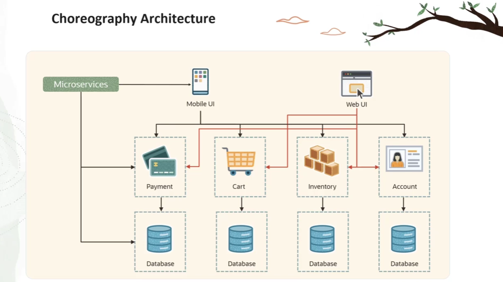
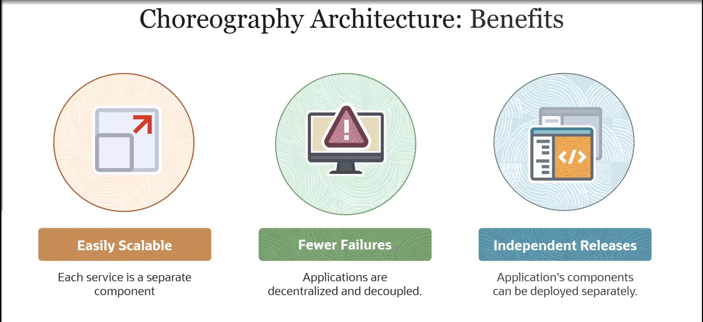
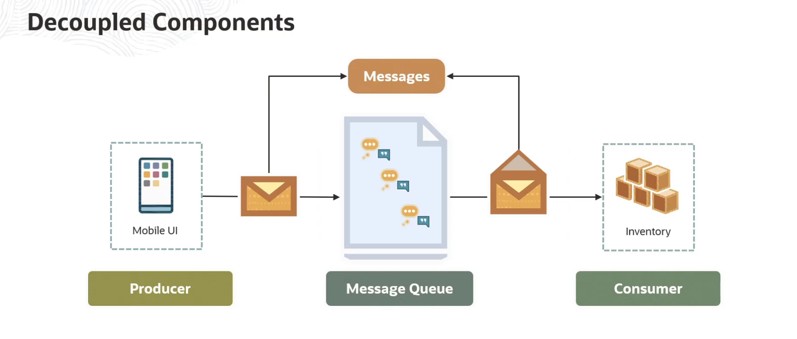
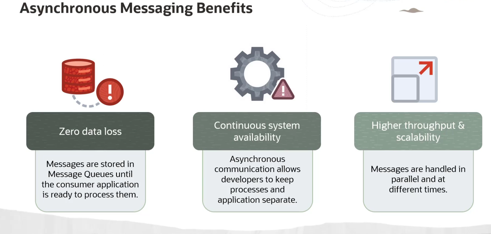

= Visão Geral do OCI Queue Service
:toc:
:icons: font

== O Conceito de Filas de Mensagens (Message Queues)

Um serviço de fila é uma solução de middleware que permite que aplicações e serviços se comuniquem de forma assíncrona em um ambiente de computação em nuvem. Ele fornece uma ou mais filas que servem como um buffer leve que armazena mensagens de forma temporária, mas persistente.

O serviço de fila oferece endpoints que permitem que componentes de software se conectem para enviar e receber mensagens, desacoplando esses componentes uns dos outros.

== O Desafio das Arquiteturas Tradicionais (Orquestração)

Em arquiteturas tradicionais e monolíticas (como um site de e-commerce com funcionalidades de conta, inventário, pagamento e carrinho em uma única base de código), os componentes são fortemente acoplados e frequentemente compartilham o mesmo banco de dados.

Esta abordagem apresenta desafios significativos:
* *Escalabilidade:* Um aumento de tráfego em uma única funcionalidade (ex: carrinho de compras) exige o escalonamento de toda a aplicação.
* *Confiabilidade:* Um erro ou bug em um componente pode levar à necessidade de reimplantar toda a aplicação.
* *Resiliência:* Uma falha em um único serviço pode causar uma falha completa da aplicação devido à alta interdependência.
* *Agilidade:* O crescimento e a evolução da aplicação são lentos e complexos.

== A Solução: Arquiteturas Desacopladas (Coreografia)

Para superar esses desafios, as arquiteturas de nuvem modernas decompõem as aplicações em blocos de construção menores e independentes (microsserviços), que são mais fáceis de desenvolver, implantar e manter.

=== Benefícios da Abordagem de Microsserviços

*`Escalabilidade`*::
Como cada serviço é um componente separado, é possível escalar uma única função ou serviço sem ter que escalar a aplicação inteira.

*`Resiliência`*::
A aplicação é descentralizada e desacoplada. Se um único serviço falhar, o impacto de uma falha completa da aplicação é minimizado.

*`Implantação Independente`*::
Os componentes da aplicação podem ser implantados separadamente quando necessário, permitindo entregas de novas funcionalidades de forma mais ágil.

=== O Papel da Comunicação Assíncrona

Esta arquitetura desacoplada requer uma configuração de comunicação para a troca de mensagens e dados entre os componentes. A comunicação síncrona ponto a ponto é frágil; portanto, as filas de mensagens são utilizadas para permitir que as diferentes partes de um sistema se comuniquem e processem operações de forma assíncrona.

.O Modelo Produtor-Consumidor:
. Um componente conhecido como *Produtor (Producer)* adiciona uma mensagem à fila.
. Posteriormente, um *Consumidor (Consumer)*, que é um componente diferente, recupera e processa a mensagem da fila.

Este padrão de troca de mensagens, chamado de *comunicação assíncrona*, oferece três benefícios chave:
. *Zero Perda de Dados:* As mensagens são armazenadas na fila até que o consumidor esteja pronto para processá-las.
. *Resiliência:* Os sistemas podem continuar a funcionar mesmo se processos ou conexões falharem, pois o produtor e o consumidor não precisam estar online ao mesmo tempo.
. *Maior Throughput e Escalabilidade:* Como as mensagens podem ser tratadas em paralelo e em momentos diferentes, a confiabilidade e a escalabilidade da comunicação são significativamente aprimoradas.

[NOTE]
====
.Analogia: Mensagem de Texto vs. Ligação Telefônica
A comunicação síncrona é como uma ligação telefônica: ambas as partes devem estar disponíveis ao mesmo tempo. A comunicação assíncrona é como uma mensagem de texto: você envia a mensagem, que fica em uma "fila" no telefone do destinatário, e ele a processa e responde quando estiver disponível.
====

== O Serviço OCI Queue

O *OCI Queue* é um serviço de nuvem totalmente gerenciado e serverless que pode ser utilizado em um modelo de preços on-demand. Ele fornece comunicação por mensagens entre aplicações ou entre os vários componentes (microsserviços) de uma única aplicação.

=== Definição e Capacidades

* *Alto Volume Transacional:* Suporta uma ou mais filas de mensagens que lidam com dados transacionais de alto volume, que podem exigir que as mensagens sejam processadas de forma independente, sem perda ou duplicação.
* *Escalabilidade Automática:* O serviço escala de forma transparente e automática com base no throughput de mensagens entre produtores e consumidores.
* *Padrões Abertos:* Além das bibliotecas dos SDKs da OCI, o OCI Queue também suporta padrões abertos, como APIs REST, para facilitar a comunicação com qualquer produtor ou consumidor com esforço mínimo.

=== Benefícios Principais

*`Serverless (Sem Gerenciamento de Infraestrutura)`*::
Fornece um serviço de mensageria assíncrona que não requer nenhum gerenciamento de infraestrutura, permitindo que as equipes de desenvolvimento se concentrem em decisões de design e implementação.

*`Redução de Custos (Pay-per-use)`*::
O modelo de pagamento por uso ajuda a reduzir os custos administrativos e o esforço de provisionar e manter infraestruturas de mensageria.

*`Monitoramento e Manutenção Simplificados`*::
Fornece as ferramentas necessárias para facilitar o monitoramento, a geração de relatórios, o suporte e a manutenção.

*`Gerenciamento Automático de Recursos`*::
A Oracle gerencia a alocação de recursos (servidores, armazenamento) e outras atividades de manutenção tradicionalmente associadas à implantação de outras soluções de mensageria, como WebLogic JMS ou sistemas Apache Kafka.
