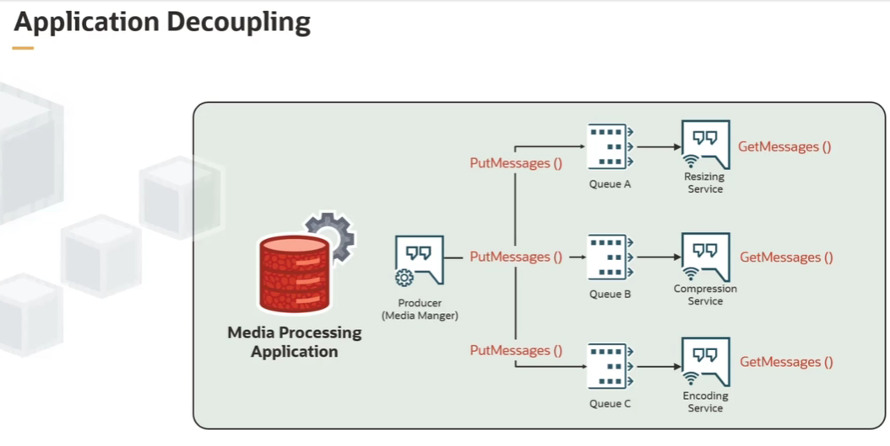
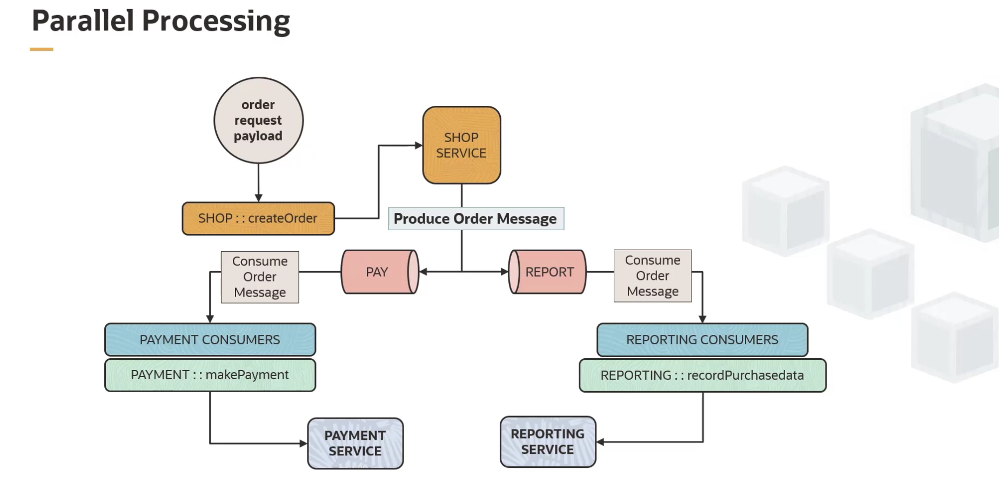
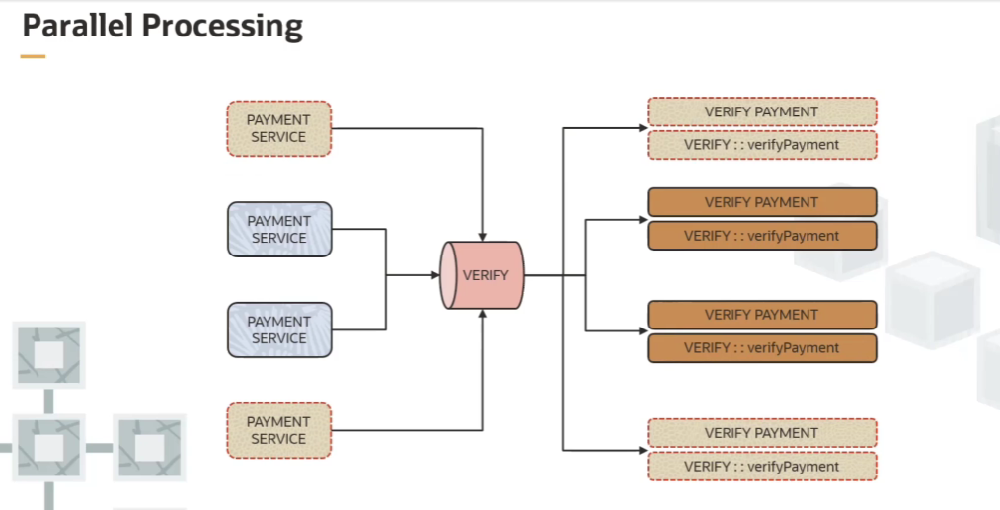
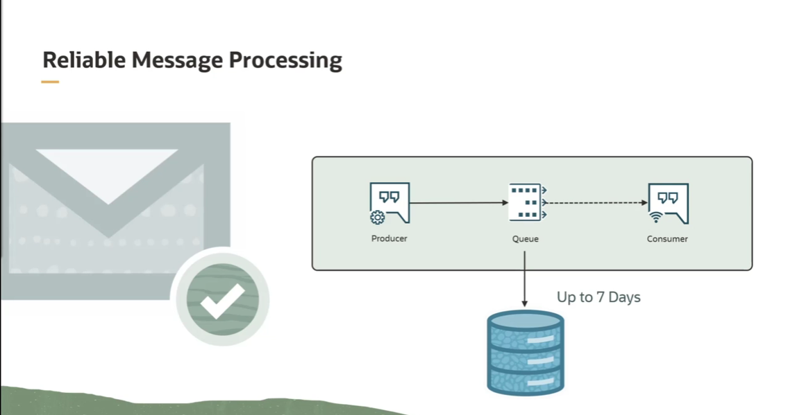
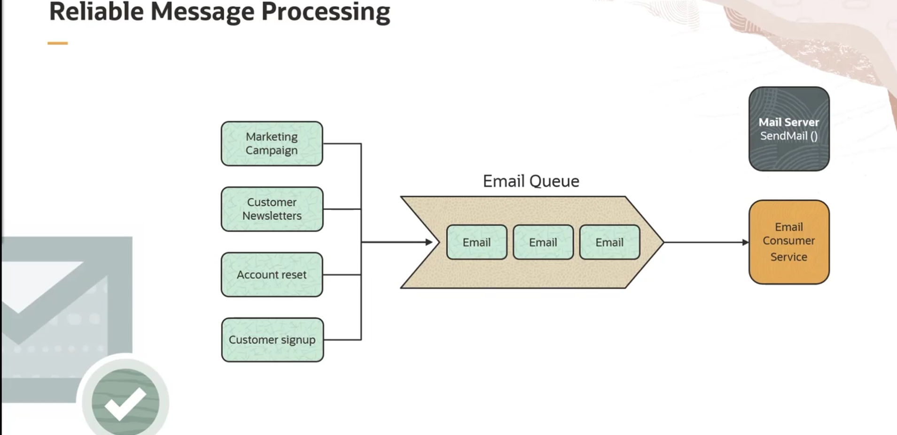

= Casos de Uso e Padrões de Arquitetura com OCI Queue
:toc:
:icons: font

== Padrão 1: Desacoplamento de Aplicações

Este padrão utiliza múltiplas filas para desacoplar diferentes componentes de um sistema, permitindo que cada um trabalhe e escale de forma independente.

.Exemplo: Aplicação de Processamento de Mídia
Neste cenário, um componente produtor, o "Media Manager", envia requisições de trabalho assíncronas para várias filas. Cada fila é dedicada a um tipo específico de processamento.

* *Produtor:* `Media Manager`
* *Fila A:* Requisições de redimensionamento.
* *Consumidor A:* `Resizing Microservice`
* *Fila B:* Requisições de compressão.
* *Consumidor B:* `Media Compression Microservice`
* *Fila C:* Requisições de codificação.
* *Consumidor C:* `Encoding Microservice`

Ao usar uma fila diferente para cada serviço, cada consumidor de backend pode operar de forma independente, e sua capacidade pode ser escalada individualmente com base na carga de trabalho específica da sua fila, alcançando um maior throughput geral.

== Padrão 2: Processamento Paralelo (Fan-Out)

Este padrão envolve um único evento que dispara múltiplos processos de negócio independentes e paralelos.

.Exemplo: Processamento de Pedidos de E-commerce
Quando um pedido de compra é recebido, a lógica do serviço "Shop" é acionada. Este serviço, atuando como produtor, publica duas cópias da mensagem do pedido para duas filas distintas.

. *Produtor:* `Shop Service` (ao receber um pedido)
. *Fila de Pagamento:* Recebe a mensagem do pedido.
. *Consumidor de Pagamento:* `Payment Microservice` processa o pagamento.
. *Fila de Relatório:* Recebe a mesma mensagem do pedido.
. *Consumidor de Relatório:* `Reporting Microservice` registra os dados da compra para gerar análises de produto em tempo real.

Este padrão pode ser estendido. Por exemplo, após o `Payment Microservice` processar um pagamento, ele pode se tornar um produtor e publicar os detalhes em uma "Verify Queue", da qual múltiplos microserviços consumidores podem verificar a transação com os bancos em paralelo.

[NOTE]
====
A ideia chave deste padrão é ter múltiplos consumidores processando mensagens de uma única fila em paralelo. Em caso de picos de tráfego, tanto a fila quanto os consumidores podem escalar de forma independente para acomodar o aumento de mensagens.
====

== Padrão 3: Mensageria Confiável (Consumer Indisponível)

Este padrão é essencial para casos de uso onde a entrega da mensagem deve ser garantida, mesmo que o serviço consumidor esteja temporariamente indisponível.

.Exemplo: Serviço de Entrega de E-mails
Empresas utilizam serviços de e-mail para diversas finalidades não urgentes, como campanhas de marketing, newsletters, reset de senhas e confirmação de cadastro. Embora um atraso na entrega não interfira na operação essencial, é crucial garantir que os e-mails sejam enviados.

* *Produtores:* Múltiplos serviços (marketing, contas de usuário, etc.) colocam mensagens de e-mail na fila.
* *Fila de E-mail:* Uma única fila central para todas as requisições de envio.
* *Consumidor:* Um único microserviço de entrega de e-mail que lê as mensagens da fila uma de cada vez e envia os e-mails.

[IMPORTANT]
====
A confiabilidade é fornecida pelo serviço de fila. A mensagem permanece persistida na fila (por um período de retenção de até sete dias) e não será perdida ou descartada. Isso dá tempo suficiente para que o consumidor se torne disponível novamente ou para que um novo consumidor seja implantado para retomar o processamento.
====

== Padrão 4: Tratamento de Erros com Dead Letter Queues (DLQ)

Este padrão lida com a resiliência do sistema quando um consumidor não consegue processar uma mensagem devido a um problema com a própria mensagem (uma "poison message").

=== O Problema da "Poison Message"

Se uma mensagem está corrupta ou é ilegível pelo consumidor, ela pode causar falhas repetidas, bloqueando o processamento de outras mensagens válidas na fila.

=== A Solução: A Dead Letter Queue (DLQ)

Para evitar o bloqueio, uma fila pode ser configurada com uma *Dead Letter Queue (DLQ)*. Após um número configurado de tentativas de entrega falhas (`maximum delivery attempts`), a mensagem não processada é movida automaticamente para a DLQ.

=== Opções de Tratamento para Mensagens na DLQ

Uma vez que as mensagens estão na DLQ, existem várias estratégias para lidar com elas:

. *Reprocessar a Mensagem (Após Correção):*
** A mensagem pode precisar ser corrigida antes de ser reprocessada. A solução pode ser um script automatizado ou uma intervenção humana para editar a mensagem. Alternativamente, a mensagem corrigida pode ser devolvida ao produtor para reenvio.

. *Descartar a Mensagem (Após Análise):*
** Alguns casos de uso podem esperar uma certa porcentagem de mensagens inválidas que podem ser simplesmente descartadas. No entanto, antes de deletar, um processo de negócio deve examiná-las, por exemplo, através de um dashboard que visualize as mensagens de erro.

. *Analisar para Obter Insights:*
** Em vez de processar cada mensagem individualmente, os dados da DLQ podem ser analisados para obter insights em tempo real. Uma aplicação simples poderia calcular o número médio de mensagens de erro por hora para informar sobre problemas nos produtores.

. *Interromper o Processo (Circuit Breaker):*
** Se mensagens inválidas são raramente esperadas, pode ser necessário interromper o fluxo de trabalho do produtor. A ação de interrupção pode ser automatizada ou decidida por um operador responsável pela solução de problemas.

. *Não Fazer Nada (Deixar Expirar):*
** Em certos casos de uso, especialmente com mensagens transitórias, pode ser apropriado não tomar nenhuma ação. O serviço de fila simplesmente deletará as mensagens da DLQ assim que o período máximo de retenção expirar.
