= OCI Queue: Operações de Gerenciamento de Filas e Mensagens
:toc: levels=2
:icons: font

[preamble]
--
Nesta seção do curso, mergulhei nas operações práticas do OCI Queue Service. Vamos dissecar as duas áreas principais de interação com o serviço: o *Control Plane*, onde gerenciamos as filas em si, e o *Data Plane*, onde nossas aplicações gerenciam as mensagens. O domínio destes dois planos é essencial para construir sistemas assíncronos robustos e eficientes.
--

== Gerenciamento de Filas (Control Plane)

O gerenciamento de filas compreende todas as operações administrativas, como criar, ler, atualizar e excluir (CRUD) o próprio recurso da fila. Estas operações são realizadas contra o *endpoint de controle* do serviço, que é único para cada região.

.Exemplo de Endpoint do Control Plane (US Phoenix):
[source,text]
----
https://queues.us-phoenix-1.oci.oraclecloud.com
----

=== Interfaces de Gerenciamento

Existem três maneiras principais de interagir com o Control Plane para gerenciar as filas.

* *OCI Console (Interface Gráfica):*
** Ideal para operações manuais e visualização. A UI do console guia o usuário através das opções de configuração para criar, visualizar, atualizar ou excluir filas.

* *OCI CLI (Linha de Comando):*
** Perfeita para automação e scripts administrativos. As operações são realizadas através de comandos `oci queue queue ...`.
[source,bash]
----
# Exemplo: Criar uma fila
oci queue queue create --compartment-id <compartment_ocid> --display-name "MinhaFilaDeProcessamento"

# Exemplo: Obter detalhes de uma fila
oci queue queue get --queue-id <queue_ocid>
----

* *OCI SDKs e API REST:*
** Para integração programática em aplicações. Utiliza-se a classe `QueueAdminClient` nos SDKs (Java, Python, etc.) ou chamadas diretas à API REST para realizar as operações de gerenciamento.

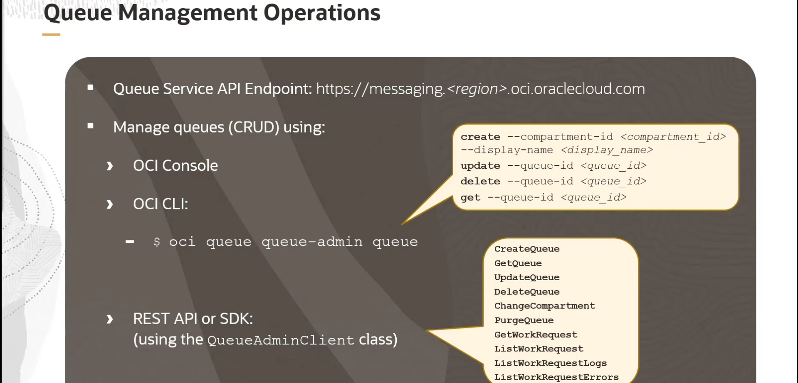

== Gerenciamento de Mensagens (Data Plane)

Após a criação de uma fila, o gerenciamento de mensagens é realizado pelas aplicações cliente (produtores e consumidores). Estas operações do Data Plane são focadas em publicar, consumir, atualizar e excluir as mensagens.

[IMPORTANT]
====
As operações de mensagens são realizadas contra o *endpoint de mensagens* da fila, que é específico para cada fila. Este endpoint pode ser encontrado na página de detalhes da fila no Console da OCI ou obtido via API com a requisição `GetQueue`.

.Formato do Endpoint de Mensagens:
`+https://<identificador_unico>.queues.<regiao>.oci.oraclecloud.com+`
====

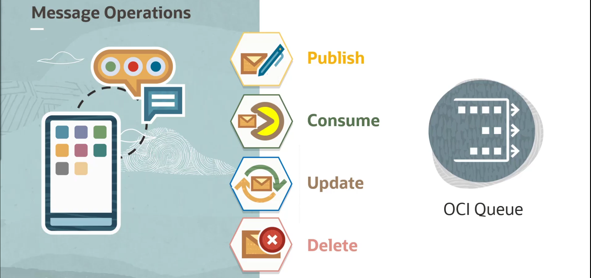

=== Publicação de Mensagens (PutMessages)

Um cliente produtor publica mensagens na fila.

* *Operação:* `PutMessages`
* *Batching:* Permite o envio de *1 a 20 mensagens* em uma única requisição.
* *Overrides Opcionais:* Na mesma requisição, é possível sobrescrever os valores padrão de `retentionInSeconds` e `visibilityInSeconds` para as mensagens enviadas naquele lote.
* *Retorno:* Após uma publicação bem-sucedida, o serviço retorna o *ID* de cada mensagem enviada.

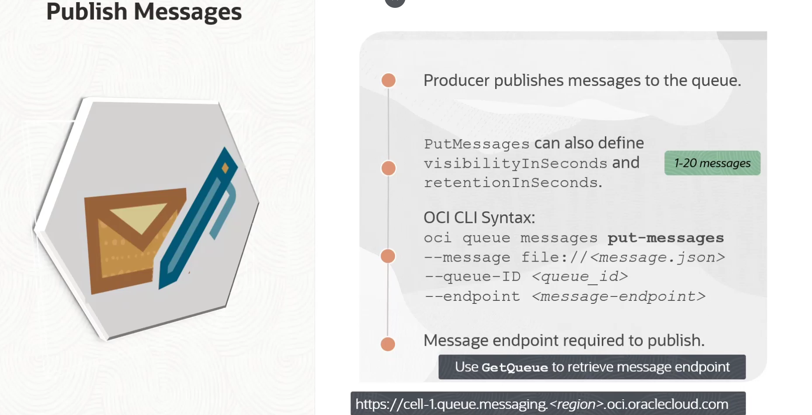

.Exemplo de `PutMessages` via OCI CLI:
[source,bash]
----
oci queue message put --queue-id <queue_ocid> --messages '[{"content":"SuaMensagemAqui"}]' --endpoint <message_endpoint>
----

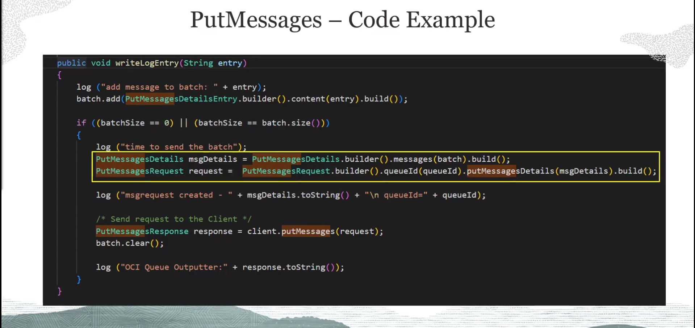

=== Consumo de Mensagens (GetMessages)

Um cliente consumidor recupera mensagens da fila para processamento.

* *Operação:* `GetMessages`
* *Batching:* Retorna um array de até *20 mensagens* por chamada. Se a fila estiver vazia, a chamada retorna uma lista vazia após o timeout.
* *Metadados Retornados:* Além do conteúdo, a resposta inclui para cada mensagem:
** `ID`: O identificador único da mensagem.
** `expirationTime`: O timestamp de expiração.
** `visibilityInSeconds`: O tempo de invisibilidade atual.
** `deliveryCount`: O número de vezes que a mensagem foi entregue.
** `receipt`: Um "recibo" temporário e único, essencial para as operações de `Update` e `Delete`.
* *Mecanismo de Lock (Visibility Timeout):* Ao ser entregue, uma mensagem se torna invisível para outros consumidores por um período (`visibility timeout`). Se o consumidor não conseguir processá-la e deletá-la dentro deste tempo, a mensagem se torna visível novamente na fila.
* *Dead Letter Queue (DLQ):* A cada vez que uma mensagem é recuperada, seu `deliveryCount` é incrementado. Se este contador exceder o `maximumDeliveryAttempts` configurado para a fila, a mensagem é movida para a DLQ associada.

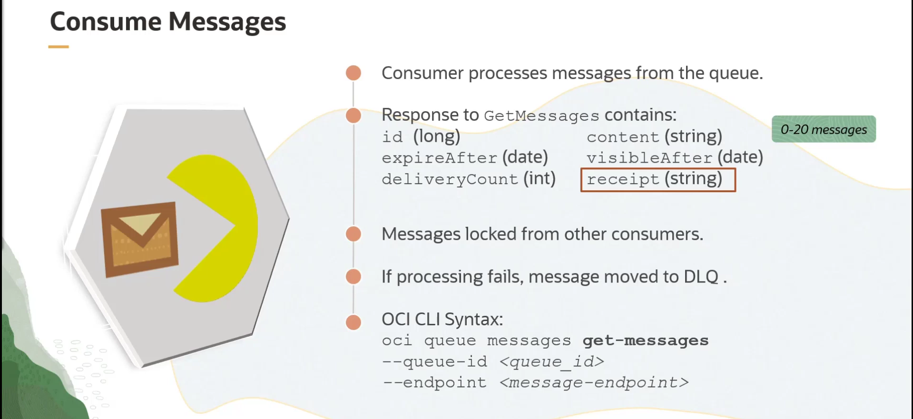

.Exemplo de `GetMessages` via OCI CLI:
[source,bash]
----
oci queue message get --queue-id <queue_ocid> --endpoint <message_endpoint>
----

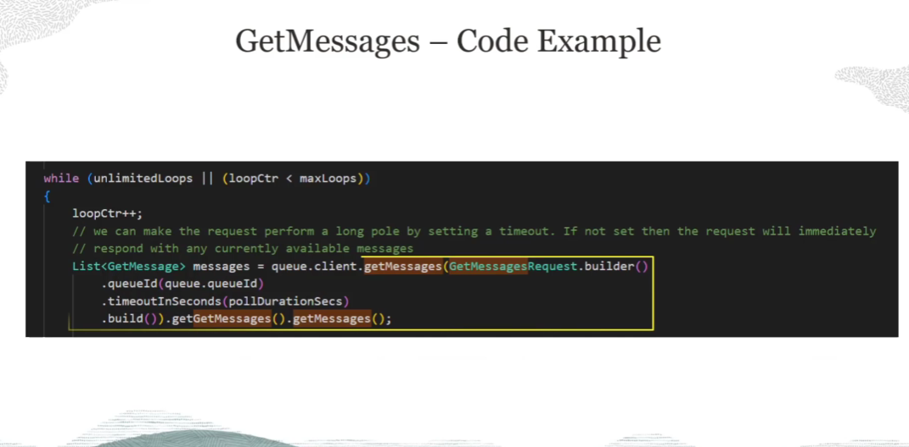

=== Atualização de Mensagens (UpdateMessage / UpdateMessages)

Esta operação permite que um consumidor estenda ou reduza o _lock_ (o `visibility timeout`) de uma mensagem que está sendo processada.

* *Caso de Uso:* Útil quando diferentes tipos de mensagens requerem tempos de processamento distintos.
* *Requisito:* A chamada requer o `receipt` da mensagem, obtido na requisição `GetMessages`.
* *Restrição:* O `visibility timeout` não pode ser estendido para além do período máximo de retenção da fila.
* *Operações:* `UpdateMessage` para uma única mensagem, `UpdateMessages` para um lote.

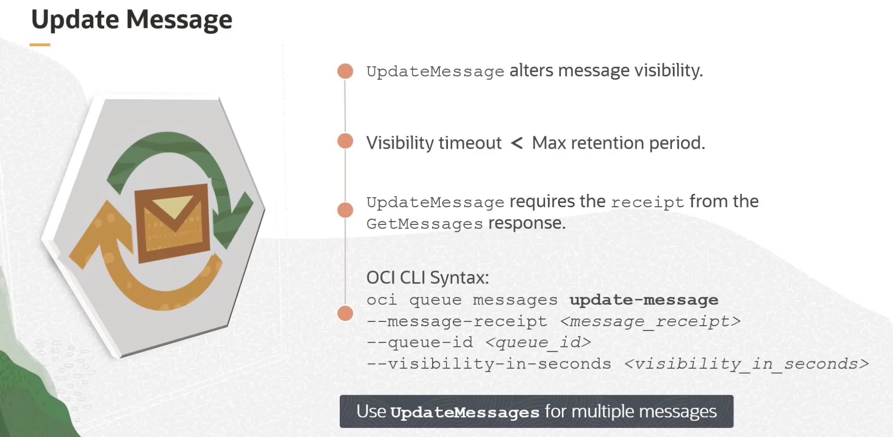

.Exemplo de `UpdateMessage` via OCI CLI:
[source,bash]
----
oci queue message update --queue-id <queue_ocid> --message-receipt <receipt_string> --visibility-in-seconds <novo_timeout> --endpoint <message_endpoint>
----

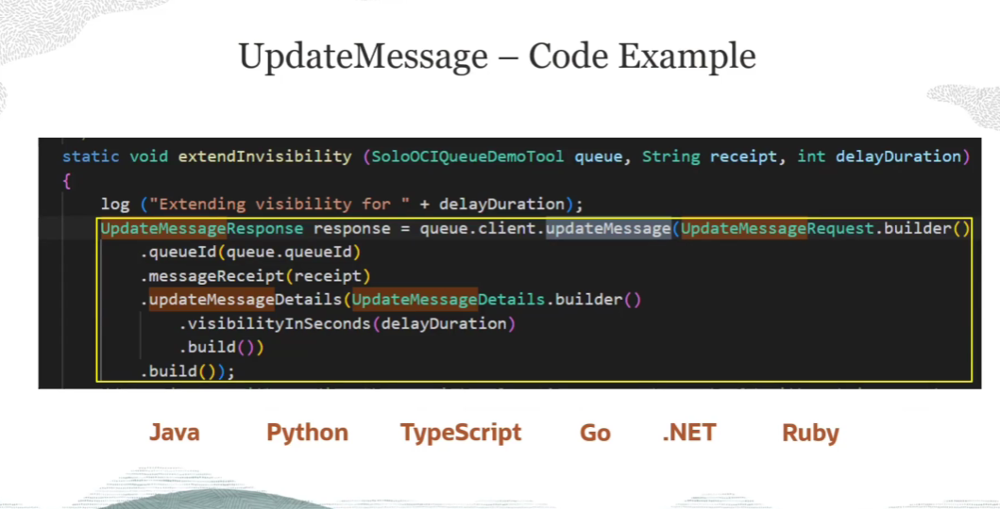

=== Exclusão de Mensagens (DeleteMessage / DeleteMessages / PurgeQueue)

Após uma mensagem ser processada com sucesso, o consumidor *deve* deletá-la da fila para garantir que ela não seja processada novamente.

* *Operações do Consumidor:*
** `DeleteMessage` (única) e `DeleteMessages` (em lote).
** Ambas as operações requerem o `receipt` da mensagem.
* *Operação Administrativa:*
** `PurgeQueue` é uma operação administrativa que deleta *todas* as mensagens de uma fila de uma vez.
** *Opções de Purge:* `NORMAL` (fila principal), `DLQ` (dead-letter queue), ou `BOTH`.

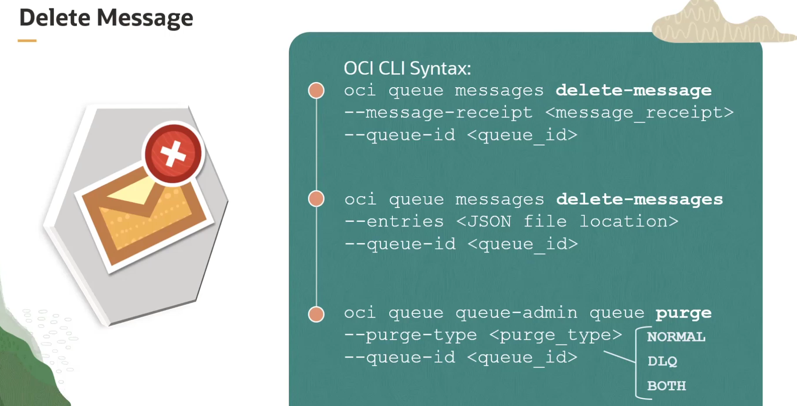

[WARNING]
====
A operação `PurgeQueue` é destrutiva e deve ser usada com cuidado, pois remove todas as mensagens, incluindo aquelas que ainda não foram processadas.
====

.Exemplos de Exclusão via OCI CLI:
[source,bash]
----
# Deletar uma única mensagem
oci queue message delete --queue-id <queue_ocid> --message-receipt <receipt_string> --endpoint <message_endpoint>

# Limpar (purge) a fila principal e a DLQ
oci queue queue purge --queue-id <queue_ocid> --purge-type BOTH
----

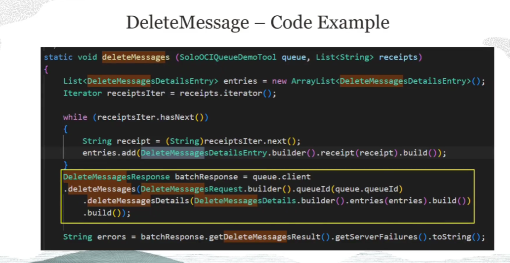

== Garantias do Serviço e Limites

=== Garantias

O OCI Queue Service oferece as seguintes garantias para assegurar a confiabilidade:
* *Confirmação de Publicação:* O serviço envia um `acknowledgment` ao produtor quando uma mensagem é publicada com sucesso.
* *Persistência Garantida:* Uma mensagem publicada é garantida para permanecer persistida até ser deletada pelo consumidor ou até que seu período de retenção expire.
* *Bloqueio de Visibilidade:* Uma mensagem com um `visibility timeout` ativo não será entregue a outros consumidores até que o timeout expire.
* *Não Exclusão pelo Serviço:* Dentro do período de retenção, o serviço não deletará a mensagem. Apenas um consumidor pode processá-la e deletá-la.

=== Limites de Serviço

.Limites Atuais do OCI Queue Service:
[options="header", cols="2,1"]
|===
| Recurso | Limite
| *Filas por Região* | 10
| *Batch de `PutMessages`* | 20 mensagens (total <= 512 KB)
| *Batch de `GetMessages`* | 20 mensagens (total <= 2 MB)
| *Tamanho Máximo por Mensagem* | 128 KB
|===
[NOTE]
====
Estes limites podem ser alterados em atualizações futuras do serviço. Consulte sempre a documentação oficial para obter as informações mais recentes.
====

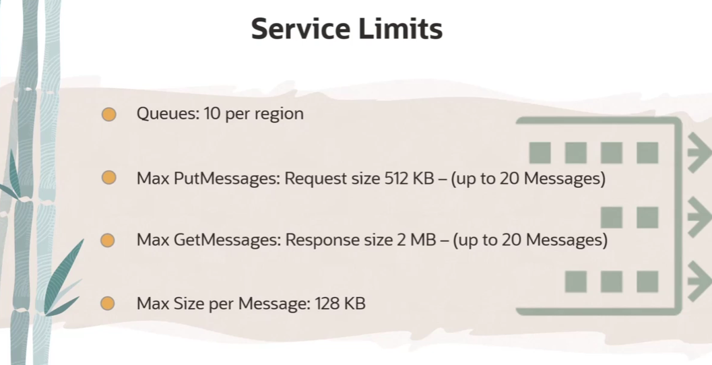