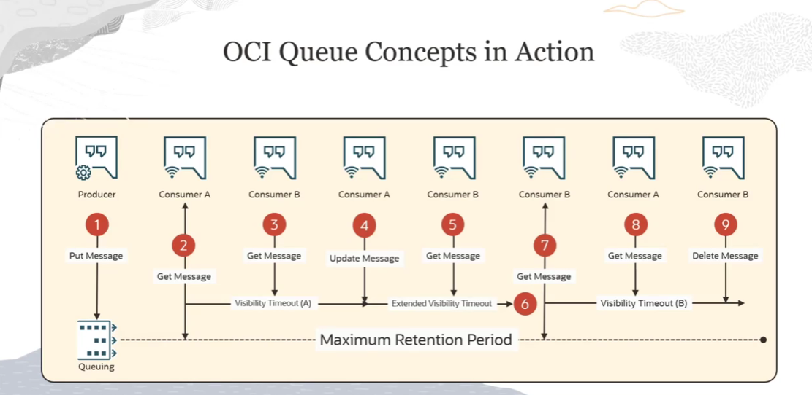
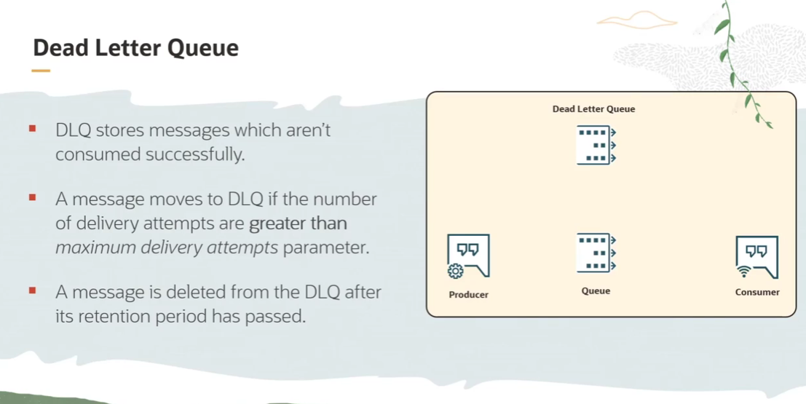

= OCI Queue: Conceitos Fundamentais e Ciclo de Vida da Mensagem
:toc: levels=2
:icons: font

[preamble]
--
Bem-vindo a este módulo do curso. Agora que temos uma visão geral do OCI Queue, vamos aprofundar nos conceitos fundamentais que governam o comportamento de uma fila e o ciclo de vida de cada mensagem. Dominar estes conceitos é crucial para projetar sistemas assíncronos que sejam não apenas eficientes, mas também resilientes e previsíveis.
--

== Dicionário de Conceitos Fundamentais

A seguir, uma dissecação detalhada dos termos e parâmetros essenciais do OCI Queue Service.

*Message*::
A unidade fundamental de dados. É uma string que pode representar qualquer informação necessária para a comunicação entre processos (requisição, resposta, detalhes de uma transação, etc.). Cada mensagem é processada de forma independente.

*Producer*::
Qualquer serviço ou aplicação cliente que serve como a fonte de uma mensagem. Um produtor *publica* (envia) uma ou mais mensagens para uma fila específica, onde elas são imediatamente persistidas.

*Consumer*::
Qualquer serviço ou aplicação cliente que se conecta a uma fila para processar mensagens. Um consumidor *recebe* uma cópia de uma ou mais mensagens, as *processa* e, crucialmente, as *deleta* da fila após o processamento bem-sucedido.

*Maximum Retention Period*::
O tempo máximo que uma mensagem pode permanecer na fila antes de ser automaticamente deletada pelo sistema.

[NOTE]
====
.Notas do Instrutor
Este parâmetro é uma salvaguarda. Idealmente, o consumidor deleta a mensagem. Se ele falhar, a retenção garante que a fila não cresça indefinidamente. O valor padrão é de *24 horas*, mas pode ser configurado entre *10 segundos* e *7 dias*.
====

*Delivery Count*::
Um contador associado a cada mensagem individual, que rastreia o número de vezes que a mensagem foi entregue a um consumidor.

*Maximum Delivery Attempts*::
Um parâmetro configurável para cada fila (de *1* a *20*) que define o limite para o `Delivery Count`. Quando o `Delivery Count` de uma mensagem excede este valor, ela é movida para a Dead Letter Queue (DLQ).

*Polling Timeout*::
O tempo máximo (até *30 segundos*, que é o padrão) que uma chamada `GetMessages` de um consumidor irá aguardar (bloquear) se a fila estiver vazia. Essencialmente, define o intervalo de polling para consumidores que operam em um loop contínuo.

*Visibility Timeout*::
O "período de bloqueio" de uma mensagem após ser entregue a um consumidor. A mensagem se torna invisível para outros consumidores durante este tempo.
[NOTE]
====
.Notas do Instrutor
Este é o mecanismo central que garante que uma mensagem seja processada por *apenas um consumidor por vez*. O padrão é de *30 segundos*, mas pode ser configurado de *1 segundo* até *12 horas*. O consumidor pode estender este tempo programaticamente se precisar de mais tempo para o processamento.
====

*In-flight Messages*::
Mensagens que foram entregues a um consumidor, mas ainda não foram deletadas. Elas estão "em voo", invisíveis para outros consumidores, aguardando o processamento ou a expiração do seu `Visibility Timeout`.

*Message Endpoint*::
A URL única e específica de uma fila, utilizada por produtores e consumidores para realizar operações de mensagens (Put, Get, Update, Delete). Pode ser encontrada na página de detalhes da fila no Console da OCI.

== O Ciclo de Vida de uma Mensagem na Prática: Um Exemplo Detalhado

Para solidificar os conceitos, vamos analisar um cenário de interação passo a passo.

.Participantes:
* *Produtor*
* *Consumidor A*
* *Consumidor B*

.Sequência de Eventos:
. *Evento 1:* O *Produtor* envia a *Mensagem 1* para a fila. O serviço confirma o recebimento e a persistência da mensagem.
. *Evento 2:* O *Consumidor A* se conecta e consome a *Mensagem 1*. A mensagem agora está _in-flight_ (invisível para outros) com um `Visibility Timeout` padrão.
. *Evento 3:* O *Consumidor B* tenta consumir uma mensagem. *Resultado:* A fila retorna vazia, pois a *Mensagem 1* está "bloqueada" pelo *Consumidor A*.
. *Evento 4:* O *Consumidor A* percebe que precisa de mais tempo e atualiza a *Mensagem 1*, estendendo seu `Visibility Timeout`.
. *Evento 5:* O *Consumidor B* tenta novamente. *Resultado:* A fila continua vazia, pois o _lock_ do *Consumidor A* foi estendido.
. *Evento 6 (Falha):* O *Consumidor A* falha em processar a mensagem e não a deleta. O `Visibility Timeout` estendido finalmente expira. A mensagem se torna visível novamente na fila.
. *Evento 7:* O *Consumidor B* tenta pela terceira vez. *Resultado:* Ele agora recebe a *Mensagem 1*, que ganha um novo `Visibility Timeout` e é bloqueada pelo *Consumidor B*.
. *Evento 8:* O *Consumidor A* tenta consumir uma mensagem. *Resultado:* A fila retorna vazia. O *Consumidor A* perdeu o "lock" da mensagem e não pode mais atualizá-la ou deletá-la.
. *Evento 9 (Sucesso):* O *Consumidor B* processa a mensagem com sucesso e a *deleta* da fila. Ele recebe a confirmação de que a mensagem foi permanentemente removida.

== Lidando com Falhas: A Dead Letter Queue (DLQ)

=== Propósito e Funcionamento

Ao criar uma fila, uma *Dead Letter Queue (DLQ)* correspondente é automaticamente disponibilizada. O propósito da DLQ é isolar mensagens problemáticas ("poison messages") para que elas não bloqueiem o processamento de outras mensagens válidas na fila principal.

=== O Gatilho para a DLQ

Uma mensagem é movida para a DLQ apenas quando o número de tentativas de entrega malsucedidas excede o limite configurado.

[IMPORTANT]
====
.O que é uma "Entrega Malsucedida"?
Uma tentativa de entrega é considerada malsucedida quando um consumidor recebe a mensagem, mas falha em deletá-la antes que o `Visibility Timeout` expire.

A condição para mover uma mensagem para a DLQ é: `Delivery Count > Maximum Delivery Attempts`
====

=== Ciclo de Vida da Mensagem na DLQ

É crucial entender que as mensagens na DLQ *não são permanentes*. Elas ainda estão sujeitas ao `Maximum Retention Period` original da fila.

[TIP]
====
.Janela para Troubleshooting
O período de retenção (que pode ser de até sete dias) serve como uma janela de tempo para que um administrador ou um processo automatizado possa recuperar as mensagens da DLQ, examiná-las e solucionar a causa raiz da falha de processamento. Após o período de retenção expirar, a mensagem é permanentemente deletada da DLQ pelo serviço.
====

O ciclo foi melhor apresentado no curso. Recomendo voltar nessa parte também se quiser ver como funciona o ciclo de vida de uma mensagem na fila.

