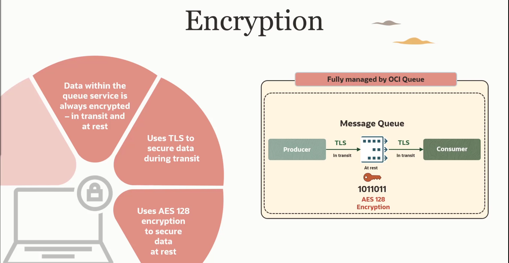
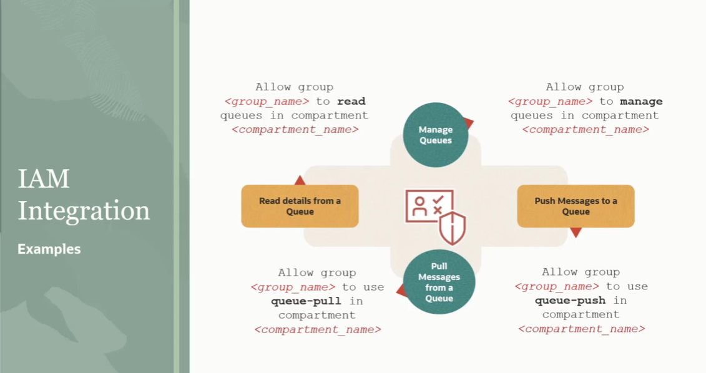
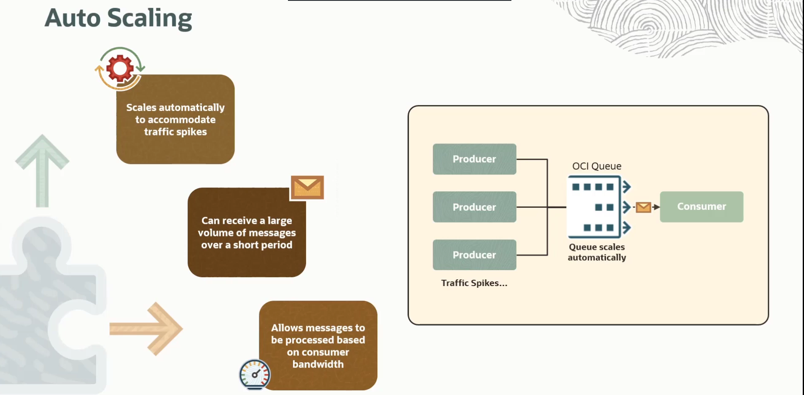
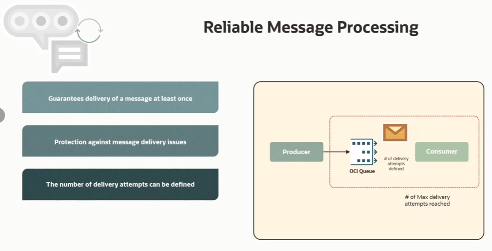
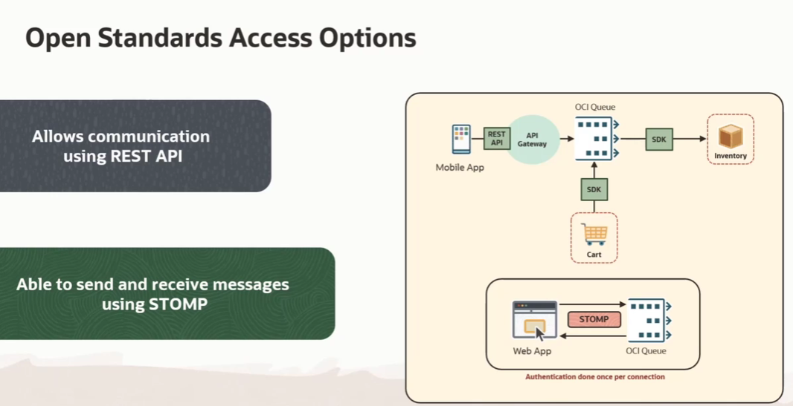

= OCI Queue: Análise Detalhada das Funcionalidades
:toc: levels=2
:icons: font

[preamble]
--
Vamos analisar em profundidade as funcionalidades que fazem do OCI Queue uma ferramenta robusta para a construção de arquiteturas assíncronas. Foi melhor apresentado no curso os pilares de segurança, as características arquitetônicas que promovem escalabilidade, as garantias de confiabilidade no processamento de mensagens e os diversos métodos de acesso disponíveis para os desenvolvedores.
--

== Funcionalidades de Segurança

A segurança é um pilar fundamental e não opcional no OCI Queue. O serviço é projetado com múltiplas camadas de proteção, cobrindo desde a transmissão dos dados até o controle de acesso granular.

=== Criptografia End-to-End (Padrão e Obrigatória)

O serviço garante a criptografia completa das mensagens em todo o seu ciclo de vida.

*Em Trânsito (In Transit)*::
Toda a comunicação entre um cliente (produtor ou consumidor) e o serviço OCI Queue é criptografada utilizando *TLS (Transport Layer Security)*. O TLS utiliza uma combinação de criptografia simétrica e assimétrica para negociar chaves seguras no início da conexão, garantindo que os dados não possam ser interceptados ou lidos por terceiros durante a transmissão pela rede.

*Em Repouso (At Rest)*::
Quando o serviço OCI Queue recebe uma mensagem, ele a armazena de forma segura utilizando o algoritmo *AES (Advanced Encryption Standard)* com uma chave de 128 bits. Este é um padrão de criptografia amplamente utilizado que oferece forte proteção para dados armazenados.

[IMPORTANT]
====
.Totalmente Gerenciado e Compulsório
Tanto a criptografia em trânsito quanto a em repouso são funcionalidades padrão, totalmente gerenciadas pela Oracle, e *não podem ser desabilitadas*. Isso assegura um nível base de segurança para todas as interações com o serviço.
====

=== Integração com OCI IAM

O OCI Queue é totalmente integrado com o OCI Identity and Access Management (IAM) para autenticação e autorização.

==== Autenticação

A conexão a uma fila requer um dos mecanismos de autenticação padrão da OCI, como:
* Um par de chaves de assinatura de API (API Signing Key).
* Credenciais de token OAuth 2.0.

==== Autorização (Políticas de IAM)

As políticas de IAM permitem um controle de acesso fino sobre todas as operações da fila. É possível definir permissões para diferentes grupos de usuários, segregando responsabilidades.

.Exemplos de Políticas de IAM:
[source,text]
----
# Concede privilégios administrativos completos para um grupo
Allow group QueueAdmins to manage queues in compartment <compartment_name>

# Permite que um grupo de produtores apenas publique mensagens
Allow group Producers to use queue-push in compartment <compartment_name>

# Permite que um grupo de consumidores apenas consuma mensagens
Allow group Consumers to use queue-pull in compartment <compartment_name>

# Permite que um grupo de auditores apenas visualize mensagens e estatísticas
Allow group Auditors to read queues in compartment <compartment_name>
----

== Funcionalidades de Arquitetura

=== Desacoplamento de Componentes

O serviço é projetado para facilitar a criação de aplicações e sistemas desacoplados através de mensageria assíncrona.
* *Escalabilidade Independente:* Componentes individuais da aplicação podem escalar de forma independente.
* *Evolução Contínua:* Novos componentes podem ser adicionados para produzir ou consumir de uma fila existente sem impactar os componentes já em operação.
* *Tolerância a Falhas:* A falha temporária de um componente (ex: um microserviço consumidor) não causa a falha da aplicação inteira.

=== Serverless e Escalabilidade Automática

O OCI Queue é um serviço serverless, o que significa que a Oracle gerencia toda a infraestrutura subjacente.
* *Escalabilidade Automática:* O serviço escala sua capacidade automaticamente para acomodar picos de tráfego. A Oracle provisiona mais recursos de infraestrutura conforme necessário, de forma transparente para o usuário.
* *Alta Ingestão:* A fila pode ingerir um volume significativo de mensagens em um curto período (até 10 MB/s), mesmo com consumidores limitados, permitindo que as mensagens sejam processadas com base na disponibilidade e na largura de banda dos consumidores.
* *Mensagens Ilimitadas:* O serviço suporta um número ilimitado de mensagens por fila.

== Funcionalidades de Confiabilidade (Reliability)

O serviço oferece garantias para um processamento de mensagens confiável.

* *Entrega "At-Least-Once":*
** Uma mensagem é garantida para ser entregue ao consumidor *pelo menos uma vez*, a menos que a mensagem tenha expirado.

* *Proteção Contra Perda de Mensagens:*
** A persistência na fila protege contra a perda de mensagens, mesmo que o consumidor se torne indisponível temporariamente.

* *Tentativas de Entrega Configuráveis e DLQ:*
** É possível definir o número máximo de tentativas de entrega para uma mesma mensagem. Se uma mensagem não puder ser consumida com sucesso após o número máximo de tentativas, ela é enviada para uma *Dead Letter Queue (DLQ)*, de onde pode ser inspecionada para troubleshooting.

== Interoperabilidade e Métodos de Acesso

O OCI Queue oferece múltiplas maneiras para que os desenvolvedores interajam com o serviço.

*`OCI SDKs`*::
A abordagem mais comum para desenvolvedores de microsserviços. A OCI fornece SDKs para diversas linguagens populares, permitindo a produção e o consumo de mensagens de forma programática.

*`API REST (OpenAPI)`*::
O serviço também expõe uma API REST, com todas as operações e payloads definidos através de uma especificação OpenAPI. Isso permite a comunicação a partir de qualquer cliente ou linguagem capaz de fazer requisições HTTP.
[TIP]
====
.Uso com API Gateway
Uma melhor prática de segurança é abstrair os clientes remotos (da web) utilizando um deployment no API Gateway como fachada para a API REST da fila.
====

*`STOMP (Simple Text Oriented Messaging Protocol)`*::
O OCI Queue suporta o STOMP, um protocolo aberto projetado para mensageria.
[NOTE]
====
.Vantagem de Performance do STOMP
O STOMP pode aumentar a eficiência porque a autenticação é realizada *apenas uma vez por conexão*, em vez de em cada requisição individual, como ocorre com o acesso REST sobre HTTP.
====

