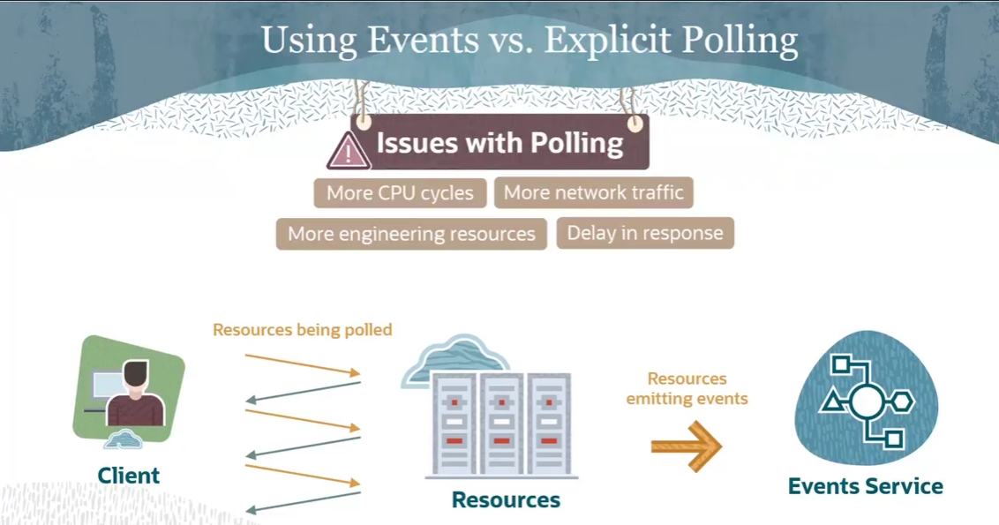
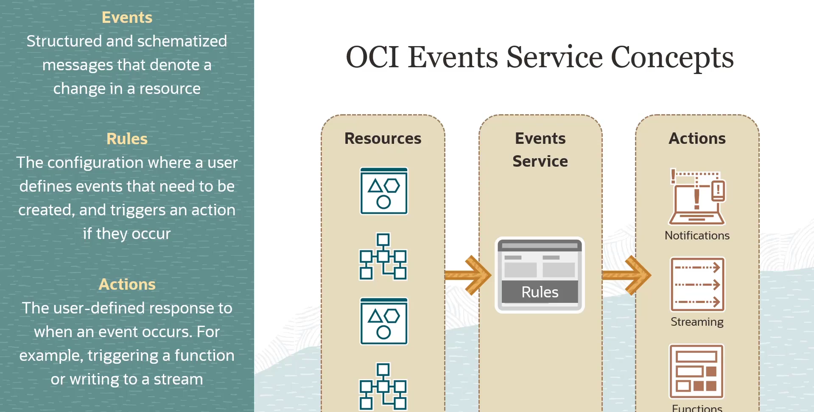
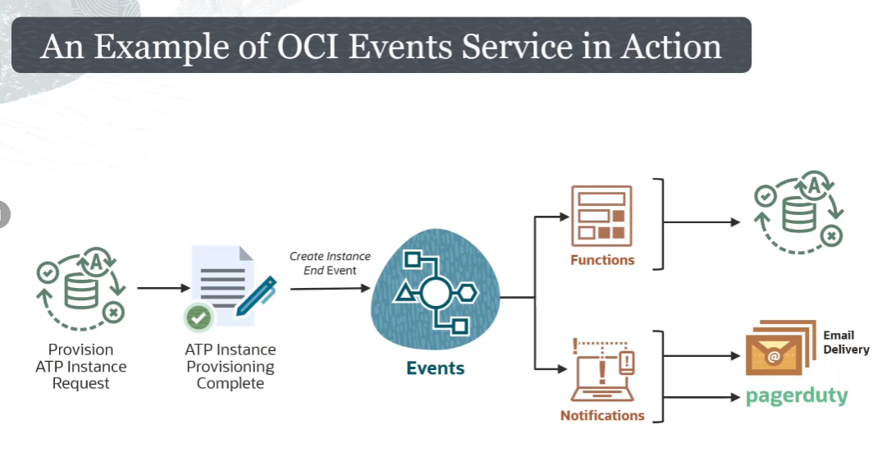

= OCI Events Service: A Arquitetura de Automação Cloud-Native
:toc: levels=2
:icons: font

[preamble]
--
Neste módulo do curso, exploramos o OCI Events Service. Pense neste serviço como o sistema nervoso central da sua tenancy na OCI. Ele permite que você pare de perguntar "algo mudou?" (polling) e comece a reagir em tempo real quando "algo muda". Dominar a arquitetura orientada a eventos é uma habilidade fundamental para qualquer desenvolvedor sênior ou arquiteto de nuvem, pois é a base para a criação de automações eficientes, resilientes e escaláveis.
--

== Visão Geral e Propósito

=== O que é o OCI Events Service?

O OCI Events Service é um serviço que permite a criação de automação baseada em *mudanças de estado* de recursos dentro de uma tenancy. Ele permite que equipes de desenvolvimento respondam automaticamente a eventos, criando uma arquitetura reativa e fracamente acoplada.

.Exemplos de Casos de Uso:
* Enviar uma notificação quando o backup de um banco de dados é concluído.
* Disparar uma OCI Function para converter um arquivo quando ele é carregado em um bucket do Object Storage.

=== Tipos de Eventos

Um evento pode ser gerado por diversas ocorrências que impactam um recurso na OCI:
* *Operações CRUD:* Ações de criação, leitura, atualização ou exclusão de um recurso.
* *Mudanças no Estado do Ciclo de Vida:* Transições no estado de um recurso, como `backup.complete` ou `instance.start.begin`.
* *Eventos de Sistema da OCI:* Outros eventos do sistema que afetam um recurso.

[NOTE]
====
.Padrão Aberto: CloudEvents
Os eventos na OCI seguem o formato do padrão industrial *CloudEvents*, um projeto hospedado pela Cloud Native Computing Foundation (CNCF). A adesão a este padrão garante a interoperabilidade entre diferentes provedores de nuvem e até mesmo entre sistemas on-premises e a nuvem, o que é uma consideração de design crucial para arquiteturas híbridas.
====

== A Vantagem da Arquitetura Orientada a Eventos (vs. Polling)

Uma questão comum é por que usar eventos em vez de criar aplicações que fazem _polling_ (consultas contínuas) dos recursos para verificar mudanças. A abordagem de polling apresenta várias desvantagens.

[options="header", cols="1,2,2"]
|===
| Característica | Abordagem de Polling | Abordagem Orientada a Eventos

| *Eficiência de Recursos*
| Ineficiente. Consome recursos de rede e computação constantemente, mesmo quando não há nenhuma mudança.
| Altamente eficiente. A lógica só é executada quando uma mudança relevante ocorre.

| *Latência na Resposta*
| Alta. A detecção da mudança depende do intervalo de polling. Uma mudança pode não ser detectada por vários minutos.
| Baixa. A resposta à mudança é quase em tempo real.

| *Complexidade*
| Alta. Requer a escrita e manutenção de código para consultar o estado, comparar com o estado anterior e gerenciar a lógica de polling.
| Baixa. A lógica é baseada em configuração ("se este evento ocorrer, então execute esta ação"), que é mais simples de criar e manter.

| *Escalabilidade*
| Limitada. Escalar uma solução de polling para monitorar milhares de recursos é complexo e caro.
| Altamente escalável. O serviço é gerenciado e projetado para lidar com o volume de eventos de toda a tenancy.
|===

[TIP]
====
.Agilidade na Manutenção
Uma arquitetura baseada em eventos, sendo baseada em configuração, é muito mais ágil. Para reagir a um novo caso de uso, basta criar uma nova regra. Em uma abordagem de polling, seria necessário reescrever, testar e implantar o código da aplicação cliente.
====

== Os Três Conceitos Fundamentais do Serviço

O serviço opera com base em três componentes interligados.

*`Event (Evento)`*::
*Definição:* Uma representação estruturada de uma mudança em um recurso da OCI, iniciada pelo sistema ou por uma ação do usuário.
[NOTE]
====
.Notas do Instrutor
Pense no *Evento* como um fato imutável que ocorreu. É uma mensagem bem formatada (JSON) que contém metadados sobre _o que_ aconteceu (ex: `com.oraclecloud.objectstorage.createobject`), _onde_ aconteceu (o compartimento e o OCID do recurso) e outros detalhes que podem ser usados para processamento downstream.
====

*`Rule (Regra)`*::
*Definição:* Um filtro definido pelo cliente sobre um ou mais campos de um evento.
[NOTE]
====
.Notas do Instrutor
A *Regra* é a parte "SE" da lógica "SE-ENTÃO". Ela intercepta todos os eventos que fluem pelo sistema e os filtra com base em condições que você define. Uma regra pode ser tão ampla quanto "qualquer evento no compartment X" ou tão específica quanto "apenas eventos de `instance.terminate.end` para recursos com a tag `env=prod`".
====

*`Action (Ação)`*::
*Definição:* A atividade downstream que é acionada quando uma Regra corresponde a um Evento.
[NOTE]
====
.Notas do Instrutor
A *Ação* é a parte "ENTÃO" da lógica. Quando uma regra encontra um evento correspondente, ela dispara uma ou mais ações pré-definidas. O conteúdo (payload) do evento é passado para a ação. As ações disponíveis são:
* Enviar o evento para o *OCI Streaming Service*.
* Invocar uma *Oracle Function*.
* Enviar o evento para o *OCI Notifications Service* (para e-mail, PagerDuty, Slack, etc.).
====

== Exemplo Prático: Automação Pós-Provisionamento de um ATP

Vamos aplicar os conceitos a um caso de uso real para solidificar o entendimento.

.Fluxo de Execução:
. *Início:* Um banco de dados *Autonomous Transaction Processing (ATP)* é provisionado.
. *Emissão do Evento:* Após a conclusão bem-sucedida, um evento do tipo `com.oraclecloud.databaseservice.createautonomousexadatainfrastructure.end` é emitido pelo serviço de banco de dados.
. *Correspondência da Regra:* O OCI Events Service recebe o evento. Uma *Regra* pré-configurada para filtrar por este tipo de evento em um compartment específico encontra uma correspondência.
. *Disparo das Ações:* A correspondência da regra dispara duas *Ações* em paralelo:
.. *Ação 1 (Oracle Functions):* Uma função é invocada. O payload do evento, contendo o OCID do novo banco de dados, é passado para a função. A função então executa scripts para criar schemas, tabelas e importar dados iniciais ("golden data") no banco de dados recém-provisionado.
.. *Ação 2 (Notifications Service):* Uma notificação é enviada para um tópico, que por sua vez envia um e-mail para um administrador e cria um incidente no PagerDuty para notificar a equipe de operações.

