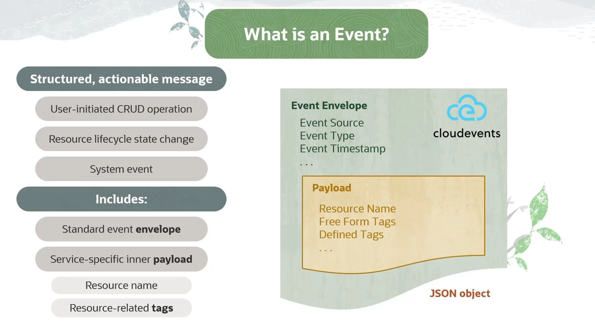
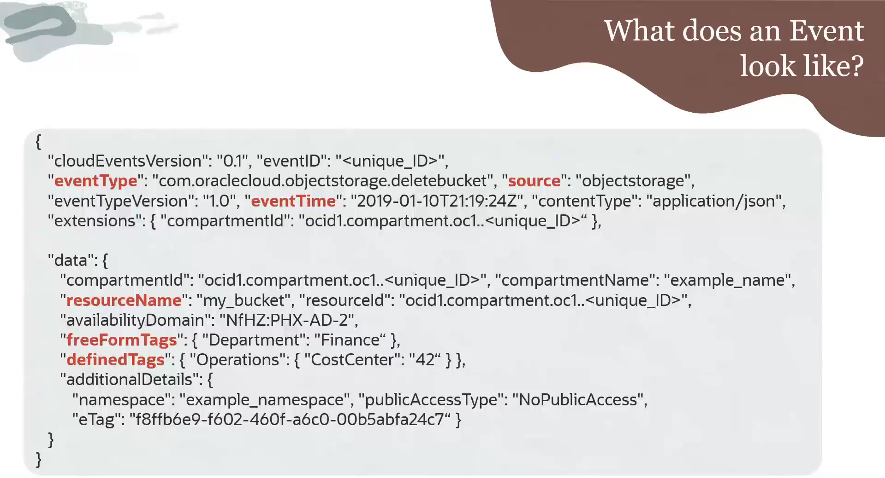
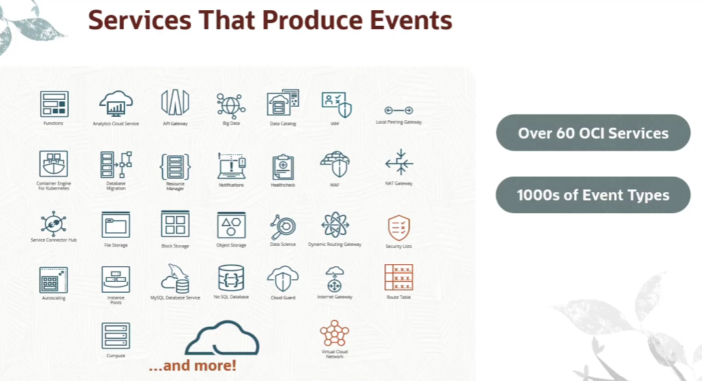

= OCI Events: Anatomia das Mensagens e Tipos de Eventos
:toc: levels=2
:icons: font

[preamble]
--
Neste módulo do curso, fizemos um "deep dive" na unidade fundamental do OCI Events Service: a própria mensagem de evento. Compreender a estrutura de uma mensagem e como os milhares de tipos de eventos são organizados é essencial para construir regras de automação que sejam precisas, eficientes e robustas. Vamos dissecar o que acontece "debaixo do capô".
--

== Anatomia de uma Mensagem de Evento

=== Evento vs. Log: Estrutura e Contexto

É crucial distinguir um evento de uma entrada de log genérica.
* *Logs:* Geralmente são registros brutos e não estruturados ou semiestruturados.
* *Eventos:* São mensagens leves, *estruturadas* e com *contexto derivado*. Eles não apenas registram que algo aconteceu, mas o fazem de uma forma que é garantidamente acionável por sistemas de automação.

=== A Estrutura Padrão: CloudEvents

Cada evento na OCI é composto por um "envelope" que se conforma ao padrão *CloudEvents* da CNCF. Este envelope contém metadados consistentes para todos os tipos de eventos.

.Atributos do Envelope CloudEvents:
*`eventSource`*::
O serviço da OCI que gerou o evento. Ex: `objectstorage`, `compute`.

*`eventType`*::
Uma designação que descreve a mudança de estado específica. Ex: `com.oraclecloud.objectstorage.deletebucket`, `com.oraclecloud.compute.instance.stop.end`.

*`eventTime`*::
O timestamp de quando o evento ocorreu.

=== O Conteúdo: Payload de Dados (`data`)

Dentro do envelope, há um payload (`data`) que contém informações detalhadas e específicas do serviço para descrever a mudança e o recurso impactado com mais detalhe, incluindo quaisquer tags (free-form ou defined) associadas ao recurso.

=== Exemplo Prático: Dessecando um Evento JSON

Abaixo está um exemplo de evento, no formato JSON, que representa a exclusão de um bucket no Object Storage.

[source,json]
----
{
  "cloudEventsVersion" : "0.1",
  "contentType" : "application/json",
  "source" : "objectstorage", <1>
  "eventID" : "f329c3a6-a36a-4952-839f-7e04b4e9b6a3",
  "eventType" : "com.oraclecloud.objectstorage.deletebucket", <2>
  "eventTime" : "2020-10-15T21:19:28.056Z", <3>
  "data" : { <4>
    "compartmentId" : "ocid1.compartment.oc1..aaaaaaaarv25kxxxxxxxxxxx",
    "compartmentName" : "my-compartment",
    "resourceName" : "my_bucket", <5>
    "resourceId" : "ocid1.bucket.oc1.iad.aaaaaaaavol7txxxxxxxxxxx",
    "availabilityDomain" : "US-ASHBURN-AD-1",
    "freeformTags" : {
      "dev" : "true" <6>
    },
    "definedTags" : {
      "qa-team" : {
        "release" : "alpha"
      }
    }
  }
}
----
<1> *Source:* O serviço que emitiu o evento, neste caso, `objectstorage`.
<2> *eventType:* O tipo de evento específico. A estrutura `com.oraclecloud.{service}.{action}` é o padrão.
<3> *eventTime:* O momento exato em que o evento ocorreu, em formato UTC.
<4> *data:* O payload interno. Seu conteúdo varia drasticamente entre diferentes serviços e tipos de evento.
<5> *resourceName:* O nome legível do recurso que foi afetado, neste caso, o bucket `my_bucket`.
<6> *freeformTags:* As tags associadas ao recurso no momento do evento. As regras podem filtrar eventos com base nestas tags.

== Organização e Escopo dos Tipos de Eventos

A OCI possui mais de 60 serviços que produzem eventos, resultando em milhares de tipos de eventos distintos. Para tornar isso gerenciável, eles são organizados de forma hierárquica.

=== O Fluxo de Eventos na Tenancy

Tecnicamente, todos os eventos de todos os recursos fluem automaticamente para o Events Service. O serviço então os verifica em relação a todas as regras criadas pelo usuário.
* Se um evento *corresponde* a uma regra, a ação definida pelo usuário é disparada.
* Se um evento *não corresponde* a nenhuma regra, ele é simplesmente descartado.

=== A Hierarquia dos Tipos de Eventos

Os tipos de evento são organizados da seguinte forma para facilitar a descoberta e a configuração de regras:

* *Nível 1: Serviço (Service)*
** Ex: `Compute`, `API Gateway`, `Virtual Cloud Network`, `Oracle Integration`.
* *Nível 2: Tipo de Recurso (Resource Type)*
** Ex: Dentro do serviço `Compute`, existem tipos de recurso como `Instance`, `Image`, `Boot Volume Backup`.
* *Nível 3: Tipo de Evento (Event Type)*
** Ex: Dentro do tipo de recurso `Instance`, existem dezenas de tipos de evento, como `instance-launch-start`, `instance-launch-end`, `instance-reboot-begin`.

=== Estudo de Caso: Eventos do Serviço OCI Compute

Para ilustrar a escala e a organização, vamos analisar o serviço OCI Compute:
* Ele emite *87 tipos de eventos diferentes*.
* Estes eventos são organizados em *10 categorias* de tipos de recurso.
* A categoria "Instance Event Types" sozinha agrupa *22 tipos de eventos* (`instance-launch`, `instance-stop`, etc.) que, crucialmente, compartilham uma *estrutura de payload (`data`) similar*.

[IMPORTANT]
====
.Implicação para a Criação de Regras
Esta organização hierárquica é a chave para a usabilidade do serviço. Ao criar uma regra no Console da OCI, a interface guia o usuário através desta hierarquia. Você primeiro seleciona o *Serviço* (ex: Compute), depois o *Tipo de Recurso* (ex: Instance), e então pode selecionar um ou múltiplos *Tipos de Evento* específicos para aquela categoria. Isso abstrai a complexidade de ter que conhecer e digitar os nomes de milhares de eventos.
====

image::images/image114.png[alt="Hierarquia dos Tipos de Eventos", title="Hierarquia dos Tipos de Eventos"]