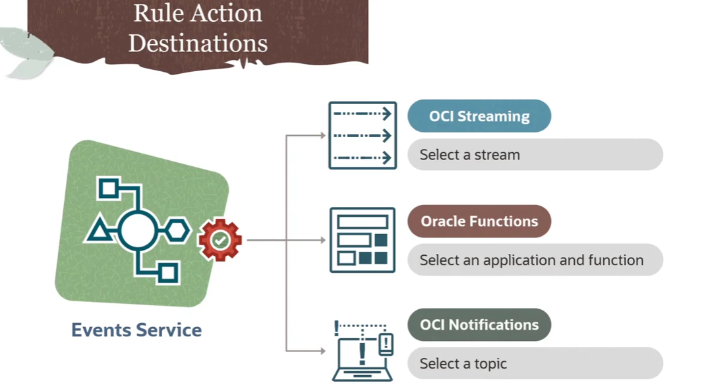
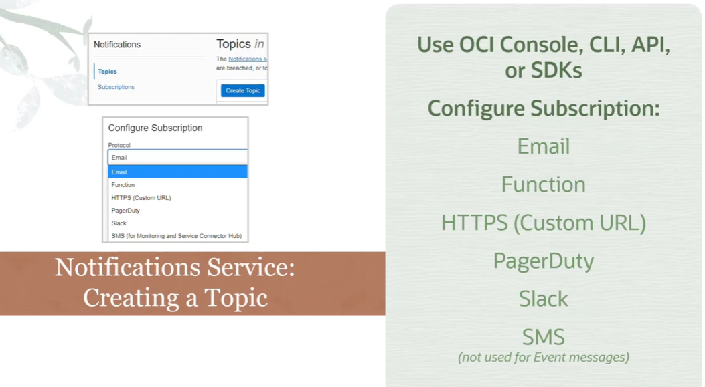
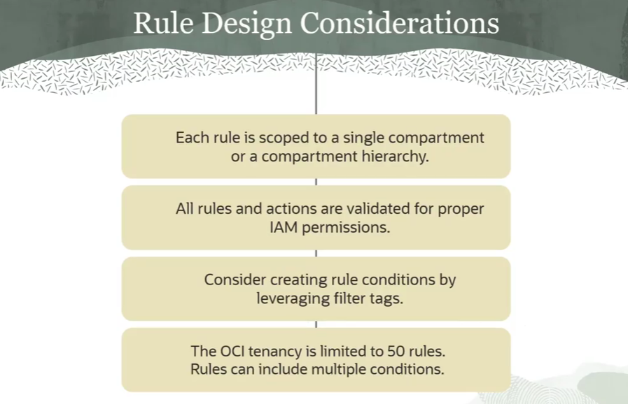

= OCI Events: Configurando Ações de Regra (Destinos de Eventos)
:toc: levels=2
:icons: font

[preamble]
--
Nos módulos anteriores, definimos o "SE" da nossa lógica de automação: o Evento e a Regra que o filtra. Agora, vamos focar no "ENTÃO": a Ação. Uma Ação é o destino para onde um evento filtrado é enviado. A escolha do destino correto é uma decisão de arquitetura crucial que define o que acontecerá a seguir. Nesta lição, vamos dissecar as três opções de destino disponíveis e entender os pré-requisitos e casos de uso de cada uma.
--

== As Três Ações de Destino

Quando uma Regra do OCI Events Service corresponde a um evento, ela pode disparar uma ou mais ações. Existem três tipos de destino que podem ser configurados:

. *OCI Streaming Service:* Para processamento de fluxos de eventos em tempo real e integração com o ecossistema Kafka.
. *Oracle Functions:* Para executar lógica customizada e sem servidor em resposta a um evento.
. *OCI Notifications Service:* Para distribuir o evento para múltiplos endpoints através de um padrão _publish-subscribe_.

[IMPORTANT]
====
.Pré-requisito Universal
Antes que qualquer um desses destinos possa ser selecionado como uma Ação em uma regra, o recurso de destino (o Stream, a Função ou o Tópico de Notificação) *já deve existir* na sua tenancy OCI.
====

== Ação 1: OCI Streaming Service

Esta ação encaminha o evento para um stream no OCI Streaming Service.

=== Visão Geral do OCI Streaming

O Streaming Service funciona como um log _append-only_ (apenas para anexação), distribuído e de alta vazão.
* *Produtor:* Neste caso, o OCI Event Service atua como o produtor, publicando a mensagem do evento no stream.
* *Partições:* As mensagens são distribuídas entre partições gerenciadas pela Oracle para escalabilidade. Cada partição garante a ordem de entrega das mensagens.
* *Consumidor:* Uma ou mais aplicações consumidoras leem as mensagens do stream. Cada mensagem possui um `offset` para que os consumidores saibam onde pararam.
* *Compatibilidade Kafka:* O serviço é compatível com a maioria das APIs do Kafka, permitindo que aplicações existentes escritas para Kafka consumam os eventos da OCI sem reescrever o código.

image::images/image140.png[alt="Visão Geral do OCI Streaming", title="Visão Geral do OCI Streaming"]

[NOTE]
====
.Para Aprofundar
Para uma análise completa do OCI Streaming, consulte os módulos anteriores deste curso e a documentação oficial da Oracle.
====

=== Pré-requisitos e Configuração

. *Criar um Stream:*
.. Antes de configurar a ação, é necessário criar um *Stream* através do Console, CLI, SDKs ou Resource Manager.
.. Ao criar, define-se o *Compartment*, o *Stream Pool*, o *período de retenção* (horas) e o *número de partições*.
. *Configurar a Ação na Regra:*
.. Ao editar uma regra de evento, selecione `Streaming` como o *Action Type*.
.. Selecione o *Compartment* que contém o stream.
.. Escolha o *Stream* apropriado na lista.

== Ação 2: Oracle Functions

Esta ação invoca uma função serverless, passando o evento como payload.

=== Visão Geral do Oracle Functions

O Oracle Functions é uma plataforma serverless, baseada no projeto open source *Fn Project*.
* *Container-Native:* Uma função é construída como uma imagem Docker e enviada para um registry.
* *Metadados da Função:* O servidor do Functions armazena metadados que descrevem como executar a função, incluindo a imagem a ser utilizada, o tempo máximo de execução e a memória máxima permitida.
* *IAM e FDKs:* O serviço é totalmente integrado com o OCI IAM e suporta diversas linguagens através de Function Development Kits (FDKs).
* *Aplicações:* Funções são agrupadas logicamente em *Aplicações*, que fornecem um contexto comum para configuração e isolamento de runtime.

image::images/image141.png[alt="Visão Geral do Oracle Functions", title="Visão Geral do Oracle Functions"]

[TIP]
====
.Melhor Prática para o Design da Função
Para que uma função funcione bem como um destino de evento, o desenvolvedor deve projetar sua interface para aceitar uma requisição *HTTP POST*, esperando a mensagem de evento (em formato JSON) como seu payload.
====

=== Pré-requisitos e Configuração

. *Criar e Implantar a Função:*
.. A função que será invocada já deve estar criada e implantada dentro de uma Aplicação no serviço Oracle Functions.

. *Configurar a Ação na Regra:*
.. Ao editar uma regra de evento, selecione `Functions` como o *Action Type*.
.. Selecione o *Compartment* que contém a aplicação da função.
.. Escolha a *Aplicação* na lista.
.. Selecione a *Função* específica a ser invocada.

== Ação 3: OCI Notifications Service

Esta ação publica o evento em um tópico de notificação, que por sua vez o distribui para todos os seus assinantes.

=== Visão Geral do OCI Notifications

O serviço de Notificações utiliza um padrão *publish-subscribe (pub-sub)* para transmitir mensagens para componentes distribuídos de forma segura, confiável e com baixa latência.
* *Tópico (Topic):* O canal de comunicação para publicar mensagens.
* *Assinatura (Subscription):* O endpoint de um assinante do tópico.
* *Entrega Confiável:* Quando uma mensagem é publicada no tópico, o serviço a envia para todas as suas assinaturas. Se um endpoint de assinante não confirmar o recebimento (ex: um servidor de e-mail offline), o serviço de Notificações tentará reenviar a mensagem.

image::images/image142.png[alt="Visão Geral do OCI Notifications", title="Visão Geral do OCI Notifications"]

=== Pré-requisitos e Configuração

. *Criar um Tópico e Assinaturas:*
.. Antes de configurar a ação, é necessário criar um *Tópico* e configurar pelo menos uma *Assinatura* para ele.

. *Tipos de Assinatura (Endpoints):*
.. *Email:* Envia um e-mail para um ou mais endereços.
.. *Function:* Invoca uma OCI Function. (Para casos de uso de eventos, é mais direto usar a Ação de Função).
.. *HTTPS (Custom URL):* Envia a mensagem do evento para um serviço web REST, seja ele hospedado na OCI ou externamente.
.. *PagerDuty:* Cria um incidente no PagerDuty.
.. *Slack:* Envia a mensagem do evento para um canal específico do Slack.
.. *SMS:* Este tipo de assinatura *não pode* ser usado diretamente para receber mensagens de eventos.

. *Configurar a Ação na Regra:*
.. Ao editar uma regra de evento, selecione `Notifications` como o *Action Type*.
.. Selecione o *Compartment* que contém o tópico.
.. Escolha o *Tópico* apropriado na lista.

=== Workflow de Planejamento e Criação de Regras (Design e Criação de Regras de Automação)

A criação de uma regra eficaz começa com um planejamento cuidadoso.

.Fases do Workflow:
. *Preparação dos Recursos de Ação:*
+
--
Antes de criar a regra, os recursos que servirão como destino (Ação) já devem existir. Por exemplo, se a intenção é notificar uma equipe quando um backup for concluído, o tópico do *OCI Notifications Service* e suas assinaturas (ex: um canal do Slack) devem ser criados primeiro.

[NOTE]
====
Os recursos de destino (Ações) *não precisam* estar no mesmo compartment que a Regra. É possível, por exemplo, ter uma regra no `compartment-A` que invoca uma função no `compartment-B`.
====
--
. *Planejamento da Estratégia de Correspondência (Matching):*
+
--
É preciso planejar a lógica de filtragem.
* *Verificar a Emissão:* Confirme que o recurso que você deseja monitorar (ex: Autonomous Data Warehouse) de fato emite um tipo de evento que atende à sua necessidade de automação (ex: `backup.end`).
* *Analisar o Payload:* Revise um exemplo do evento JSON para determinar a melhor maneira de identificar e filtrar os recursos de interesse (ex: usando o `resourceName`, o `compartmentId` ou tags).
--
. *Criação da Regra:*
+
--
Com o planejamento concluído, a regra é criada no compartment apropriado, especificando as condições de filtro e as ações de destino.
--

=== A Anatomia de uma Regra

Uma regra é uma estrutura simples que conecta uma condição de gatilho a uma ou mais ações de resposta.

*`Trigger Condition (Condição de Gatilho)`*::
A parte "SE" da lógica. É composta por um ou mais *tipos de evento* e, opcionalmente, por *filtros* adicionais baseados em atributos do evento ou em tags do recurso.

*`Response Action (Ação de Resposta)`*::
A parte "ENTÃO" da lógica. É a ação a ser executada quando a condição de gatilho é atendida. Uma única regra pode ter múltiplas ações (ex: notificar uma equipe *e* invocar uma função).

=== Construindo Condições de Regra no Console

A interface do Console da OCI oferece dois modos para a criação de regras.

=== Modo Simples (Simple Mode)

Este modo guia o usuário através da construção de condições com menus dropdown.
. *Condição 1: Tipo de Evento (Event Type):*
** Seleciona-se o *Serviço* (ex: `Database Service`) e um ou mais *Tipos de Evento* (ex: `Autonomous Database - Backup End`).
. *Condição 2 (Opcional): Filtros de Atributo:*
** Permite filtrar por valores específicos no payload do evento. Por exemplo, pode-se adicionar um filtro onde o atributo `resourceName` deve ser igual a `PROD_DB_01`.
. *Condição 3 (Opcional): Filtros de Tag:*
** Permite filtrar por recursos que possuem uma tag específica. Por exemplo, apenas acionar para recursos com a _defined tag_ `Project.CostCenter` igual a `XYZ`.

=== Modo Avançado (Advanced Mode)

Permite que usuários experientes escrevam a lógica da regra diretamente em uma sintaxe JSON complexa, ideal para condições mais elaboradas que não são possíveis no modo simples.

=== Considerações de Design e Melhores Práticas

* *Escopo de Compartment:*
** Regras se aplicam a eventos no compartment em que são criadas. É possível, opcionalmente, incluir todos os _child compartments_ (sub-compartimentos). Para criar uma regra que abranja toda a tenancy, ela deve ser criada no *root compartment*.

* *Permissões de IAM:*
** *Para Usuários:* Para criar, ler, atualizar e deletar (CRUD) regras de eventos, os usuários precisam da permissão `events-rule-management`.
** *Para o Serviço:* É necessário criar uma política que permita ao *próprio Events Service* entregar mensagens aos recursos de destino. Ex: `Allow service events to use functions in compartment <compartment_name>`.

* *Uso de Tags para Filtragem:*
** É uma melhor prática utilizar tags para refinar as condições de uma regra, além de filtrar por atributos do recurso. Isso permite um controle mais granular e flexível.

* *Limites de Serviço:*
** O número máximo de regras por tenancy é de 50 (este limite pode ser aumentado). Uma única regra pode conter múltiplas condições e ações.

== Garantias do Serviço e Monitoramento

=== Garantias de Entrega

O Events Service oferece as seguintes garantias:
* *Avaliação At-Least-Once:* Todo evento ingerido será avaliado *pelo menos uma vez* contra todas as regras definidas.
* *Tentativa de Entrega At-Least-Once:* Se uma regra for correspondida, o serviço tentará entregar o evento para todas as suas ações *pelo menos uma vez*.
* *Política de Retentativas (Retries):* Se um destino de ação não estiver respondendo, o serviço tentará a entrega por até *5 horas* ou até que um erro não recuperável ocorra.
[WARNING]
====
.Não-Garantia de Ordem
O serviço *não garante* que os eventos serão processados ou recebidos na ordem em que foram gerados.
====

=== Métricas de Monitoramento

O OCI Events Metrics ajuda a medir o sucesso das regras e a qualidade dos eventos na tenancy. Os dados são armazenados por até 90 dias.

.Métricas Chave por Regra:
* O número total de eventos que *corresponderam* à regra.
* Quantos eventos foram *roteados com sucesso* para as ações correspondentes.
* Quantas entregas *falharam*.

Estas métricas podem ser visualizadas em dashboards de telemetria, e também é possível visualizar o número total de eventos emitidos no escopo de um compartment inteiro.

