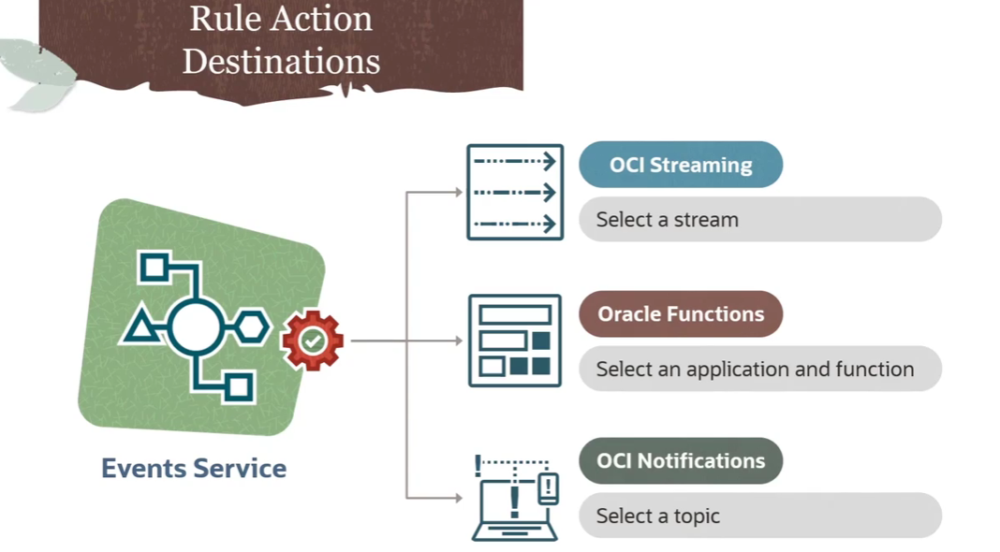
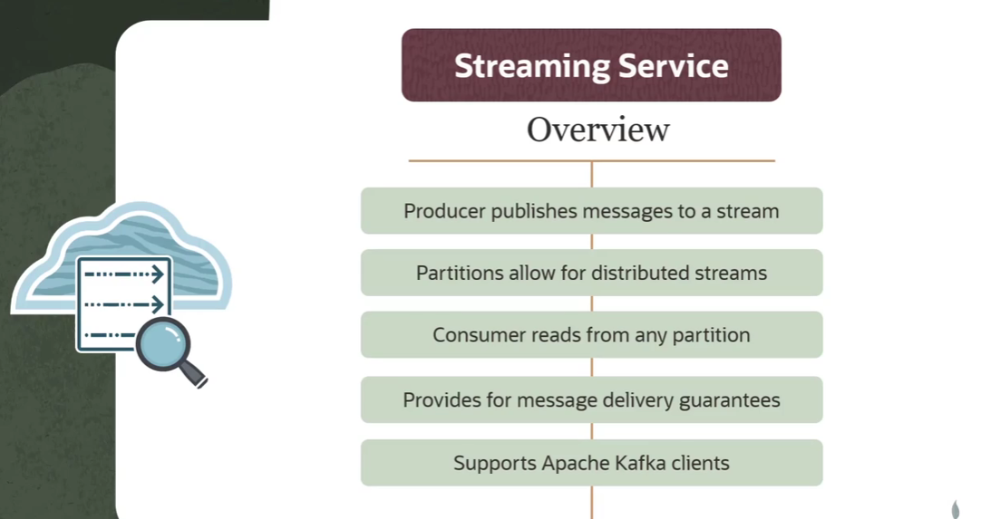
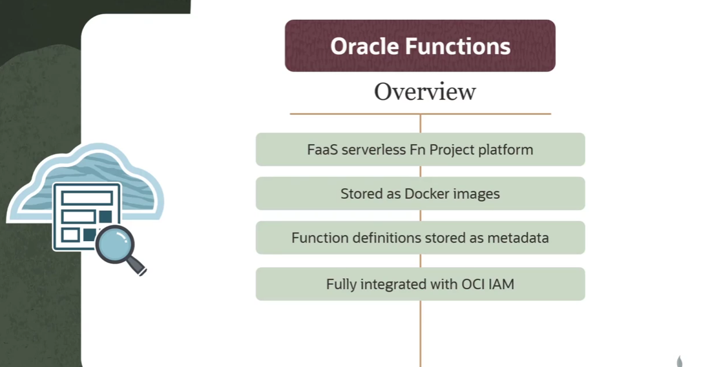
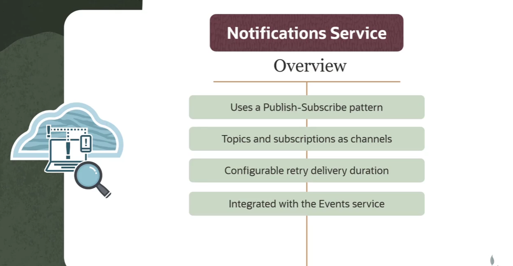
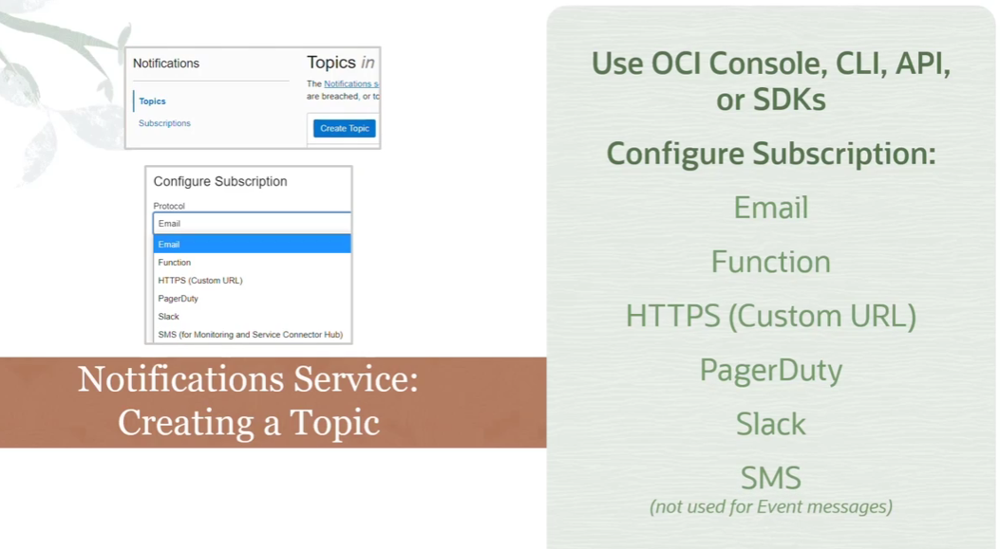

= OCI Events: Configurando Ações de Regra (Destinos de Eventos)
:toc: levels=2
:icons: font

[preamble]
--
Nos módulos anteriores, definimos o "SE" da nossa lógica de automação: o Evento e a Regra que o filtra. Agora, vamos focar no "ENTÃO": a Ação. Uma Ação é o destino para onde um evento filtrado é enviado. A escolha do destino correto é uma decisão de arquitetura crucial que define o que acontecerá a seguir. Nesta lição, vamos dissecar as três opções de destino disponíveis e entender os pré-requisitos e casos de uso de cada uma.
--

== As Três Ações de Destino

Quando uma Regra do OCI Events Service corresponde a um evento, ela pode disparar uma ou mais ações. Existem três tipos de destino que podem ser configurados:

. *OCI Streaming Service:* Para processamento de fluxos de eventos em tempo real e integração com o ecossistema Kafka.
. *Oracle Functions:* Para executar lógica customizada e sem servidor em resposta a um evento.
. *OCI Notifications Service:* Para distribuir o evento para múltiplos endpoints através de um padrão _publish-subscribe_.

[IMPORTANT]
====
.Pré-requisito Universal
Antes que qualquer um desses destinos possa ser selecionado como uma Ação em uma regra, o recurso de destino (o Stream, a Função ou o Tópico de Notificação) *já deve existir* na sua tenancy OCI.
====

== Ação 1: OCI Streaming Service

Esta ação encaminha o evento para um stream no OCI Streaming Service.

=== Visão Geral do OCI Streaming

O Streaming Service funciona como um log _append-only_ (apenas para anexação), distribuído e de alta vazão.
* *Produtor:* Neste caso, o OCI Event Service atua como o produtor, publicando a mensagem do evento no stream.
* *Partições:* As mensagens são distribuídas entre partições gerenciadas pela Oracle para escalabilidade. Cada partição garante a ordem de entrega das mensagens.
* *Consumidor:* Uma ou mais aplicações consumidoras leem as mensagens do stream. Cada mensagem possui um `offset` para que os consumidores saibam onde pararam.
* *Compatibilidade Kafka:* O serviço é compatível com a maioria das APIs do Kafka, permitindo que aplicações existentes escritas para Kafka consumam os eventos da OCI sem reescrever o código.

[NOTE]
====
.Para Aprofundar
Para uma análise completa do OCI Streaming, consulte os módulos anteriores deste curso e a documentação oficial da Oracle.
====

=== Pré-requisitos e Configuração

. *Criar um Stream:*
.. Antes de configurar a ação, é necessário criar um *Stream* através do Console, CLI, SDKs ou Resource Manager.
.. Ao criar, define-se o *Compartment*, o *Stream Pool*, o *período de retenção* (horas) e o *número de partições*.
. *Configurar a Ação na Regra:*
.. Ao editar uma regra de evento, selecione `Streaming` como o *Action Type*.
.. Selecione o *Compartment* que contém o stream.
.. Escolha o *Stream* apropriado na lista.

== Ação 2: Oracle Functions

Esta ação invoca uma função serverless, passando o evento como payload.

=== Visão Geral do Oracle Functions

O Oracle Functions é uma plataforma serverless, baseada no projeto open source *Fn Project*.
* *Container-Native:* Uma função é construída como uma imagem Docker e enviada para um registry.
* *Metadados da Função:* O servidor do Functions armazena metadados que descrevem como executar a função, incluindo a imagem a ser utilizada, o tempo máximo de execução e a memória máxima permitida.
* *IAM e FDKs:* O serviço é totalmente integrado com o OCI IAM e suporta diversas linguagens através de Function Development Kits (FDKs).
* *Aplicações:* Funções são agrupadas logicamente em *Aplicações*, que fornecem um contexto comum para configuração e isolamento de runtime.

[TIP]
====
.Melhor Prática para o Design da Função
Para que uma função funcione bem como um destino de evento, o desenvolvedor deve projetar sua interface para aceitar uma requisição *HTTP POST*, esperando a mensagem de evento (em formato JSON) como seu payload.
====

=== Pré-requisitos e Configuração

. *Criar e Implantar a Função:*
.. A função que será invocada já deve estar criada e implantada dentro de uma Aplicação no serviço Oracle Functions.

. *Configurar a Ação na Regra:*
.. Ao editar uma regra de evento, selecione `Functions` como o *Action Type*.
.. Selecione o *Compartment* que contém a aplicação da função.
.. Escolha a *Aplicação* na lista.
.. Selecione a *Função* específica a ser invocada.

== Ação 3: OCI Notifications Service

Esta ação publica o evento em um tópico de notificação, que por sua vez o distribui para todos os seus assinantes.

=== Visão Geral do OCI Notifications

O serviço de Notificações utiliza um padrão *publish-subscribe (pub-sub)* para transmitir mensagens para componentes distribuídos de forma segura, confiável e com baixa latência.
* *Tópico (Topic):* O canal de comunicação para publicar mensagens.
* *Assinatura (Subscription):* O endpoint de um assinante do tópico.
* *Entrega Confiável:* Quando uma mensagem é publicada no tópico, o serviço a envia para todas as suas assinaturas. Se um endpoint de assinante não confirmar o recebimento (ex: um servidor de e-mail offline), o serviço de Notificações tentará reenviar a mensagem.

=== Pré-requisitos e Configuração

. *Criar um Tópico e Assinaturas:*
.. Antes de configurar a ação, é necessário criar um *Tópico* e configurar pelo menos uma *Assinatura* para ele.

. *Tipos de Assinatura (Endpoints):*
.. *Email:* Envia um e-mail para um ou mais endereços.
.. *Function:* Invoca uma OCI Function. (Para casos de uso de eventos, é mais direto usar a Ação de Função).
.. *HTTPS (Custom URL):* Envia a mensagem do evento para um serviço web REST, seja ele hospedado na OCI ou externamente.
.. *PagerDuty:* Cria um incidente no PagerDuty.
.. *Slack:* Envia a mensagem do evento para um canal específico do Slack.
.. *SMS:* Este tipo de assinatura *não pode* ser usado diretamente para receber mensagens de eventos.

. *Configurar a Ação na Regra:*
.. Ao editar uma regra de evento, selecione `Notifications` como o *Action Type*.
.. Selecione o *Compartment* que contém o tópico.
.. Escolha o *Tópico* apropriado na lista.

