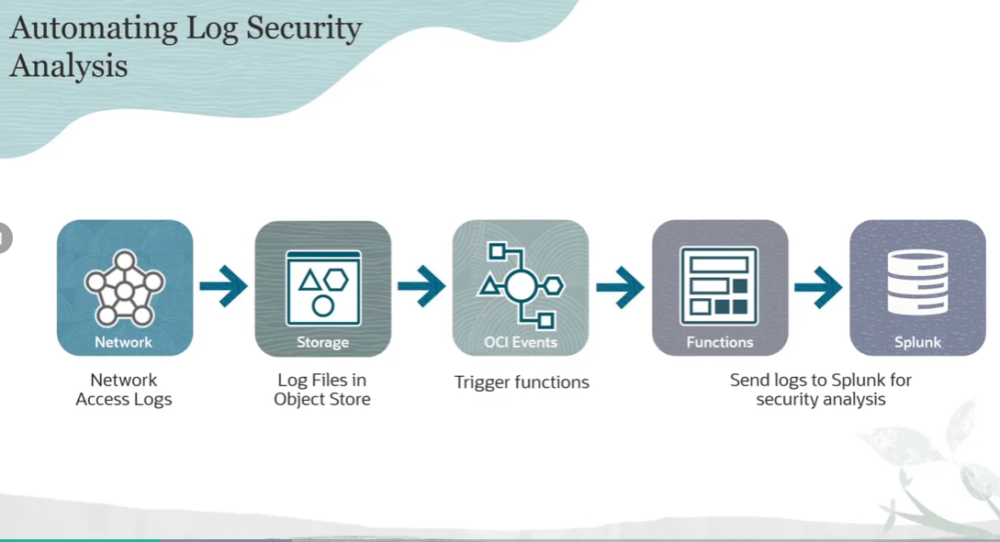
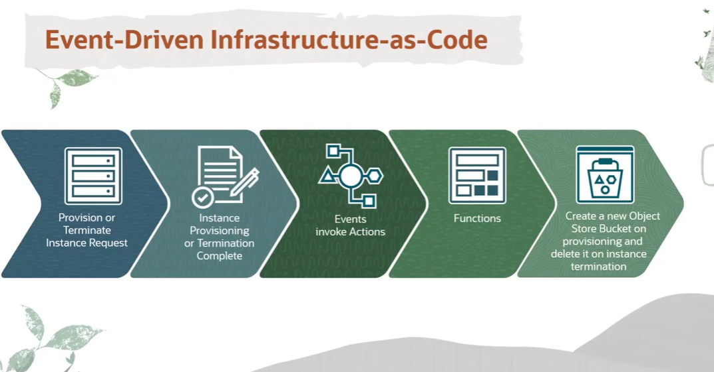
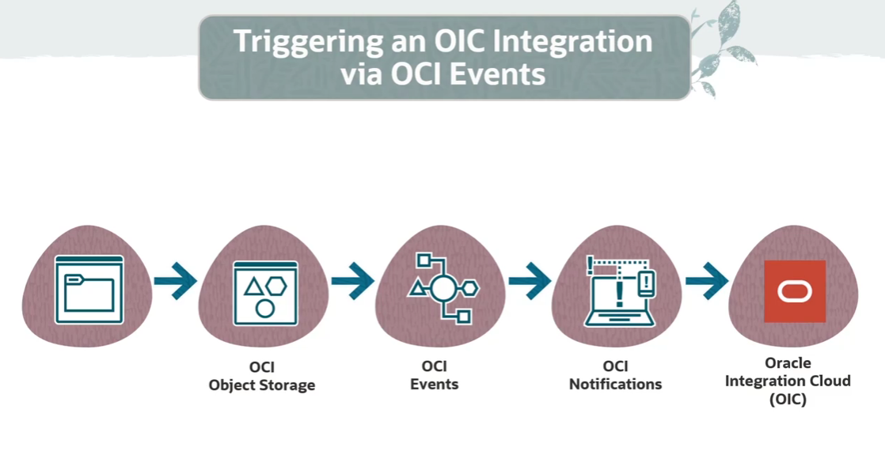
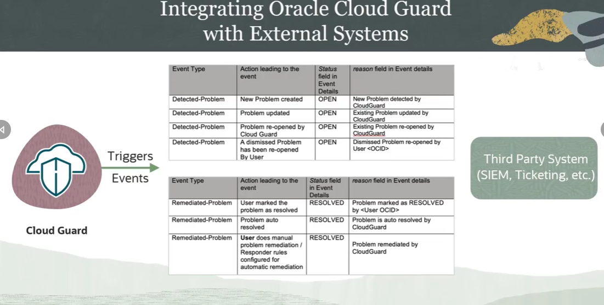
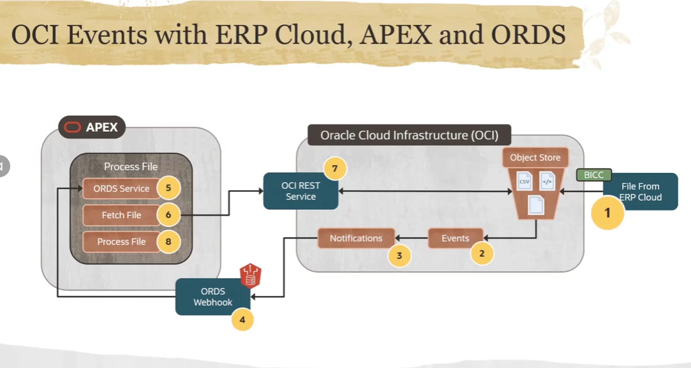
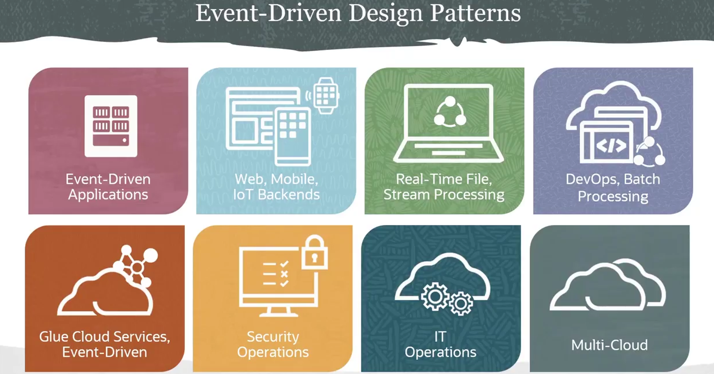

= OCI Events: Casos de Uso e Padrões de Arquitetura
:toc: levels=2
:icons: font

== Padrões Gerais de Utilização

O Events Service pode ser aplicado a uma vasta gama de cenários para equipes de Cloud Operations e desenvolvedores.

.Exemplos de Padrões:
* *Ações Pós-Término de Recursos:*
** Executar scripts de limpeza ou invocar outros serviços quando um recurso, como uma Instância de Compute ou um Bucket do Object Storage, é terminado.

* *Análise de Logs de Rede:*
** Configurar automação para analisar logs de rede (VCN Flow Logs) quando avisos ou problemas são detectados. Os logs podem ser enviados para ferramentas de terceiros como o Splunk para análise de segurança.

* *Processamento Automático de Arquivos:*
** Disparar um processo (ex: uma OCI Function para conversão de formato) sempre que novos arquivos são carregados em um bucket específico do Object Storage.

* *Automação de Onboarding:*
** Criar automaticamente recursos, como um bucket privado no Object Storage, durante o processo de onboarding de um novo usuário para armazenar seus arquivos e artefatos.

* *Arquivamento de Eventos:*
** Arquivar todos os eventos associados a um compartment específico em um stream do OCI Streaming para consumo e análise posterior.

* *Notificação de Tarefas Longas:*
** Publicar uma notificação (via e-mail, Slack, PagerDuty) para indivíduos ou sistemas de DevOps quando tarefas demoradas, como o provisionamento de um Autonomous Database, são concluídas.

* *Testes de Regressão de Infraestrutura:*
** Disparar uma suíte de testes de regressão sempre que um novo recurso de infraestrutura é criado ou deletado em um compartment específico.

== Arquiteturas de Exemplo Detalhadas

A seguir, vamos analisar seis casos de uso distintos que ilustram a implementação do OCI Events Service em cenários de clientes Oracle.

=== 1. Análise de Logs com Ferramentas Externas (Splunk)

.Fluxo da Automação:
. Arquivos de log de acesso à rede são carregados em um bucket do *Object Storage*.
. O evento `Object Create` é emitido.
. Uma *Regra* do Events Service, filtrando por este tipo de evento e por este bucket específico, é acionada.
. A *Ação* da regra invoca uma *OCI Function*.
. A função recupera os logs, os processa (se necessário) e os envia para uma instância do *Splunk* para análise de segurança periódica.

=== 2. Provisionamento/Desprovisionamento de Recursos (Infrastructure-as-Code)

Este é um caso de uso de automação de infraestrutura orientada a eventos.

.Fluxo da Automação:
. Uma nova *Instância de Compute* é provisionada ou terminada.
. Uma única *Regra* do Events Service captura ambos os tipos de evento (`instance-launch-end` e `instance-terminate-end`).
. A *Ação* da regra invoca uma *OCI Function*.
. A lógica da função verifica o tipo de evento recebido:
** Se o evento for de criação, a função cria um novo *Bucket Privado* no Object Storage, utilizando o nome da nova instância como nome para o bucket.
** Se o evento for de término, a função localiza o bucket previamente associado e o exclui.

=== 3. Automação de Conformidade de Segurança (Compliance)

Este caso de uso envolve a verificação automática de conformidade com políticas de segurança corporativas.

.Fluxo da Automação:
. Uma nova *Instância de Compute* é provisionada em um compartment.
. O evento de criação da instância aciona uma *Regra* que, por sua vez, invoca uma *OCI Function*.
. A lógica da função executa uma ou mais verificações de conformidade (ex: a instância possui IP público? Está na VCN correta? Possui as tags obrigatórias?).
. Se qualquer verificação falhar, a lógica da função:
.. Termina a instância não conforme.
.. Envia notificações apropriadas (ex: para a equipe de segurança e para o usuário que criou a instância).
.. Potencialmente, inicia uma nova requisição de provisionamento com os parâmetros corretos.

=== 4. Invocação de Fluxos do Oracle Integration Cloud (OIC)

Este padrão demonstra como integrar o OCI Events com serviços de integração de alto nível.

.Fluxo da Automação:
. Um arquivo é carregado em um bucket do *Object Storage*.
. O evento `Object Create` aciona uma *Regra* que filtra por aquele bucket específico.
. A *Ação* da regra envia o evento para um tópico do *OCI Notifications Service*.
. O tópico de notificação possui uma assinatura do tipo *HTTPS*, configurada com a URL do endpoint de um fluxo de integração no *Oracle Integration Cloud (OIC)*.
. O OIC recebe a requisição REST, o que dispara a execução do fluxo de integração.
. O fluxo de integração, então, recupera e processa o arquivo do Object Storage.

=== 5. Integração com OCI Cloud Guard para SIEM Externo

Este caso de uso permite a exportação de alertas de segurança para sistemas externos.
[NOTE]
====
.O que é SIEM?
*SIEM (Security Information and Event Management)* refere-se à estratégia e às ferramentas (como Datadog, SolarWinds) que uma empresa utiliza para agregação e análise de dados de segurança.
====

.Fluxo da Automação:
. O *OCI Cloud Guard* detecta um problema de segurança (ex: um bucket público) e emite um evento.
. Uma *Regra* do Events Service captura os eventos do Cloud Guard.
. A *Ação* da regra invoca uma *OCI Function* (ou envia para o Notifications).
. A função recebe o payload do problema detectado e invoca uma API em um sistema externo para:
** Enviar os dados para um sistema SIEM central para análise correlacionada.
** Criar um ticket em um sistema de gerenciamento de serviços (ex: ServiceNow, Jira).

=== 6. Processamento de Arquivos de ERP Cloud com APEX

Este é um caso de uso mais evoluído, ilustrando uma integração complexa entre SaaS, PaaS e IaaS. O desafio é saber quando um job de extração de dados de um ERP finalizou e o arquivo está pronto para ser processado.

.Fluxo da Automação:
. *(1)* Um job (agendado ou manual) no *Oracle Business Intelligence Cloud Connector (BICC)* do ERP Cloud extrai dados e exporta um arquivo CSV para um bucket no *OCI Object Storage*.
. *(2)* O evento `Object Create` dispara uma *Regra* no Events Service.
. *(3)* A *Ação* da regra envia o evento para um tópico do *OCI Notifications*.
. *(4)* O tópico possui uma assinatura *HTTPS* que aponta para um webhook de um serviço *Oracle REST Data Services (ORDS)*, executando em um ambiente *Oracle APEX*.
. *(5)* O serviço ORDS recebe o evento e submete um job assíncrono no *Database Scheduler*.
. *(6)* O job do banco de dados utiliza a API REST da OCI para buscar o arquivo do Object Storage, o analisa (parse) com o APEX Data Parser e disponibiliza os dados para as aplicações APEX.

== Resumo dos Padrões de Design Orientados a Eventos

Os exemplos demonstram a vasta gama de casos de uso possíveis com o OCI Events, impulsionados pela extensa quantidade de tipos de evento e pela flexibilidade ilimitada da lógica que pode ser implementada nas três opções de Ação: OCI Notifications, OCI Streaming e Oracle Functions.

