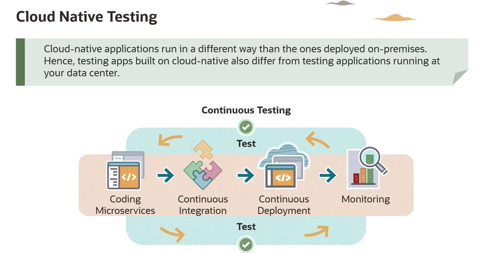
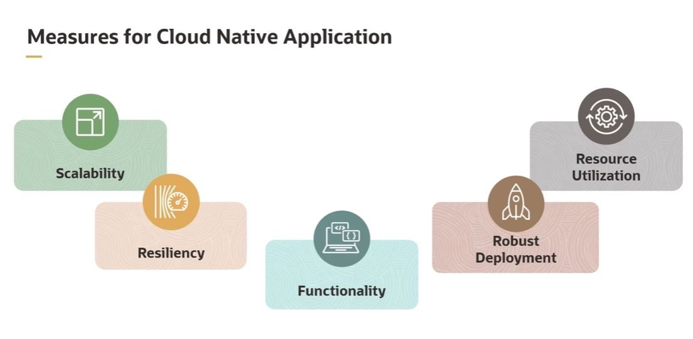

= Testes em Aplicações Cloud-Native: Uma Visão Geral
:toc: levels=2
:icons: font

== A Mudança de Paradigma: Por que Testar em Cloud-Native é Diferente?

Testar aplicações construídas para a nuvem difere drasticamente dos testes em ambientes on-premises. As técnicas tradicionais precisam ser revistas e complementadas com novas abordagens para detectar, depurar, analisar e reportar problemas de forma eficaz.

Esta necessidade de adaptação surge das características inerentes das aplicações cloud-native:
* *Natureza Dinâmica e Distribuída:*
** São construídas sobre microsserviços, o que aumenta a complexidade das interações e os pontos de falha.
* *Velocidade de Entrega Acelerada:*
** São entregues em um ritmo muito mais rápido, impulsionado por práticas de CI/CD e DevOps, o que reduz a janela de tempo para testes manuais extensivos.
* *Modos de Falha Imprevisíveis:*
** A natureza distribuída e a efemeridade dos componentes (contêineres sendo criados e destruídos) introduzem modos de falha que são difíceis de antecipar e replicar em ambientes de teste tradicionais.

[IMPORTANT]
====
.Teste Contínuo é Mandatório
Para aplicações cloud-native, o teste não pode ser uma fase isolada no final do ciclo de desenvolvimento. Ele deve ser uma parte integral e contínua de *todas as fases* do SDLC (Software Development Lifecycle), abrangendo desde o pré-desenvolvimento até a pós-produção (monitoramento e observabilidade).
====

== Os Cinco Pilares de um Plano de Testes Cloud-Native

Um plano de testes robusto para aplicações cloud-native deve se concentrar nas seguintes áreas críticas.

=== 1. Escalabilidade (Scalability)

*Definição:* A capacidade da aplicação de escalar seus contêineres ou pods para cima (scale-up) ou para baixo (scale-down) com base em requisitos em tempo real.

*Importância:* Uma aplicação cloud-native deve ser capaz de resistir a demandas flutuantes e dinâmicas sem degradação de performance. A estratégia de testes deve validar este comportamento.

.Cenários de Teste Essenciais:
* O que acontece quando as instâncias não são mais necessárias? O _scale-down_ funciona como esperado?
* Como o serviço se comporta durante o processo de _scaling_? Há impacto na performance ou disponibilidade?
* Como o tráfego é roteado quando os nós estão sobrecarregados ou durante um evento de auto-scaling?

=== 2. Resiliência (Resiliency)

*Definição:* A filosofia de "projetar para a falha, mas testar para a recuperação". A resiliência é a capacidade do sistema de se recuperar de falhas e continuar funcionando.

*Importância:* Em um sistema distribuído, falhas parciais são inevitáveis. Os testes devem garantir que a falha de um componente não cause uma falha em cascata que derrube todo o sistema.

.Cenários de Teste Essenciais:
* Como o roteamento de tráfego se comporta durante a sobrecarga de um serviço?
* Como o balanceamento de carga (_load balancing_) afeta a performance e a distribuição de requisições?
* Como as requisições dos usuários são tratadas quando algumas funcionalidades ou serviços dependentes estão indisponíveis? (Testes de _graceful degradation_).

=== 3. Funcionalidade (Functionality)

*Definição:* O objetivo clássico do teste de software: confirmar que a aplicação se comporta como esperado antes de chegar à produção.

*Importância:* Identificar e corrigir brechas funcionais (bugs) antes que causem downtime ou impactem negativamente a experiência do usuário.

.Funções Essenciais a serem Verificadas:
* Carregamento de páginas e componentes da UI.
* Funcionalidade de login e controle de acesso.
* Validações de entrada de dados em formulários e APIs.
* Verificações da corretude das saídas (outputs).
* Comportamento e responsividade das interfaces de usuário.

=== 4. Robustez do Deploy (Robust Deployment)

*Definição:* A automação é o fator principal que impulsiona a velocidade de deploy em aplicações cloud-native. O foco dos testes de regressão deve mudar.

*Importância:* Em vez de focar em pacotes de regressão manuais, grandes e de manutenção difícil, a ênfase deve ser em *pacotes de testes inteligentes e automatizados* que podem validar simultaneamente o sucesso de um deployment e executar um conjunto selecionado de testes funcionais críticos.

[TIP]
====
.Testes como Valor Contínuo
Este tipo de regressão automatizada agrega valor constante ao esforço de desenvolvimento. O conjunto de testes pode ser expandido ou reduzido dinamicamente à medida que o produto evolui, garantindo uma cobertura relevante e um feedback rápido para os desenvolvedores.
====

=== 5. Utilização de Recursos (Resource Utilization)

*Definição:* Em aplicações cloud-native, um processo de orquestração central (como o Kubernetes) gerencia e agenda dinamicamente os contêineres para otimizar a utilização de recursos.

*Importância:* Esta automação é baseada em parâmetros definidos pela equipe de DevOps. É crucial testar se o balanceamento de cargas e a alocação de recursos estão sendo mantidos de forma eficiente.

[NOTE]
====
.Riscos de Má Configuração
Configurações inadequadas de recursos podem resultar em baixa utilização (desperdício de custos na nuvem) ou, inversamente, em recursos insuficientes, o que aumenta o tempo de resposta e degrada a performance da aplicação.
====

