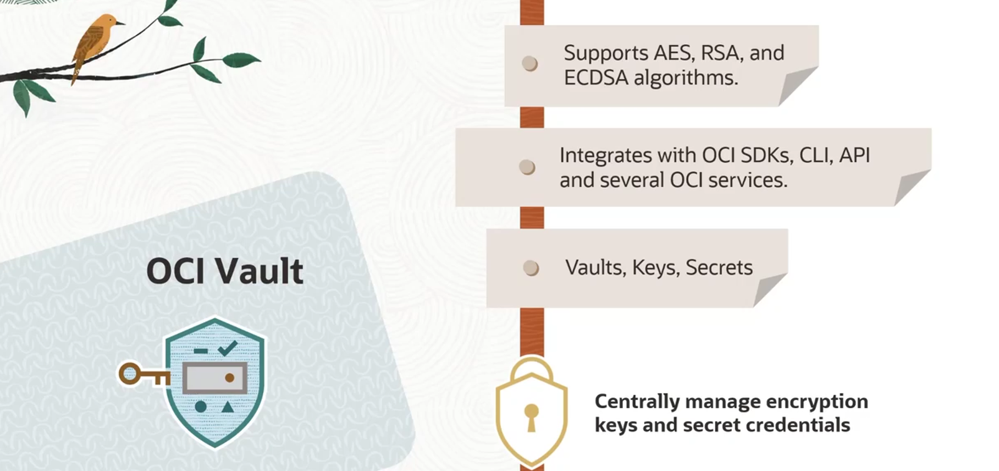
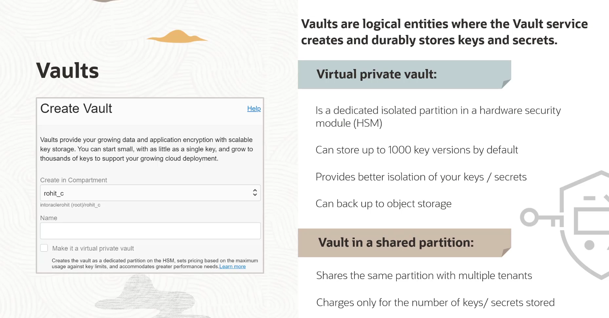
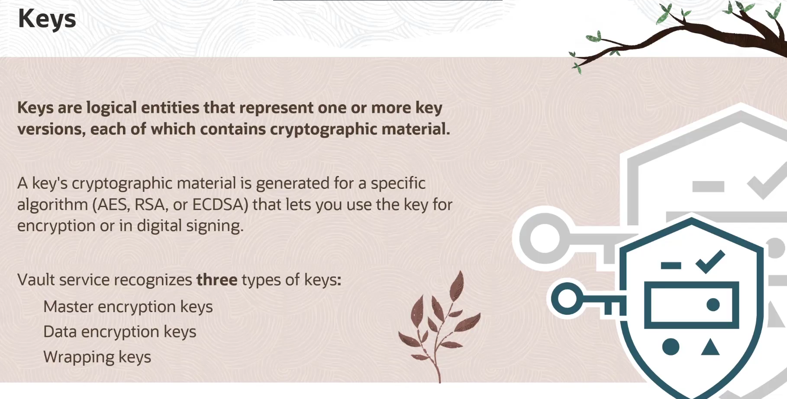
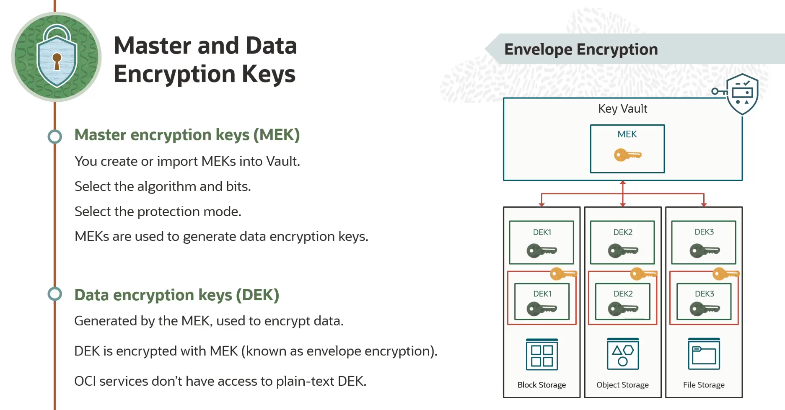
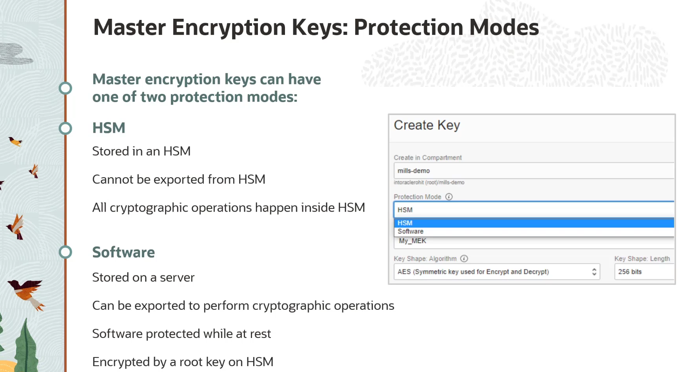
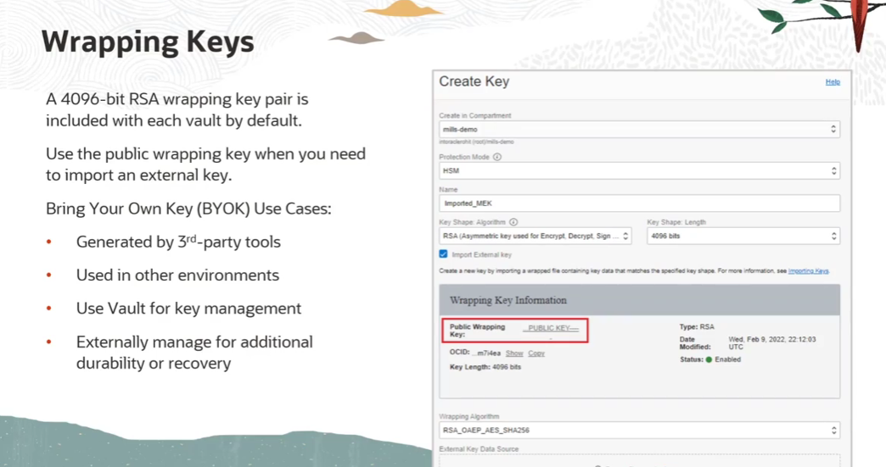
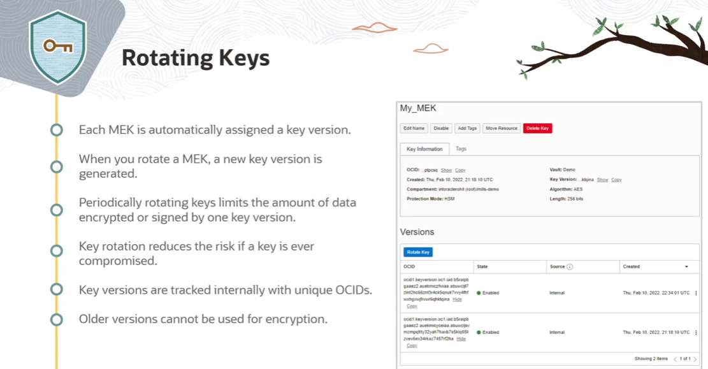

= OCI Vault: Gerenciamento Centralizado de Chaves e Segredos
:toc: levels=2
:icons: font

== Visão Geral e Componentes

O *OCI Vault* é um serviço gerenciado para o gerenciamento centralizado de chaves de criptografia e credenciais secretas.

.Componentes Principais:
* *Vaults:* Os "cofres" lógicos que contêm as chaves e segredos.
* *Keys:* As chaves de criptografia utilizadas para cifrar/decifrar dados e assinar mensagens.
* *Secrets:* As credenciais (senhas, tokens, etc.) armazenadas de forma segura.

O serviço se integra com SDKs da OCI, CLI e API, além de diversos serviços da OCI que o utilizam de forma transparente para criptografia.

== Componente 1: Vaults (Os Cofres)

Um Vault é um contêiner lógico onde chaves e segredos são criados e armazenados de forma durável. Ao criar um Vault, é necessário escolher entre dois tipos.

.Tabela Comparativa: Tipos de Vault
[options="header", cols="1,2,2"]
|===
| Característica | Virtual Private Vault | Default (Shared) Vault

| *Isolamento*
| Partição dedicada e isolada em um *Hardware Security Module (HSM)*.
| Partição compartilhada em um HSM com outros clientes.

| *Limite de Versões de Chave*
| 1.000
| _(Não especificado, menor que o Private)_

| *Backup e DR*
| Suporta backup do Vault e de suas chaves para um bucket do OCI Object Storage, permitindo recuperação de desastres e replicação entre regiões.
| *Não suporta* backup para o Object Storage.

| *Custo*
| Custo fixo mais alto, por ser um recurso dedicado.
| Custo mais baixo, baseado no número real de chaves, versões e segredos armazenados.

| *Caso de Uso Ideal*
| Aplicações que exigem o mais alto nível de isolamento, conformidade regulatória rigorosa e necessidade de backup/DR das chaves.
| A maioria dos casos de uso que necessitam de gerenciamento seguro de chaves e segredos com um bom custo-benefício.
|===

== Componente 2: Keys (As Chaves)

As chaves são entidades lógicas que representam uma ou mais versões de material criptográfico.

=== Definição e Algoritmos

.Algoritmos Suportados e Seus Usos:
* *`AES` (Advanced Encryption Standard):* Chaves simétricas para criptografia e decriptografia.
* *`RSA` (Rivest-Shamir-Adleman):* Chaves assimétricas para criptografia/decriptografia ou para assinatura digital de mensagens.
* *`ECDSA` (Elliptic Curve Digital Signature Algorithm):* Chaves assimétricas exclusivamente para assinatura digital de mensagens.

=== Tipos Conceituais de Chaves

*`Master Encryption Keys (MEK)`*::
Estas são as chaves que o usuário cria ou importa para o Vault. É para estas chaves que se define o algoritmo e o "shape" (tamanho em bits para AES/RSA ou a curva elíptica para ECDSA).

*`Data Encryption Keys (DEK)`*::
São chaves geradas por uma Master Encryption Key para cifrar os dados da sua aplicação. As próprias DEKs são retornadas ao cliente de forma cifrada pela MEK. Este padrão é conhecido como *envelope encryption*.
[NOTE]
====
.Envelope Encryption na Prática
Serviços da OCI como Block Volume e Object Storage utilizam este padrão. Eles solicitam ao Vault uma DEK para cifrar seus dados, e o Vault retorna a DEK em texto simples (para uso imediato) e uma versão cifrada da DEK (para armazenamento). Quando precisam decifrar, eles enviam a DEK cifrada de volta ao Vault, que a decifra com a MEK e retorna a DEK em texto simples.
====

*`Wrapping Keys`*::
Uma chave de empacotamento (do tipo RSA) é incluída automaticamente em cada Vault. Sua porção pública é usada para "embrulhar" (cifrar) uma chave externa que você deseja importar para o Vault. Apenas o Vault possui a chave privada correspondente para "desembrulhar" e importar a chave como uma nova Master Encryption Key.

=== Aprofundando em Master Encryption Keys

==== Modos de Proteção

Ao criar uma MEK, é necessário escolher um de dois modos de proteção.

.Tabela Comparativa: Modos de Proteção de Chave
[options="header", cols="1,2,2"]
|===
| Característica | Modo HSM | Modo Software

| *Armazenamento da Chave*
| A chave é armazenada e processada exclusivamente dentro de um *Hardware Security Module (HSM)*.
| A chave é armazenada em um servidor interno, protegida em repouso por uma chave raiz no HSM.

| *Local das Operações*
| Todas as operações criptográficas (cifrar, decifrar, assinar) ocorrem *dentro* do HSM.
| A chave pode ser exportada para um cliente (ex: uma VM) para realizar as operações criptográficas no lado do cliente.

| *Exportabilidade*
| A chave *nunca* pode ser exportada do HSM.
| A chave *pode* ser exportada (de forma cifrada) para o cliente.

| *Nível de Segurança*
| Máximo. O material da chave nunca deixa o hardware seguro.
| Alto. A chave é protegida em repouso por uma chave no HSM.

| *Preço*
| Custo mais alto.
| Custo mais baixo.
|===

==== Estratégia "Bring Your Own Key" (BYOK)

Utilizando as Wrapping Keys, o Vault permite a estratégia BYOK, onde o cliente importa suas próprias chaves em vez de gerá-las no serviço.
.Motivos para usar BYOK:
* Utilizar chaves geradas a partir de uma fonte ou ferramenta específica que atenda a requisitos de conformidade.
* Utilizar as mesmas chaves que já estão em uso em outros ambientes (outras nuvens, on-premises).
* Reter a posse e o manuseio das chaves fora da OCI para casos de uso de durabilidade e recuperação adicionais.

==== Rotação de Chaves (Key Rotation)

A rotação de chaves é uma prática de segurança fundamental para limitar a quantidade de dados protegidos por uma única versão de chave, reduzindo o risco em caso de comprometimento.
* *Processo:* Ao rotacionar uma chave, o Vault gera uma *nova versão* da chave. A versão antiga é mantida, mas não pode mais ser usada para *cifrar* novos dados.
* *Decriptografia Transparente:* O Vault gerencia as versões de forma transparente. Ao receber um dado para decifrar, ele identifica com qual versão da chave aquele dado foi cifrado (através do OCID da versão) e utiliza a versão correta para a decriptografia.

[TIP]
====
.Melhor Prática
Roteie as Master Encryption Keys periodicamente. Isso não quebra a capacidade de decifrar dados antigos e melhora significativamente a postura de segurança dos seus dados.
====

