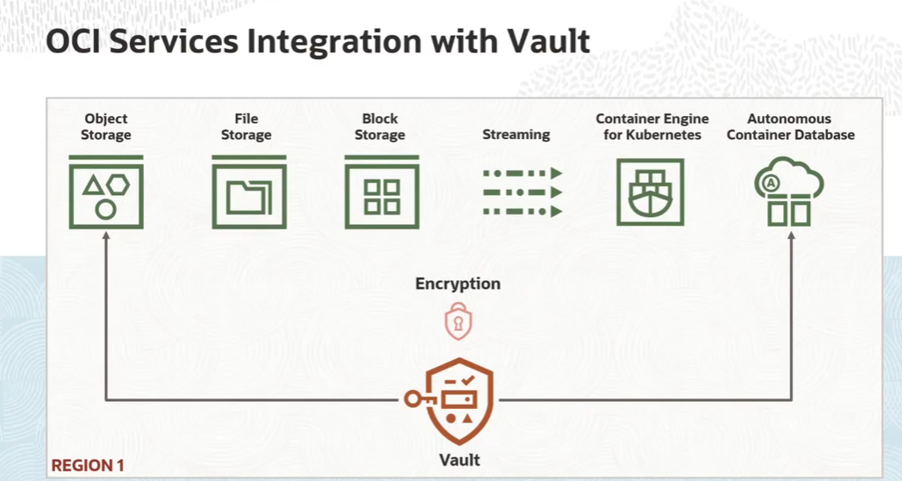
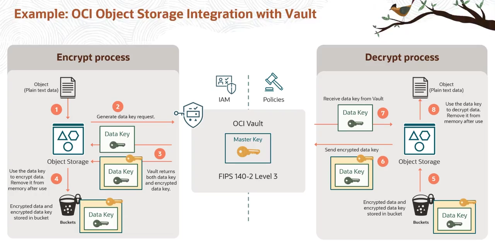

= OCI Vault: Integração e Criptografia de Dados em Serviços OCI
:toc: levels=2
:icons: font

== Serviços OCI Integrados

O OCI Vault pode ser utilizado para gerenciar as chaves de criptografia de uma lista crescente de serviços da OCI. A integração é regional, o que significa que as chaves devem residir em um Vault na mesma região que o recurso a ser protegido.

.Serviços Atualmente Suportados:
* Object Storage (Buckets)
* File Storage
* Block Volume e Boot Volume
* OCI Streaming (Streams dentro de um Stream Pool)
* OKE (Kubernetes Secrets)
* Autonomous Container Databases

[TIP]
====
A lista de serviços integrados está em constante expansão. Consulte sempre a documentação oficial da Oracle para obter a lista mais atualizada.
====

== Modelos de Criptografia de Dados em Repouso (At-Rest)

Ao provisionar a maioria dos serviços de armazenamento na OCI, você tem a opção de escolher entre dois modelos de gerenciamento de chaves para a criptografia de dados em repouso.

.Tabela Comparativa: Modelos de Gerenciamento de Chaves
[options="header", cols="1,2,2"]
|===
| Característica | Chaves Gerenciadas pela Oracle (Oracle-Managed Keys) | Chaves Gerenciadas pelo Cliente (Customer-Managed Keys)

| *Controle da Chave*
| A Oracle gerencia a Master Encryption Key em um Vault interno, não acessível pelo cliente.
| O cliente utiliza uma Master Encryption Key do *seu próprio* OCI Vault, sobre a qual tem total controle.

| *Gerenciamento do Ciclo de Vida*
| A Oracle é responsável por todo o ciclo de vida da chave, incluindo a rotação.
| O *cliente* é responsável por gerenciar todo o ciclo de vida da chave, incluindo sua criação, rotação e exclusão.

| *Custo*
| Incluído no custo do serviço.
| O cliente incorre em custos associados ao uso do serviço OCI Vault (armazenamento de chaves, operações criptográficas).

| *Caso de Uso Principal*
| Cenário padrão para a maioria das aplicações que não possuem requisitos de conformidade rigorosos sobre o controle de chaves.
| Aplicações que precisam de controle e auditoria sobre o ciclo de vida das chaves, ou que operam em Security Zones.

| *Requisito em Security Zones*
| Não permitido.
| *Obrigatório*. Recursos em um compartment do tipo Security Zone devem usar chaves gerenciadas pelo cliente.
|===

[IMPORTANT]
====
.Clarificação: "Customer-Managed" vs. "Bring Your Own Key" (BYOK)
O termo *Customer-Managed Keys* refere-se a uma chave que é mantida dentro do Vault do cliente. Essa chave pode ter sido:
* *Gerada pelo próprio serviço Vault*, ou
* *Importada para o Vault pelo cliente* (a estratégia BYOK).
Em ambos os casos, a chave pertence e é gerenciada pelo cliente.
====

== O Mecanismo de Envelope Encryption em Detalhe

Quando um serviço OCI é configurado para usar uma chave gerenciada pelo cliente, ele utiliza um padrão de criptografia robusto e amplamente utilizado chamado *Envelope Encryption*. Vamos dissecar o fluxo completo, usando o Object Storage como exemplo.

=== Fluxo de Criptografia (Escrita de um Arquivo)

Aqui está o passo a passo do que acontece quando um arquivo é gravado em um bucket configurado com uma chave do seu Vault.

. *Contexto Inicial:*
.. O seu Vault, apoiado por um HSM com conformidade FIPS 140-2 Nível 3, contém sua Master Encryption Key (MEK).
.. Políticas de IAM foram configuradas para permitir que o serviço Object Storage acesse esta MEK específica.

. *Processo de Criptografia:*
.. *Passo 1: Requisição da Chave de Criptografia de Dados (DEK):*
+
O serviço Object Storage faz uma chamada à API do Vault solicitando uma nova *Data Encryption Key (DEK)*, gerada a partir da sua MEK.
+
.. *Passo 2: Resposta do Vault:*
+
O Vault retorna duas versões da DEK para o serviço Object Storage:
*** A DEK em *texto plano* (para uso imediato).
*** Uma versão da DEK *cifrada* com a sua MEK.
+
.. *Passo 3: Criptografia do Dado:*
+
O serviço Object Storage utiliza a DEK em texto plano para cifrar o dado do arquivo (ex: um arquivo de log).
+
.. *Passo 4: Remoção Imediata da Chave da Memória:*
+
Imediatamente após a cifragem, a DEK em texto plano é *permanentemente removida* da memória do serviço Object Storage. Este é um passo de segurança crítico.
+
.. *Passo 5: Armazenamento Seguro:*
+
O dado agora cifrado e a DEK cifrada são armazenados juntos no bucket. Neste ponto, mesmo que um ator malicioso obtenha acesso a ambos os artefatos, os dados permanecem protegidos, pois a chave necessária para decifrá-los (a DEK) também está cifrada.

=== Fluxo de Decriptografia (Leitura de um Arquivo)

Quando um cliente solicita a leitura do arquivo, o processo inverso ocorre.

. *Processo de Decriptografia:*
.. *Passo 1: Requisição de Decriptografia da DEK:*
+
Para ler o dado, o serviço Object Storage envia a *DEK cifrada* (que estava armazenada no bucket) de volta para o Vault.
+
.. *Passo 2: Decriptografia da DEK pelo Vault:*
+
O serviço Vault utiliza a MEK apropriada para decifrar a DEK e retorna a *DEK em texto plano* de volta para o serviço Object Storage.
+
.. *Passo 3: Decriptografia do Dado:*
+
O Object Storage utiliza a DEK em texto plano para decifrar o conteúdo do arquivo.
+
.. *Passo 4: Remoção Imediata da Chave da Memória:*
+
Novamente, assim que o processo de decifragem é concluído, a DEK em texto plano é *permanentemente removida* da memória do serviço.

[NOTE]
====
.Princípio Fundamental de Segurança
O serviço que se integra com o Vault (Object Storage, Block Volume, etc.) *nunca* tem acesso persistente à chave de criptografia de dados (DEK) em formato de texto plano. Ele a solicita ao Vault apenas no momento exato da operação (leitura ou escrita) e a descarta da memória imediatamente após o uso. Seus dados em repouso estão sempre protegidos.
====

