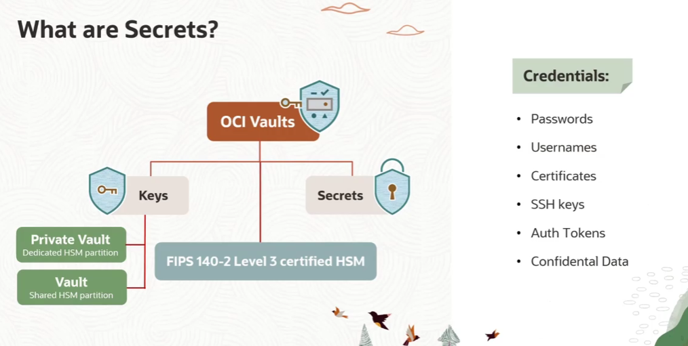
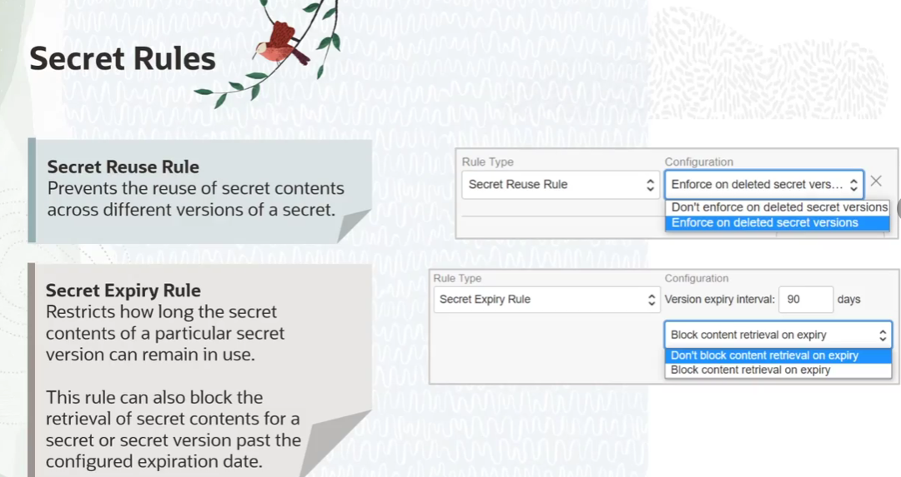

= OCI Vault: Gerenciamento de Secrets
:toc: levels=2
:icons: font

== Conceito Fundamental: O que é um Secret?

Dentro do contexto do OCI Vault, um *Secret* é um recurso projetado para armazenar credenciais e outros dados confidenciais.
* *Conteúdo:* Pode ser qualquer tipo de dado que necessita de proteção, como senhas, tokens de API, chaves SSH, certificados TLS, ou qualquer outra informação confidencial.
* *Propósito:* O objetivo principal é eliminar a necessidade de armazenar estes dados sensíveis em locais inseguros, como arquivos de configuração versionados no Git ou diretamente no código-fonte da aplicação (`hard-coding`).
* *Acesso:* Os secrets podem ser recuperados de forma segura e programática pelo serviço Vault quando uma aplicação precisa deles para acessar outros recursos ou serviços.

=== Interfaces de Gerenciamento

Assim como outros recursos da OCI, os secrets podem ser gerenciados através de múltiplas interfaces:
* OCI Console (UI)
* OCI SDKs (para integração em código)
* OCI CLI (para scripts e automação)
* API REST

== Gerenciamento do Ciclo de Vida de um Secret

O OCI Vault oferece um robusto conjunto de funcionalidades para gerenciar o ciclo de vida completo de um secret.

=== Versionamento e Rotação

Cada secret no Vault é automaticamente versionado.
* *Versionamento:* Quando o conteúdo de um secret é atualizado (rotacionado), o serviço não sobrescreve o valor antigo. Em vez disso, ele cria uma *nova versão* do secret.
* *Rotação:* A prática de rotacionar secrets periodicamente é fundamental para a segurança. Ela reduz o impacto caso um secret seja exposto, pois limita o tempo em que uma credencial comprometida pode ser utilizada.
[IMPORTANT]
====
.OCID Estável
O identificador único do secret (seu OCID) *permanece o mesmo* através de múltiplas rotações. As aplicações sempre se referem ao secret pelo seu OCID para obter a versão *atual* do conteúdo. Isso permite que as equipes de DevOps rotacionem as credenciais no Vault sem a necessidade de alterar ou reimplantar as aplicações que as consomem.
====

=== Regras de Ciclo de Vida (Lifecycle Rules)

Opcionalmente, regras podem ser aplicadas a secrets específicos para reforçar políticas de segurança e conformidade.

* *Regra de Reutilização (Re-use Rule):*
** Impede que o mesmo conteúdo de secret seja reutilizado em uma nova versão. Isso garante que, ao rotacionar uma senha, a nova senha seja de fato diferente da anterior. É possível configurar se esta regra se aplica inclusive a versões que já foram deletadas.

* *Regra de Expiração (Expiry Rule):*
** Define por quanto tempo uma versão de um secret pode existir. A expiração ajuda a manter as credenciais seguras, limitando o tempo que um ator malicioso teria para explorá-las. Existem duas formas de configurar a expiração:
*** *Intervalo de Tempo:* A versão do secret expira após um determinado número de dias desde sua criação (entre 1 e 90 dias).
*** *Data e Hora Absolutas:* A versão do secret expira em uma data e hora específicas (até um ano após sua criação).
** É possível configurar ambos os valores e decidir se o conteúdo do secret deve ser bloqueado para acesso após a data de expiração.

== Exemplos de Integração em Aplicações

A forma mais comum de utilizar secrets é referenciá-los em aplicações e pipelines de CI/CD através de seu OCID.

=== Exemplo 1: Build de Aplicação Kubernetes (OKE)

Em um arquivo de build YAML para uma aplicação que será implantada em um cluster OKE, em vez de armazenar credenciais de banco de dados diretamente, pode-se definir variáveis que apontam para os OCIDs dos secrets no Vault.
[source,yaml]
----
...
variables:
  # Em vez de: db_user: "admin"
  vault_db_user_ocid: "ocid1.vaultsecret.oc1.iad.<unique_ID>" # OCID do secret do username
  vault_db_password_ocid: "ocid1.vaultsecret.oc1.iad.<unique_ID>" # OCID do secret da senha
...
----
O processo de build (ex: Maven) seria então responsável por usar a OCI CLI ou SDK para resolver essas variáveis, recuperando o conteúdo real dos secrets do Vault durante o tempo de build.

=== Exemplo 2: Configuração do Oracle Functions

De forma similar, ao definir uma função no seu arquivo `func.yaml`, credenciais hard-coded (como as do registry) podem ser substituídas por referências aos OCIDs dos secrets.
[source,yaml]
----
# Forma insegura (hard-coded)
# registry: iad.ocir.io/mynamespace/myrepo
# user: myuser
# password: "MyPassword123"

# Forma segura (usando referências a secrets)
registry: iad.ocir.io/mynamespace/myrepo
user: ${vault.ocir_user_ocid}
password: ${vault.ocir_password_ocid}
...
----

=== Exemplo 3: Acesso Genérico via SDK/CLI/API

Para qualquer outro caso de uso, as aplicações podem recuperar dinamicamente o conteúdo de um secret em tempo de execução, utilizando o OCI Vault API, SDKs ou CLI, sempre referenciando o secret através do seu OCID.

[TIP]
====
.Automatizando a Gestão
Toda a configuração de secrets, incluindo criação, rotação, aplicação de regras e obtenção de OCIDs, pode ser totalmente automatizada através da OCI CLI, SDKs ou Terraform, eliminando a necessidade de intervenção manual no Console da OCI.
====

Para maiores informações de criação e gestão de secrets, veja a documentação oficial do OCI Vault ou a Demo que eles disponibilizam no curso.