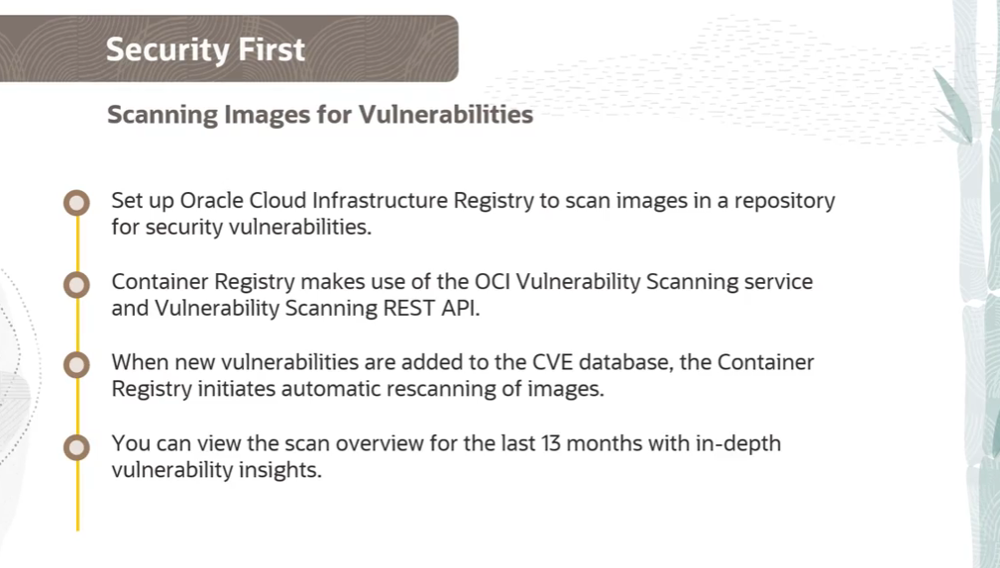
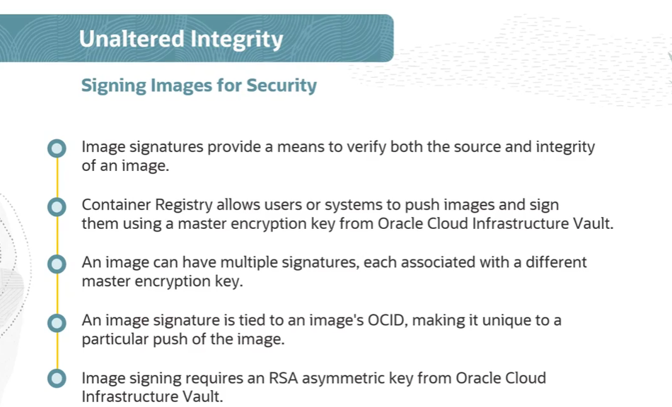
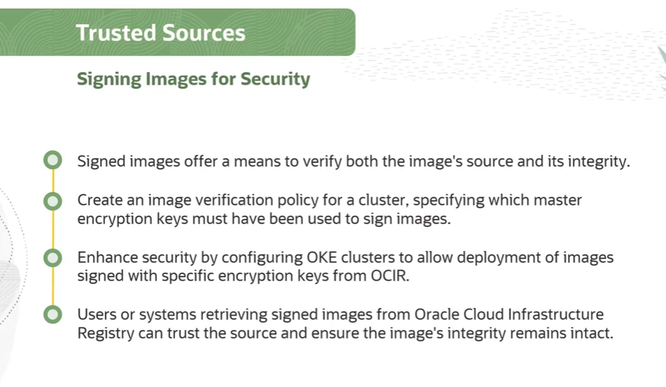

= Segurança de Imagens de Contêiner no OKE
:toc: levels=2
:icons: font

== Os Três Pilares da Segurança de Imagens

Para fortalecer a postura de segurança de uma aplicação, as imagens de contêiner devem possuir três características essenciais.

=== 1. Security First (Livre de Vulnerabilidades)

*Definição:* O princípio de que a segurança deve ser a primeira consideração, começando pela garantia de que a imagem não contém vulnerabilidades conhecidas.

*O Problema:* Pacotes de sistema operacional e bibliotecas de software incluídos em imagens frequentemente possuem vulnerabilidades conhecidas (CVEs - Common Vulnerabilities and Exposures). Gerenciar e mitigar essas vulnerabilidades é essencial para fortalecer a segurança do sistema e responder rapidamente quando novas ameaças são descobertas.

*A Solução na OCI (Image Scanning):*
O OCI Registry (OCIR) pode ser configurado para escanear imagens em busca de vulnerabilidades de segurança.
. *Mecanismo de Varredura:*
** O OCIR utiliza o *OCI Vulnerability Scanning Service* para comparar os componentes da imagem com o banco de dados público de CVEs.
. *Automação e Re-varredura:*
** Quando novas vulnerabilidades são adicionadas ao banco de dados CVE, o OCIR inicia automaticamente uma nova varredura das imagens nos repositórios que têm essa funcionalidade habilitada.
. *Análise de Resultados:*
** É possível obter insights valiosos de cada varredura realizada nos últimos 13 meses, incluindo:
*** Um resumo do número de vulnerabilidades detectadas.
*** Uma avaliação de risco geral para cada varredura.
*** Detalhes compreensivos de cada vulnerabilidade, seus níveis de risco associados e links diretos para o banco de dados CVE.
. *Gerenciamento:*
** A funcionalidade de varredura pode ser habilitada ou desabilitada por repositório.

=== 2. Integridade Inalterada (Unaltered Integrity)

*Definição:* A garantia de que o software (a imagem) não foi modificado ou adulterado desde que foi publicado por uma fonte confiável.

*O Problema:* Por razões de conformidade e segurança, administradores de sistemas precisam ter certeza de que estão implantando em produção exatamente o software que foi testado e aprovado, sem modificações maliciosas.

*A Solução na OCI (Image Signing):*
O OCIR permite que usuários ou sistemas assinem digitalmente as imagens que são enviadas ao registry.
. *Mecanismo de Assinatura:*
** A assinatura de imagem utiliza uma *Master Encryption Key* do tipo RSA assimétrico, proveniente do serviço *OCI Vault*.
. *Verificação Dupla:*
** A assinatura digital desempenha um papel duplo: verifica a *origem* da imagem e garante sua *integridade*.
. *Múltiplas Assinaturas:*
** Uma única imagem pode ter múltiplas assinaturas, cada uma associada a uma Master Encryption Key distinta. As assinaturas são vinculadas ao OCID da imagem, proporcionando granularidade ao processo de verificação.

=== 3. Fontes Confiáveis (Trusted Sources)

*Definição:* A capacidade de garantir que o software sendo implantado em um sistema de produção origina-se exclusivamente de uma fonte que a organização confia.

*O Problema:* Não basta garantir que uma imagem não foi alterada; é preciso garantir que ela foi, em primeiro lugar, criada e assinada por uma entidade autorizada.

*A Solução na OCI (Enforcement com Image Verification Policies):*
Este mecanismo conecta a *assinatura* da imagem com o *deploy* no OKE, aplicando a confiança na prática.
. *Políticas de Verificação de Imagem:*
** Administradores podem criar *Image Verification Policies* para os clusters OKE.
. *Aplicação (Enforcement):*
** A política especifica quais Master Encryption Keys (do OCI Vault) *devem* ter sido usadas para assinar as imagens. O control plane do OKE é configurado para permitir o deploy apenas de imagens que possuam uma assinatura válida de uma das chaves especificadas na política.
. *Resultado:*
** Se um usuário tentar implantar uma imagem que não foi assinada, ou que foi assinada por uma chave não confiável (não listada na política), o OKE *rejeitará* o deployment. Isso garante que apenas imagens de fontes verificadas e com integridade garantida sejam executadas no cluster.

[IMPORTANT]
====
.Conectando os Pilares
A *Varredura de Imagens* garante que a imagem está "limpa" de vulnerabilidades conhecidas. A *Assinatura de Imagens* garante que a imagem não foi adulterada após a varredura. A *Política de Verificação de Imagem* no OKE garante que apenas imagens "limpas" e "não adulteradas" de fontes confiáveis possam ser executadas. Juntos, esses três pilares formam uma defesa robusta para a segurança da cadeia de suprimentos de software.
====

