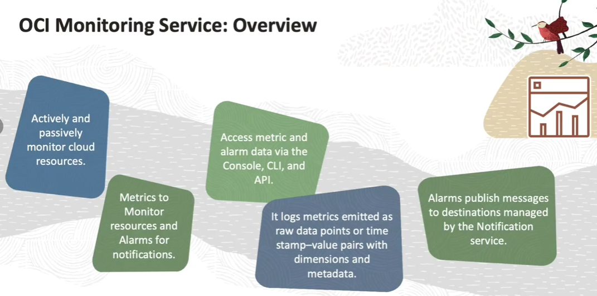
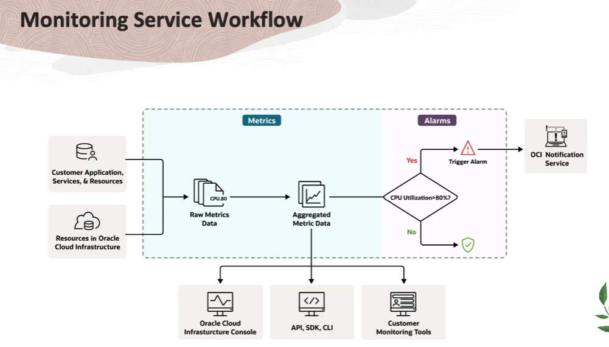
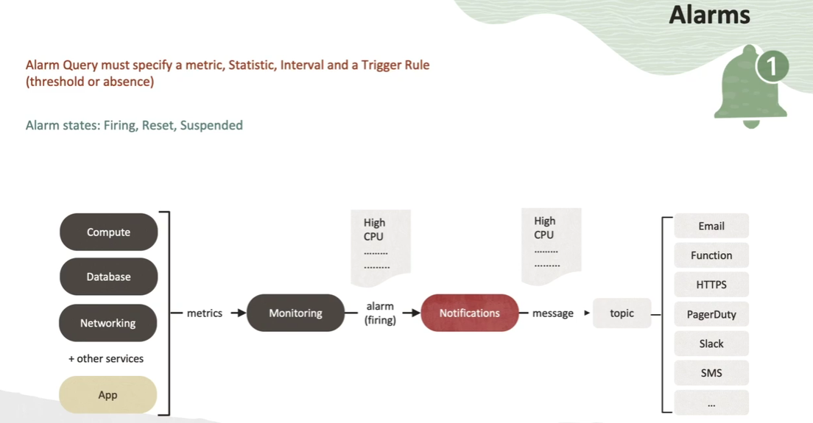

= Módulo de Treinamento: Monitoramento e Troubleshooting de Aplicações Cloud-Native dos Conceitos Fundamentais à Automação com Alarmes
:toc: levels=2
:icons: font

== Os Pilares da Observabilidade na OCI

Para facilitar o troubleshooting de aplicações cloud-native na OCI, o desenvolvedor deve dominar, no mínimo, as capacidades de três serviços fundamentais que compõem o pilar de observabilidade da plataforma.

*`OCI Monitoring`*::
Responsável pela coleta de *métricas* de performance e saúde da maioria dos recursos da OCI, incluindo os serviços essenciais para deployments cloud-native como OKE, Functions e API Gateway.

*`OCI Logging`*::
Responsável pela captura, busca e análise de *logs*, tanto os logs de serviço emitidos pela plataforma quanto logs customizados gerados pelas próprias aplicações. Permite a execução de ações downstream com base no conteúdo dos logs.

*`OCI APM (Application Performance Monitoring)`*::
Responsável pelo *tracing* distribuído, permitindo rastrear uma requisição através de múltiplos microsserviços para identificar gargalos de performance e entender o fluxo completo de uma transação.

[IMPORTANT]
====
.Além dos Serviços Nativos
Embora este módulo foque nas ferramentas da OCI, é crucial para um profissional sênior conhecer e considerar o vasto ecossistema de bibliotecas, ferramentas e serviços de código aberto (open source) para monitoramento, troubleshooting e debugging, dependendo dos requisitos e preferências de cada projeto.
====

=== OCI Monitoring Service

== Visão Geral e Funcionalidades Principais

O OCI Monitoring é um serviço central da camada de Observability and Management da OCI. Ele fornece a base para a coleta de dados de séries temporais (métricas) de todos os seus recursos.

.Funcionalidades Essenciais:
* *Monitoramento Abrangente:*
** Permite o monitoramento ativo e passivo de recursos da OCI e também de recursos externos.

* *Coleta via Métricas:*
** Utiliza o conceito de *Métricas* para medir a saúde, capacidade e performance dos recursos.

* *Automação via Alarmes:*
** Utiliza o conceito de *Alarmes* para notificar proativamente quando as métricas atingem limiares pré-definidos (gatilhos).

* *Acesso Multicanal:*
** Os dados de Métricas e Alarmes são acessíveis via Console da OCI, CLI, SDKs e API REST.

* *Integração com o Ecossistema OCI:*
** Integra-se nativamente com o *OCI Notifications Service* para o envio de mensagens de alarme e com o *Service Connector Hub* para a ingestão de dados.

== Dicionário de Conceitos Fundamentais

A terminologia do Monitoring Service é precisa e extensa. Vamos dissecar cada conceito.

*`Metric`*::
*Definição:* Uma medida relacionada à saúde, capacidade ou performance de um recurso.
[NOTE]
====
.Notas do Instrutor
Pense em uma métrica como um sinal vital do seu sistema. `CPUUtilization` é uma métrica. `DiskBytesRead` é outra. É o dado bruto que nos diz como um recurso está se comportando em um determinado momento.
====

*`Metric Namespace`*::
*Definição:* Um contêiner ou indicador para um conjunto de métricas. Essencialmente, identifica o serviço, recurso ou aplicação que está emitindo as métricas.
[NOTE]
====
.Notas do Instrutor
O namespace nos dá o contexto. A métrica `CPUUtilization` não significa nada sem sabermos de onde ela vem. O namespace `oci_compute_agent` nos diz que esta métrica está vindo de uma Instância de Compute.
====

*`Dimension`*::
*Definição:* Um par chave-valor que atua como um qualificador ou filtro para uma métrica.
[NOTE]
====
.Notas do Instrutor
Se o namespace é o "de onde", a dimensão é o "qual". Para o namespace `oci_compute_agent`, uma dimensão chave é `resourceId`. Isso nos permite filtrar as métricas de `CPUUtilization` para ver apenas os dados de uma instância de compute específica.
====

*`Metadata`*::
*Definição:* Informações adicionais que descrevem a métrica, como a unidade de medida.
[NOTE]
====
.Notas do Instrutor
O metadado `unit: bytes` para a métrica `DiskBytesRead` nos diz como interpretar o valor numérico. É o que diferencia `1024` bytes de `1024` gibibytes.
====

*`Data Point`*::
*Definição:* A unidade fundamental de uma métrica, consistindo em um par _timestamp-valor_.

*`Statistic`*::
*Definição:* Uma função de agregação (como `mean`, `sum`, `min`, `max`, `count`) aplicada a um conjunto de data points brutos dentro de um intervalo de tempo.

*`Metric Stream`*::
*Definição:* Um conjunto individual de dados agregados para uma métrica, seja para um único recurso ou agregado entre múltiplos recursos.

*`Alarm`*::
*Definição:* Um objeto de configuração que contém uma _Query de Alarme_ para avaliação e um ou mais _Destinos de Notificação_.

*`Alarm Query`*::
*Definição:* Uma expressão escrita em *Monitoring Query Language (MQL)* que é executada para avaliar se um alarme deve disparar.

*`Frequency`*::
*Definição:* O período de tempo entre cada data point bruto postado por uma métrica. O padrão para a maioria das métricas de serviço é de 60 segundos.

*`Interval`*::
*Definição:* A janela de tempo sobre a qual os data points brutos são agregados. Ex: um intervalo de 5 minutos.

*`Resolution`*::
*Definição:* A granularidade com que as janelas de tempo são agregadas. Uma resolução de 1 minuto retorna uma agregação a cada minuto.

*`Trigger Rule`*::
*Definição:* A condição (ex: `valor > 80`) que deve ser atendida para que o alarme entre no estado de disparo (_firing_).

*`Notification Destination`*::
*Definição:* O protocolo e os detalhes de um destino configurado no OCI Notifications Service para receber a mensagem do alarme.

*`Suppression`*::
*Definição:* Uma configuração para suspender as notificações de um alarme durante um intervalo de tempo especificado, útil durante janelas de manutenção.

== O Fluxo de Trabalho de Monitoramento (End-to-End)

. *Coleta de Métricas (Fontes):*
.. Métricas são coletadas de diversas fontes, incluindo:
*** Automaticamente postadas por serviços da OCI (Compute, Autonomous Database, etc.).
*** Métricas customizadas publicadas via API do Monitoring.
*** Dados enviados de outros serviços via *Service Connector Hub*.
. *Processamento e Agregação:*
.. As métricas são emitidas como data points brutos (timestamp-valor).
.. Ao consultar uma métrica, o Monitoring Service retorna dados agregados de acordo com os parâmetros especificados (ex: range de tempo, estatística, intervalo).
. *Acesso aos Dados:*
.. Os dados agregados são acessíveis via Console da OCI (que exibe gráficos por métrica), APIs, SDKs, CLI ou ferramentas de monitoramento de terceiros.
. *Notificação via Alarmes:*
.. Um Alarme é configurado com uma query que avalia os dados da métrica (ex: `CPUUtilization > 80%`).
.. Quando a condição do gatilho é atendida, o alarme dispara e publica uma mensagem para um destino configurado no *OCI Notifications Service*.

== Aprofundando em Métricas

A função primária das métricas é permitir que você entenda o quão bem seus sistemas e processos estão funcionando para que possa cumprir os níveis de serviço prometidos aos seus clientes.

=== Namespaces Comuns

Ao explorar métricas, você selecionará um namespace. Exemplos incluem:
* `oci_computeagent`: Métricas de SO de instâncias de compute (CPU, memória, disco, rede).
* `oci_blockstore`: Métricas de Block Volumes.
* `oci_objectstorage`: Métricas de Object Storage.
* `oci_vcn`: Métricas de VCN Flow Logs.
* `oci_lbaas`: Métricas de Load Balancers.

=== Metric Explorer

O *Metric Explorer* é a interface no Console da OCI para uma análise detalhada de métricas. Ele permite:
* Visualizar múltiplas métricas de diferentes recursos juntas.
* Construir queries complexas utilizando MQL (Monitoring Query Language).

== Aprofundando em Alarmes

A funcionalidade de Alarmes trabalha em conjunto com o OCI Notifications Service para notificá-lo quando as métricas atendem a gatilhos específicos.

=== Componentes de um Alarme

Um alarme é definido por:
* *Métrica:* A métrica a ser avaliada (ex: `CPUUtilization`).
* *Estatística:* A função de agregação (ex: `mean`).
* *Intervalo:* A janela de tempo para a agregação (ex: `5m`).
* *Regra de Gatilho:* A condição a ser atendida (ex: `value > 80`) ou uma condição de ausência.

=== O Fluxo de Notificação

Recurso -> Métrica -> *Monitoring Service (Alarme)* -> Trigger -> Mensagem -> *Notifications Service (Tópico)* -> Assinatura (Email, Functions, HTTPS, Slack, SMS).

=== Estados de um Alarme

*`Firing`*:: A condição do gatilho foi detectada e o alarme está ativo.
*`Reset`*:: A condição não está mais sendo detectada ou a métrica não está mais sendo emitida.
*`Suspended`*:: O alarme foi suspenso (pausado) manualmente ou por uma configuração de supressão.

