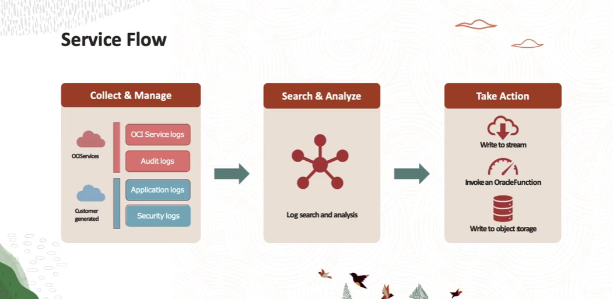

= OCI Logging Service: Do Conceito à Análise de Logs
:toc: levels=2
:icons: font

== Visão Geral e Funcionalidades Principais

O *Oracle Cloud Infrastructure Logging* é um serviço de observabilidade totalmente gerenciado, projetado para ser um ponto central de gerenciamento para todos os logs em uma tenancy.

.Funcionalidades Essenciais:
* *Gerenciamento Centralizado:*
** Agrega logs de diversas fontes, incluindo serviços da OCI, aplicações customizadas e auditoria, em um console unificado.

* *Segurança:*
** Fornece gerenciamento seguro para todos os tipos de logs, incluindo informações sensíveis sobre padrões de tráfego, atividade de usuários e autenticação.

* *Acesso Multicanal:*
** Logs podem ser acessados e pesquisados via Console da OCI, SDKs e API REST.

* *Ações Baseadas em Regras:*
** Através do *Service Connector Hub*, é possível mover logs para outros destinos e acionar automações. Por exemplo, pode-se criar um alarme no Monitoring com base em um evento de log, ou arquivar logs no Object Storage.

== Conceitos Fundamentais do Serviço

*`Log`*::
Um recurso de primeira classe da OCI que armazena e captura eventos de log coletados em um determinado contexto.

*`Log Group`*::
Um contêiner lógico para Logs, armazenado em um compartment. Ao habilitar um log para um recurso, é necessário especificar um log group.
[TIP]
====
.Notas do Instrutor: Controle de Acesso com Log Groups
Log Groups são a ferramenta principal para o controle de acesso granular a logs. Em vez de depender de hierarquias complexas de compartments, você pode segregar logs sensíveis (ex: contendo PII - Personally Identifiable Information) em um log group separado e aplicar políticas de IAM que restrinjam o acesso a ele apenas para um grupo seleto de administradores.
====

*`Service Log Category`*::
Define os tipos de logs que um serviço da OCI pode emitir para seus recursos. Cada serviço tem suas próprias categorias, que são independentes umas das outras.
.Exemplo: O serviço Object Storage suporta as categorias `ReadDataAccessEvents` (eventos de download) e `WriteDataAccessEvents` (eventos de upload) para buckets.

*`Service Connector Hub`*::
O "barramento de dados" da OCI, que permite mover dados de log para outros serviços de forma confiável e escalável.

*`Unified Monitoring Agent (Fluentd-based)`*::
Um agente gerenciado, baseado no projeto Fluentd da CNCF, utilizado para ingerir logs customizados de aplicações que rodam em Instâncias de Compute. Sua configuração é gerenciada pelo serviço de Logging.

== Os Três Tipos de Logs

O serviço classifica os logs em três tipos principais.

=== 1. Audit Logs

São logs de eventos emitidos pelo serviço *OCI Audit*. Eles registram todas as chamadas de API REST executadas por qualquer recurso na tenancy (seja um usuário ou outro serviço da nuvem). São a fonte da verdade para auditoria e investigações de segurança.

=== 2. Service Logs

São logs emitidos por serviços nativos da OCI, como API Gateway, Events, Functions, Object Storage e VCN Flow Logs. Cada serviço possui categorias de log pré-definidas que podem ser habilitadas ou desabilitadas nos respectivos recursos.

=== 3. Custom Logs

São logs que contêm informações de diagnóstico de aplicações customizadas ou de qualquer outra fonte que não seja um serviço nativo da OCI. Podem ser de aplicações rodando na OCI, em outras nuvens ou em ambientes on-premises. A ingestão é feita através da API ou do Unified Monitoring Agent.

== Busca, Análise e Visualização

O Console da OCI oferece uma poderosa ferramenta de exploração de logs.

=== Pesquisa e Filtragem (Log Search)

* *Consultas Customizadas:* Permite construir queries para filtrar logs indexados.
* *Múltiplos Filtros:* É possível filtrar por campos específicos do log, por texto/palavra-chave ou por intervalos de tempo.

=== Exploração de Logs

* *Payload JSON:* Cada linha de log pode ser expandida para visualizar o payload completo e estruturado em formato JSON.
* *Visão de Contexto:* A visão "Before and After" mostra as linhas de log imediatamente anteriores e posteriores à entrada selecionada, o que é extremamente útil para troubleshooting.
* *Exportação:* Os resultados da busca podem ser exportados para um arquivo JSON.

=== Visualização de Dados

Os dados filtrados podem ser visualizados com widgets de gráficos (barra empilhada, pizza, donut, linha). Os gráficos podem ser atualizados dinamicamente com a seleção de um intervalo de tempo e um campo para agrupar os resultados. O auto-refresh (a cada 5 ou 15 minutos) permite a visualização de logs recentes em tempo real.

== Políticas de IAM Requeridas

O acesso ao serviço de Logging é controlado por políticas de IAM.

.Para Gerenciamento de Log Groups e Logs (Exemplos):
[source,text]
----
Allow group GroupA to manage log-groups in compartment X
Allow group GroupB to manage log-content in compartment X
Allow group GroupC to read log-groups in compartment X
----

.Para Ingestão de Logs via Agente (de Instâncias):
[source,text]
----
Allow dynamic-group <instance_dynamic_group> to read log-groups in compartment X
Allow dynamic-group <instance_dynamic_group> to use log-content in compartment X
----

.Para Visualização de Logs no Console:
[source,text]
----
Allow group <log_viewers_group> to read log-groups in tenancy
Allow group <log_viewers_group> to read log-content in tenancy
----

== O Fluxo de Trabalho de Ponta a Ponta

. *1. Coleta e Ingestão:*
** Logs de Auditoria, de Serviço e Customizados são coletados e ingeridos no serviço de Logging.
. *2. Análise e Roteamento:*
** No Logging Service, os logs podem ser pesquisados, filtrados e analisados. O Service Connector Hub é configurado para rotear logs de interesse para outros serviços.
. *3. Ação:*
** Os logs roteados podem ser enviados para o *Streaming Service*, invocar uma *Oracle Function*, ou serem arquivados no *Object Storage* para retenção de longo prazo.

