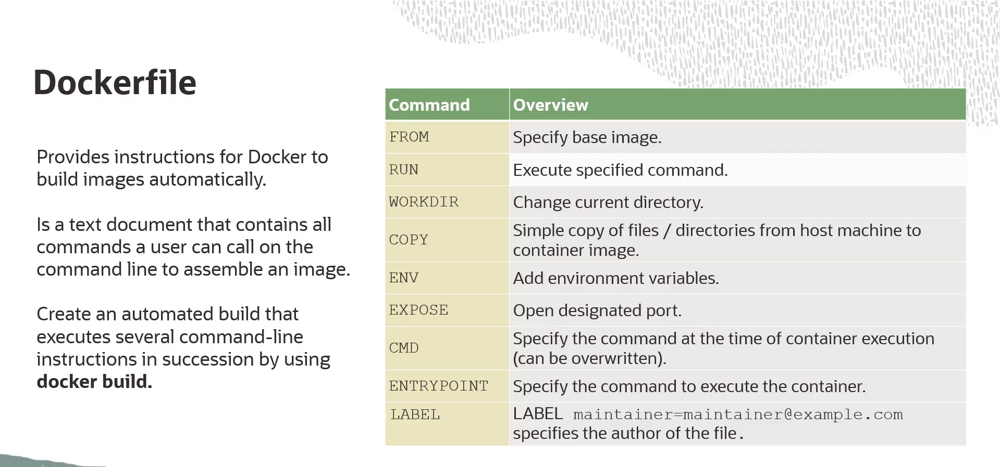
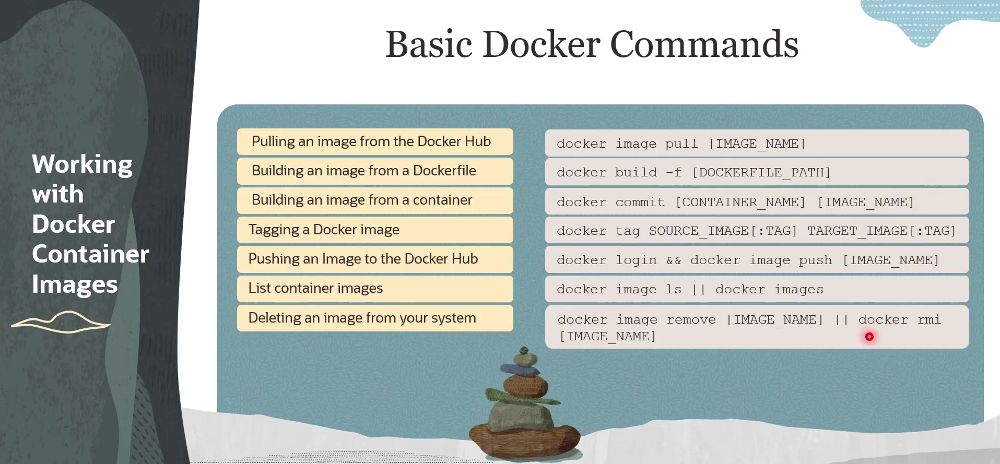

= Trabalhando com Imagens Docker: Dockerfile e Comandos
:toc:
:icons: font

== O Dockerfile: A Receita para Construir Imagens

Um *Dockerfile* é um arquivo de texto que contém um conjunto de instruções para a criação de uma imagem Docker customizada. Este arquivo define o ambiente que será utilizado em um contêiner Docker. A criação de um Dockerfile customizado é essencial quando as imagens existentes nos registries públicos não atendem aos requisitos específicos de um projeto.

O Dockerfile funciona como uma definição passo a passo do processo de construção de uma imagem. O Docker Engine executa estas instruções sequencialmente ao receber o comando `docker build`.

=== Instruções Comuns do Dockerfile

A seguir, uma descrição das instruções padrão utilizadas em um Dockerfile.

*`FROM`*::
Toda Dockerfile deve iniciar com esta instrução. Ela define a imagem base a partir da qual a nova imagem será construída. Pode ser uma imagem de base mínima (como `scratch` ou `alpine`) ou uma imagem existente de um registry.

*`RUN`*::
Executa um comando dentro da imagem durante o processo de build. O build aguardará a finalização do comando antes de prosseguir para a próxima instrução. É comumente utilizado para instalar pacotes de software (`RUN apt-get update && apt-get install -y ...`).

*`WORKDIR`*::
Define o diretório de trabalho para as instruções subsequentes (`RUN`, `CMD`, `COPY`, etc.) dentro do Dockerfile. Se o diretório não existir, ele será criado.

*`COPY`*::
Copia arquivos ou diretórios do contexto do build (a máquina local) para o filesystem da imagem.

*`ENV`*::
Define variáveis de ambiente. Estas variáveis ficam disponíveis para as instruções subsequentes no Dockerfile e também para a aplicação que rodará dentro do contêiner.

*`EXPOSE`*::
Informa ao Docker que o contêiner escutará em portas de rede específicas em tempo de execução. Esta instrução não publica a porta, apenas funciona como documentação entre o criador da imagem e o operador do contêiner.

*`CMD`*::
Define o comando padrão a ser executado quando um contêiner é iniciado a partir da imagem. Só pode haver uma instrução `CMD` em um Dockerfile. Se houver múltiplas, apenas a última terá efeito.

*`LABEL`*::
Adiciona metadados à imagem na forma de pares chave-valor. É utilizado para organizar imagens, registrar informações de licenciamento, indicar o mantenedor, etc.

.Exemplo de um Dockerfile para uma aplicação Node.js
[source,dockerfile]
----
# Define a imagem base a partir do Docker Hub
FROM node:18-alpine

# Adiciona metadados à imagem
LABEL maintainer="seu-email@example.com" version="1.0"

# Define o diretório de trabalho
WORKDIR /usr/src/app

# Copia os arquivos de manifesto de dependências
COPY package*.json ./

# Instala as dependências da aplicação
RUN npm install

# Copia o código-fonte da aplicação para o diretório de trabalho
COPY . .

# Expõe a porta em que a aplicação será executada
EXPOSE 3000

# Define o comando padrão para iniciar o contêiner
CMD [ "node", "server.js" ]
----

== Comandos de Gerenciamento de Imagens

A seguir, uma lista de comandos essenciais para o gerenciamento de imagens Docker.

[options="header", cols="1,2"]
|===
| Comando | Descrição

| `docker image pull [imagem]`
| Baixa uma imagem ou um repositório de um registry (por padrão, o Docker Hub).

| `docker build [caminho]`
| Constrói uma imagem Docker a partir de um Dockerfile e um "contexto". O contexto é o conjunto de arquivos no `caminho` especificado.

| `docker commit [container] [nova_imagem]`
| Cria uma nova imagem a partir das alterações de um contêiner. Este método é menos comum e geralmente não recomendado em favor do uso de Dockerfiles.

| `docker tag [imagem_origem] [imagem_alvo]`
| Cria uma tag (`imagem_alvo`) que se refere a uma `imagem_origem`. É utilizado para versionar imagens ou prepará-las para push para um registry específico.

| `docker image push [imagem]`
| Envia uma imagem para um registry remoto (ex: Docker Hub, OCIR).

| `docker images` ou `docker image ls`
| Lista todas as imagens Docker presentes no sistema local.

| `docker rmi [imagem]` ou `docker image rm [imagem]`
| Remove uma ou mais imagens do sistema local.
|===

[NOTE]
====
Para executar o comando `docker image push`, é necessário primeiro autenticar-se no registry de destino utilizando o comando `docker login`.
====

