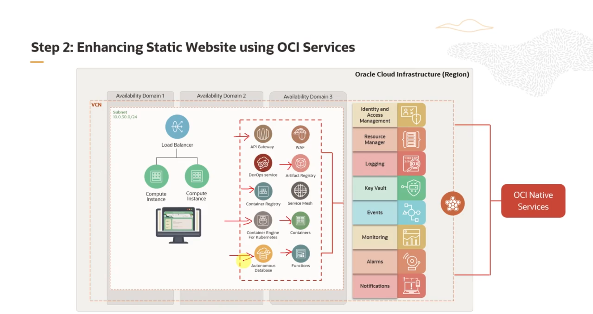

= Case Study - Solução Cloud-Native na OCI
:toc:
:icons: font

== O Desafio: Migrando o "Vision Stays" para a Nuvem

Este é um case study, o que é ótimo pra ver a teoria na prática.

.Os Personagens:
* *Tricia:* A cliente. Dona da rede de hotéis "Vision Stays".
* *Steve:* O consultor Oracle.

A Tricia chega com um pepino: ela tem um site estático e quer migrá-lo para a OCI, mas não só isso, ela quer adicionar funcionalidades novas e modernas. O Steve, tranquilamente, diz que a OCI é perfeita pra isso e que a abordagem *cloud-native* é o caminho.

=== Requisitos do Projeto "Vision Stays"

O que a Tricia precisa, na real?

* *Funcionalidade de Reserva:* Transformar o site estático em um portal de reservas de hotel.
* *Capacidade de Integração:* Permitir que agregadores de hotéis de terceiros (tipo Decolar, Booking.com) possam consultar a disponibilidade e reservar quartos via API.
* *Plataforma:* Utilizar as soluções cloud-native da OCI para hospedar e evoluir o site.

== O Plano de Ação: Do Estático aos Microsserviços

O Steve traça um plano em duas fases para resolver o problema da Tricia.

=== Fase 1: O "Lift & Shift" do Site Estático

Primeiro, o básico: tirar o site do ar e colocá-lo para rodar na OCI de forma segura e escalável.

. *Passo 1: Migrar para uma VM (OCI Compute)*
+
--
Pega todos os arquivos do site (HTML, CSS, JS, imagens) e joga pra dentro de uma instância de Compute (uma VM) na OCI. Isso já garante a performance e escalabilidade da infra da Oracle.
--
. *Passo 2: Colocar um Load Balancer na Frente*
+
--
O *OCI Load Balancer* vai ser a cara do site. Ele recebe todo o tráfego e distribui de forma inteligente entre múltiplas VMs. Isso garante alta disponibilidade (se uma VM cair, o tráfego vai pra outra) e melhora a responsividade.
[TIP]
====
O Load Balancer também oferece features de graça que a gente precisaria configurar na mão, como terminação SSL (adeus, gerenciamento de certificado no Nginx), persistência de sessão e roteamento baseado em conteúdo.
====
--
. *Passo 3: Configurar Permissões (IAM)*
+
--
Antes de qualquer coisa, configurar as políticas de *IAM (Identity and Access Management)*. O IAM é crucial para definir quem pode fazer o quê na OCI. A gente cria políticas para garantir que só as pessoas autorizadas do time da Tricia possam mexer nos recursos, mantendo a segurança do ambiente.
--

=== Fase 2: A Evolução para uma Arquitetura Cloud-Native

Com o site estático rodando e seguro, é hora da mágica: quebrar a arquitetura antiga e introduzir as novas funcionalidades usando microsserviços.

== O Canivete Suíço: Ferramentas da OCI usadas no Projeto

Para construir a nova arquitetura, o Steve propõe usar um conjunto de serviços gerenciados da OCI. Isso reduz a carga operacional do time da Tricia e acelera o desenvolvimento.

*OKE (Container Engine for Kubernetes)*::
Para rodar os microsserviços mais complexos e que precisam de orquestração, como o serviço de booking. O OKE gerencia o Kubernetes pra gente, cuidando do provisionamento, scaling e orquestração dos contêineres.

*OCI Functions*::
Para os microsserviços mais simples e orientados a eventos, como "enviar email de confirmação de reserva". É uma solução serverless, leve e que escala sob demanda.

*Container & Artifact Registry*::
Um lugar seguro e escalável para guardar as imagens Docker dos microsserviços e outros artefatos (libs, etc.). Garante que o mesmo artefato seja usado do dev até a produção.

*API Gateway*::
O ponto de entrada centralizado para todas as APIs. O Gateway gerencia a comunicação entre os clientes externos (incluindo os agregadores de terceiros) e os microsserviços. Ele cuida de autenticação, autorização, rate limiting e roteamento do tráfego. Essencial para a integração que a Tricia pediu.

*Autonomous Database*::
Para persistir os dados dos microsserviços (reservas, quartos, clientes). É um banco de dados "self-driving": a Oracle gerencia tudo (provisionamento, scaling, patching, segurança), o que tira um peso enorme das costas do time de desenvolvimento.

*Web Application Firewall (WAF)*::
Uma camada extra de segurança na frente de tudo, protegendo o site contra ataques comuns da web (SQL Injection, Cross-Site Scripting, etc.).

*OCI DevOps Service & Resource Manager*::
Para automatizar todo o processo de CI/CD. O *DevOps Project* ajuda a orquestrar o ciclo de vida do software, enquanto o *Resource Manager* (baseado em Terraform) permite gerenciar a infraestrutura como código (IaC), garantindo consistência e repetibilidade.

*Service Mesh*::
Para gerenciar a comunicação *entre* os microsserviços. Melhora a confiabilidade, a segurança e a observabilidade da rede interna de serviços.

*Serviços Core (Logging, Notifications, Vault)*::
* *Logging:* Para ter visibilidade do que está acontecendo.
* *Notifications:* Para disparar alertas e ações.
* *Vault:* Um cofre para guardar dados sensíveis, como senhas de banco de dados e chaves de API, de forma segura.

== Resumo da Solução

[quote]
"A abordagem combina o melhor dos dois mundos: usa serviços de IaaS (Compute, Load Balancer) para a parte simples e legada, e um rico ecossistema de serviços PaaS e Serverless (OKE, Functions, API Gateway, Autonomous DB) para construir as novas funcionalidades de forma moderna, escalável e segura."

No final, o case study mostra como o portfólio cloud-native da OCI permite que uma empresa como a "Vision Stays" não apenas migre para a nuvem, mas se transforme, adicionando valor de negócio de forma ágil e segura.