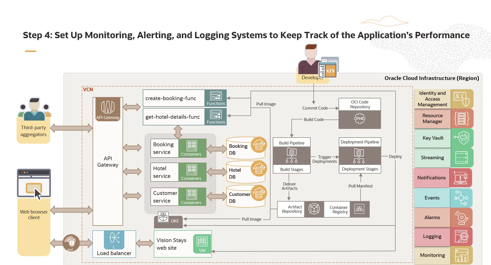

= Blueprint da Arquitetura: Aplicação Escalável Vision Stays
:toc:
:icons: font

== Visão Geral da Arquitetura

O núcleo da arquitetura é composto por três microsserviços principais:
* *Customer Service:* Coleta e armazena detalhes de clientes.
* *Hotel Service:* Gerencia informações sobre os hotéis da Vision Stays.
* *Booking Service:* Processa as reservas.

Para garantir um deploy e gerenciamento eficientes, cada microsserviço será containerizado e implantado em um cluster Kubernetes gerenciado pelo *OCI Container Engine for Kubernetes (OKE)*.

== Componentes Detalhados da Solução

=== Integração com Terceiros: Functions e API Gateway

Para estender a funcionalidade a fornecedores terceirizados, duas *Oracle Functions* serão criadas:
* `create-booking-function`
* `get-hotel-details-function`

O acesso a estas funções será protegido e gerenciado pelo *OCI API Gateway*. O gateway atua como uma barreira de proteção centralizada, regulando o acesso aos microsserviços do backend e garantindo que todas as requisições sejam tratadas de forma segura e eficiente. Internamente, estas funções interagirão com os microsserviços implantados no OKE.

=== Persistência de Dados

Todos os dados gerados pelos microsserviços serão armazenados em instâncias do *Oracle Autonomous JSON Database*.

=== Hospedagem do Frontend e Segurança

O frontend do website será hospedado em uma instância de *OCI Compute (VM)*. Conforme o plano, um *OCI Load Balancer* será implementado para distribuir o tráfego de forma eficiente e garantir a escalabilidade.

A segurança da aplicação web será reforçada através do *OCI Web Application Firewall (WAF)*, assegurando proteção robusta contra ameaças potenciais.

== Automação e Ciclo de Vida (CI/CD)

Os processos de build, teste e deploy serão automatizados utilizando práticas de DevOps e o recurso *OCI DevOps Project*.

O fluxo de CI/CD funciona da seguinte forma:
. *Commit:* Toda alteração no código é enviada para o *OCI DevOps Code Registry*.
. *Build Trigger:* O commit dispara automaticamente um "build run".
. *Criação de Artefatos:* O build gera novos artefatos ou imagens de contêiner.
. *Armazenamento:* Os novos ativos são armazenados de forma segura no *Artifact and Container Registry*.
. *Deploy:* Durante a execução do pipeline de deploy, os artefatos ou imagens são puxados do registro para implantação.

[NOTE]
====
Esta automação permite a implementação de estratégias de deploy avançadas, como *Blue/Green* e *Canary*, garantindo disrupção mínima e máxima confiabilidade durante as atualizações da aplicação.
====

== Serviços de Suporte e Observabilidade

=== Comunicação Assíncrona e Segurança de Credenciais

* *OCI Notification e Streaming Service:* O Booking Service pode utilizar estes serviços para enviar notificações por e-mail à equipe de administração do hotel sobre novas reservas e para armazenar mensagens para análises futuras (downstream analysis).
* *OCI Vault Service:* Para proteger credenciais sensíveis, como senhas de banco de dados, o OCI Vault será utilizado para armazenamento seguro.

=== Observabilidade: Events, Monitoring e Logging

Sistemas de monitoramento, alertas e logging serão estabelecidos para rastrear a performance e a saúde da aplicação.

* *OCI Event Service:* Permite que desenvolvedores disparem a execução de código (via Functions), escrevam para o Streaming Service ou enviem alertas (via Notifications) em resposta a mudanças na infraestrutura.
* *Monitoring:* Ferramentas de monitoramento avaliarão continuamente diversas métricas (uso de CPU/memória, tráfego de rede, tempos de resposta) para identificar anomalias ou gargalos de performance. Mecanismos de alerta notificarão o pessoal apropriado em caso de atividade incomum.
* *Logging:* Sistemas de logging capturam e armazenam informações detalhadas sobre eventos da aplicação e interações do usuário, permitindo análises aprofundadas e troubleshooting eficiente.

