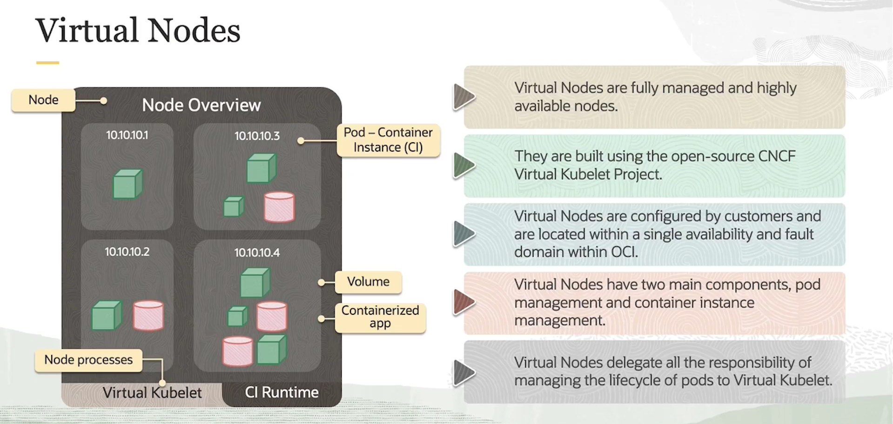

= Kubernetes Serverless no OKE com Virtual Nodes
:toc:
:icons: font

== O Desafio do Gerenciamento de Nós

A operação de um cluster Kubernetes, mesmo em um serviço gerenciado como o OKE, tradicionalmente envolve o gerenciamento dos nós de trabalho (worker nodes). Esta tarefa exige trabalho manual e expertise específica para atividades como atualizações, scaling e troubleshooting, o que pode gerar sobrecarga operacional e de custos para as equipes.

A solução para este desafio é a utilização de *Virtual Nodes*, uma funcionalidade do OKE que proporciona uma experiência Kubernetes serverless, eliminando a necessidade de gerenciamento manual dos nós.

== A Base: Managed Nodes

Antes de detalhar os Virtual Nodes, é essencial compreender o modelo padrão: os *Managed Nodes*.

Um Managed Node é um host de computação (seja uma máquina virtual ou um host bare metal) que executa as cargas de trabalho do Kubernetes.
* *Modelo de Responsabilidade:* São executados em instâncias de Compute dentro da tenancy do cliente e são, pelo menos parcialmente, gerenciados pelo cliente.
* *Responsabilidades do Cliente:* O cliente é responsável por atualizar as versões do Kubernetes nos Managed Nodes e por gerenciar a capacidade do cluster (adicionar ou remover nós).
* *Componentes Principais:* Os dois componentes de sistema mais importantes em um nó são o `kubelet` (o "cérebro" do nó) e o `container runtime` (ex: CRI-O, containerd).
* *Casos de Uso:* São ideais para cargas de trabalho com requisitos únicos ou específicos de hardware, como GPUs, drives NVMe locais, casos de uso de RDMA, arquiteturas ARM ou x86, e outros requisitos de agendamento (scheduling) customizados.

image::images/image26.png[alt="Managed Nodes", title="Managed Nodes"]

== A Evolução: Virtual Nodes

*Virtual Nodes* são nós totalmente gerenciados e de alta disponibilidade que, para o Kubernetes, se parecem e agem como nós reais. Eles proporcionam uma experiência Kubernetes verdadeiramente serverless.

* *Fundação Técnica:* São construídos utilizando o projeto open source da CNCF, o *Virtual Kubelet*, que serve como uma camada de tradução entre a OCI e a API do Kubernetes.
* *Modelo de Responsabilidade:* A Oracle gerencia completamente o ciclo de vida dos Pods e a infraestrutura subjacente dos nós. No Managed Node, essa responsabilidade é do `kubelet`.

=== Características e Benefícios

* *Experiência Totalmente Gerenciada:*
** Os clientes não precisam se preocupar em gerenciar a infraestrutura subjacente de suas aplicações containerizadas. O foco é direcionado exclusivamente para as aplicações.

* *Scaling Simplificado:*
** Permite escalar aplicações para cima ou para baixo rapidamente, sem a necessidade de provisionar ou desprovisionar instâncias de compute para os nós.

* *Otimização de Custos (Pay-per-Pod):*
** Os clientes pagam apenas pelos recursos de CPU e memória que seus Pods utilizam. Isso elimina o custo de recursos ociosos em worker nodes subutilizados.

* *Alta Densidade de Pods:*
** Virtual Nodes podem suportar até 10 vezes mais Pods do que um nó normal (até 1.000 Pods por Virtual Node), o que reduz a sobrecarga operacional e facilita o scaling de aplicações.

* *Integração com OCI Container Instances:*
** Utiliza o serviço serverless *OCI Container Instances* como backend, aproveitando nativamente funcionalidades da OCI como isolamento forte e elasticidade de computação.

== Tabela Comparativa: Managed Nodes vs. Virtual Nodes

A tabela abaixo resume as principais diferenças entre as duas abordagens de nós no OKE.

[options="header", cols="1,2,2"]
|===
| Característica | Managed Nodes | Virtual Nodes

| *Gerenciamento*
| Responsabilidade compartilhada (Cliente gerencia os nós).
| Totalmente gerenciado (Oracle gerencia os nós).

| *Faturamento*
| Pela instância de Compute (VM/Bare Metal) do nó, 24/7.
| Pelos recursos de CPU/memória consumidos pelos Pods (Pay-per-use).

| *Overhead Operacional*
| Alto (upgrades, scaling de nós, patching do SO).
| Baixo (abstraído pela Oracle).

| *Flexibilidade de Hardware*
| Alta (suporta GPUs, ARM, NVMe, etc.).
| Limitada a shapes de computação padrão.

| *Densidade de Pods*
| Limitada pela capacidade da instância e pelas configurações do Kubernetes.
| Alta (até 1.000 Pods por nó).

| *Caso de Uso Ideal*
| Workloads com requisitos específicos de hardware ou configurações de SO.
| Workloads com picos de uso, aplicações web padrão, ambientes de teste/dev, jobs em lote.
|===