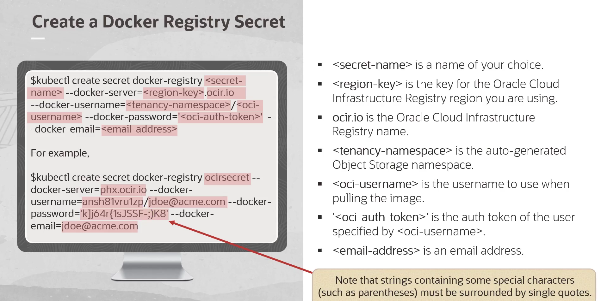

= Kubernetes na OCI com o Oracle Kubernetes Engine (OKE): Uma visão detalhada da sua criação
:toc:
:icons: font

=== 1. Pré-requisitos: Configurando o Ambiente

Antes de criar um cluster, os seguintes itens são necessários:
* *Conta na Oracle Cloud Infrastructure:* Uma conta Free Tier oferece recursos suficientes para começar.
* *OCI CLI (Interface de Linha de Comando da OCI):* Deve estar instalada e configurada com as credenciais da OCI.
* *`kubectl` instalado:* A ferramenta de linha de comando padrão para interagir com clusters Kubernetes.

=== 2. Criando um Cluster Kubernetes no OKE

O fluxo "Quick Create" no console da OCI é a maneira mais fácil de iniciar.

. *Acesse o Console da OCI* e navegue até *Developer Services -> Kubernetes Clusters (OKE)*.
. Clique em *Create Cluster* e selecione a opção *Quick Create*.
. Preencha as informações básicas:
.. *Name:* Um nome para o cluster.
.. *Compartment:* O compartimento onde o cluster será criado.
.. *Kubernetes Version:* A versão desejada do Kubernetes.
.. *Node Shape:* O tipo de máquina virtual para os nós de trabalho.
.. *Number of Nodes:* A quantidade de nós de trabalho para o cluster.
. Revise as configurações e clique em *Create Cluster*.

O OKE provisionará automaticamente toda a infraestrutura de rede necessária (VCN, sub-redes, etc.) e os nós de trabalho.

=== 3. Acessando seu Cluster

Após a criação, é necessário configurar o `kubectl` para se conectar ao cluster.
. Na página de detalhes do seu cluster no console da OCI, clique em *Access Cluster*.
. Siga as instruções fornecidas. O console fornecerá um comando da OCI CLI que deve ser executado em seu terminal. Este comando irá gerar ou atualizar seu arquivo `kubeconfig`.
. Após executar o comando, verifique a conexão com o cluster usando:
[source,bash]
----
kubectl get nodes
----
Este comando deve listar os nós de trabalho do seu cluster OKE.

=== 4. Implantando uma Aplicação (Exemplo: Nginx)

Com o cluster acessível, é possível implantar uma aplicação.

. *Crie um arquivo de Deployment* (`nginx-deployment.yaml`):
[source,yaml]
----
apiVersion: apps/v1
kind: Deployment
metadata:
  name: nginx-deployment
spec:
  replicas: 2
  selector:
    matchLabels:
      app: nginx
  template:
    metadata:
      labels:
        app: nginx
    spec:
      containers:
      - name: nginx
        image: nginx:latest
        ports:
        - containerPort: 80
----
. *Aplique o Deployment* no cluster:
[source,bash]
----
kubectl apply -f nginx-deployment.yaml
----

O Kubernetes criará dois Pods executando a imagem do Nginx.

=== 5. Expondo sua Aplicação com um Serviço

Para acessar o Nginx de fora do cluster, é necessário criar um Serviço do tipo `LoadBalancer`.

. *Crie um arquivo de Serviço* (`nginx-service.yaml`):
[source,yaml]
----
apiVersion: v1
kind: Service
metadata:
  name: nginx-service
spec:
  type: LoadBalancer
  selector:
    app: nginx
  ports:
    - protocol: TCP
      port: 80
      targetPort: 80
----
. *Aplique o Serviço*:
[source,bash]
----
kubectl apply -f nginx-service.yaml
----
O OKE provisionará automaticamente um Load Balancer na OCI. Para obter seu endereço IP público, execute:
[source,bash]
----
kubectl get service nginx-service
----
O endereço IP aparecerá na coluna `EXTERNAL-IP`. Ao acessá-lo em um navegador, a página de boas-vindas do Nginx será exibida.

=== 6. Utilizando Imagens de Registries Privados (OCIR)

O exemplo anterior utiliza a imagem `nginx` do Docker Hub, que é um repositório público. Para utilizar imagens de um registry privado, como o OCI Registry (OCIR), é necessário fornecer credenciais de autenticação ao cluster. Isso é feito criando um *Secret* do Kubernetes do tipo `docker-registry`.

. *Crie o Secret de Autenticação:*
Execute o comando a seguir no seu terminal, substituindo os placeholders pelos seus dados.
[source,bash]
----
kubectl create secret docker-registry <secret-name> \
    --docker-server=<region-key>.ocir.io \
    --docker-username='<tenancy-namespace>/<oci-username>' \
    --docker-password='<oci-auth-token>' \
    --docker-email='<email-address>'
----
*Parâmetros:*
*`<secret-name>`*:: Um nome de sua escolha para o Secret. Ex: `ocirsecret`.
*`<region-key>`*:: A chave da região do OCI Registry que você está usando. Ex: `iad` para Ashburn.
*`<tenancy-namespace>`*:: O namespace do Object Storage da sua tenancy, gerado automaticamente.
*`<oci-username>`*:: O nome de usuário OCI a ser usado para puxar a imagem.
*`<oci-auth-token>`*:: O Token de Autenticação (Auth Token) gerado para o usuário especificado.
*`<email-address>`*:: Um endereço de e-mail.
[IMPORTANT]
====
Note que strings contendo caracteres especiais (como a senha/token) devem estar entre aspas simples (`'`).
====

. *Referencie o Secret no seu Deployment:*
Para que os Pods possam usar este secret para puxar a imagem, adicione a seção `imagePullSecrets` ao seu arquivo de manifesto do Deployment (`deployment.yaml`).
[source,yaml]
----
apiVersion: apps/v1
kind: Deployment
metadata:
  name: minha-app-privada
spec:
  replicas: 2
  selector:
    matchLabels:
      app: minha-app
  template:
    metadata:
      labels:
        app: minha-app
    spec:
      containers:
      - name: meu-container
        # Exemplo de caminho para uma imagem no OCIR
        image: iad.ocir.io/mynamespace/my-repo/my-app:v1.0
        ports:
        - containerPort: 8080
      imagePullSecrets:
      - name: ocirsecret 
----

=== 7. Removendo o Cluster

Para remover o cluster e todos os seus recursos associados (nós, load balancers, etc.), siga estes passos:
. Na página de detalhes do seu cluster no console da OCI, clique em *Delete Cluster*.
. Confirme a operação na caixa de diálogo.

O OKE removerá automaticamente toda a infraestrutura provisionada para o cluster.