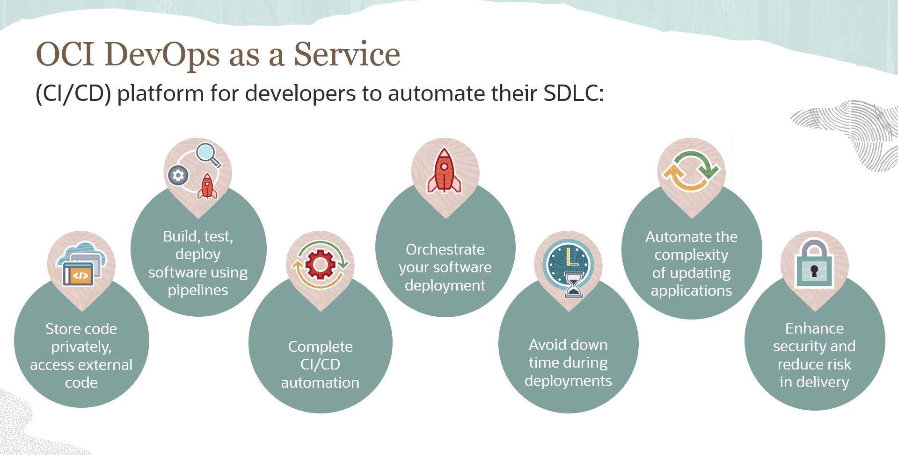
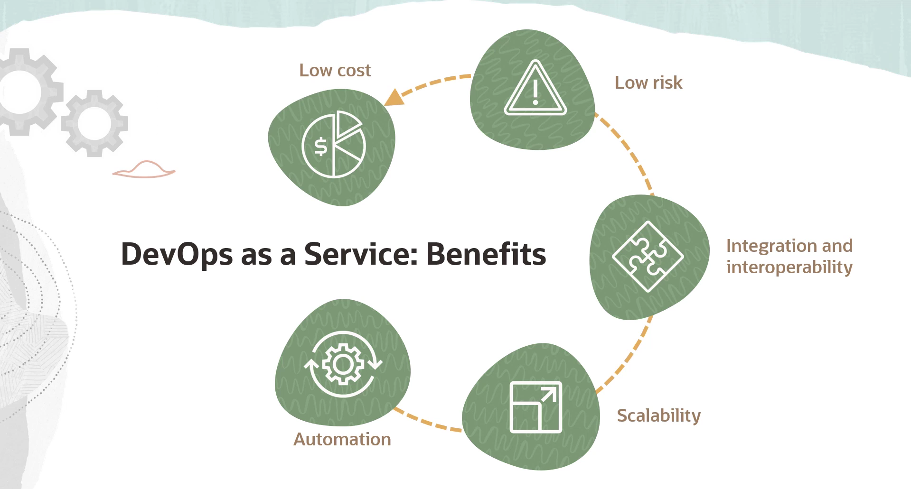

= Anotações de Dev: OCI DevOps Service
:toc:
:icons: font

== DevOps na Nuvem: O Cenário Geral

Antes de mergulhar no serviço específico da Oracle, vamos alinhar o conceito de DevOps no contexto de Cloud. A automação de DevOps está cada vez mais centrada na nuvem. Os provedores de nuvem (públicos e privados) já oferecem ferramentas de CI/CD integradas em suas plataformas.

Essa integração tem algumas vantagens claras:
* *Menor Custo:* Reduz o custo associado a manter uma infraestrutura de DevOps on-premises.
* *Governança Centralizada:* Facilita o controle e a padronização dos processos de DevOps.
* *Economia de Tempo e Esforço:* Usar uma solução pré-configurada na nuvem poupa um trabalho enorme de montar e manter essa infra do zero.
* *Quebra de Silos:* Ferramentas na nuvem facilitam a colaboração entre os times de desenvolvimento e operações, garantindo continuidade e responsabilidade.

== OCI DevOps Service: O Canivete Suíço da Oracle

O *Oracle Cloud Infrastructure (OCI) DevOps Service* é a plataforma completa de CI/CD da Oracle. O objetivo é facilitar todo o ciclo de vida de desenvolvimento (build, test, deploy) de software na OCI.

=== O que ele oferece na prática?

* *Repositórios de Código (Code Repositories):*
** Permite criar repositórios Git privados para guardar e gerenciar o código-fonte.
** Também consegue espelhar repositórios externos do GitHub, GitLab e Bitbucket Cloud.

* *Pipelines de Build (Build Pipelines):*
** Constrói e testa as últimas alterações de código usando _build runners_ gerenciados pela própria OCI. Você não precisa se preocupar com a infra de build.

* *Gatilhos (Triggers):*
** Permite configurar gatilhos para rodar um pipeline de build automaticamente a partir de um `commit` ou `pull request`, automatizando o processo de integração contínua (CI).

* *Pipelines de Deploy (Deployment Pipelines):*
** Orquestra o deploy do software para diversas plataformas da OCI, como o *Container Engine for Kubernetes (OKE)*, instâncias de Compute (VMs) e Functions (Serverless).
** Pode ser configurado para rodar automaticamente após um build bem-sucedido, fechando o ciclo de CI/CD.

[TIP]
====
Uma das features mais importantes é o suporte a estratégias de deploy avançadas para evitar downtime:

* *Blue-Green Deployment:* Mantém duas versões da aplicação em produção e vira a chave do roteador da versão antiga (azul) para a nova (verde).
* *Canary Deployment:* Libera a nova versão para um pequeno subconjunto de usuários e monitora o resultado antes de liberar para todo mundo.
====

* *Segurança e Redução de Risco:*
** A automação reduz a chance de erro humano, que é uma fonte comum de vulnerabilidades.
** Como a entrega de software é mais rápida, bugs de segurança podem ser corrigidos e deployados muito mais rapidamente.

== Por que usar o serviço da OCI? (Benefícios)

A plataforma parece completa, mas quais são os benefícios diretos de usá-la?

*Automação*::
O serviço automatiza totalmente o ciclo de vida de entrega de software. Isso aumenta a velocidade de desenvolvimento e a confiabilidade das entregas, eliminando processos manuais que são lentos e propensos a erros.

*Escalabilidade*::
O serviço escala os builds para você com os _build runners_ gerenciados. É possível rodar múltiplos builds concorrentes sem se preocupar em gerenciar os hosts de build.

*Integração e Interoperabilidade*::
Funciona com seus repositórios Git existentes. Se você já tem um CI em outro lugar, pode integrar.

[NOTE]
====
O serviço é profundamente integrado com o ecossistema OCI. Ele conversa nativamente com:
* VMs (Compute Instances)
* Oracle Container Engine for Kubernetes (OKE)
* Oracle Functions
* Artifact Repositories
* Vault (para gerenciar segredos)
* Policies de IAM
* E muito mais...
====

*Deploy de Baixo Risco e Time-to-Market Rápido*::
Com as estratégias de deploy (rolling, canary, blue-green) e rollbacks automatizados, o risco de introduzir erros em produção diminui drasticamente. Isso elimina o downtime e acelera o tempo para que novas features cheguem ao mercado.

*Baixo Custo*::
O modelo de custo é enxuto. Para os deploys, o cliente paga apenas pelos recursos que são alvo do deploy (a VM, o cluster OKE, etc.), não pelo serviço de pipeline em si.

== Resumo Rápido

[quote]
"O OCI DevOps Service é uma plataforma CI/CD ponta-a-ponta para desenvolvedores, projetada para simplificar e automatizar o ciclo de vida de entrega de software na Oracle Cloud."

Em resumo, é a solução nativa da Oracle para quem quer construir um pipeline de CI/CD moderno, seguro e integrado ao ecossistema da OCI, sem precisar montar e gerenciar toda a infraestrutura de ferramentas por conta própria.