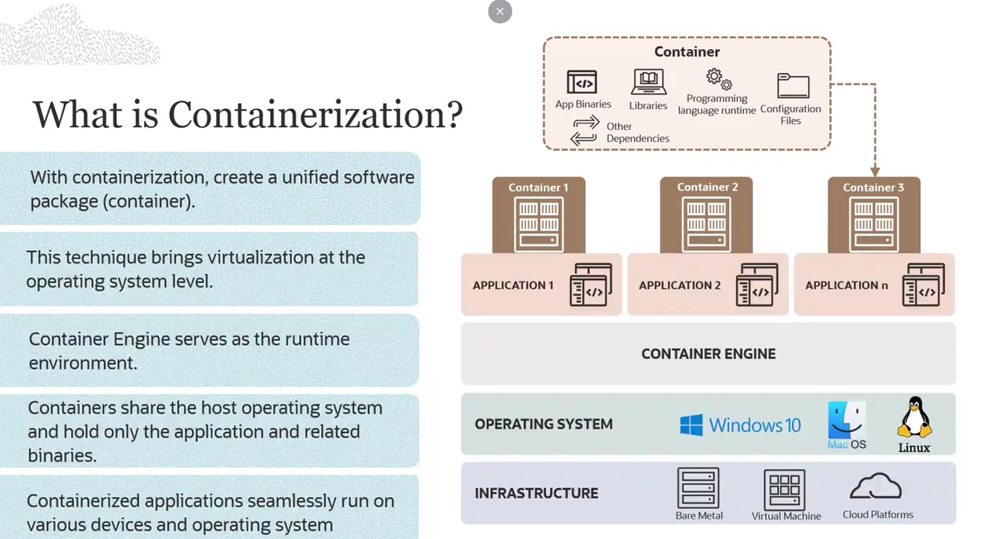
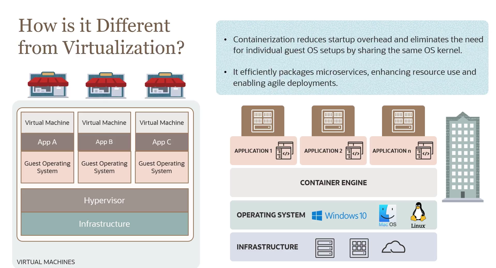

= Visão Geral de Containerização
:toc:
:icons: font

== Definição e Conceitos Fundamentais

Containerização é uma forma de virtualização no nível do sistema operacional que executa aplicações em espaços de usuário isolados, conhecidos como *contêineres*. Notavelmente, todos os contêineres compartilham o mesmo sistema operacional (SO) subjacente.

O *Container Engine* é o componente central desta tecnologia, servindo como o ambiente de runtime. Ele gerencia o ciclo de vida completo dos contêineres, incluindo sua criação, implantação e execução.

Um contêiner pode ser entendido como um ambiente computacional totalmente empacotado e portátil. Ele encapsula tudo o que uma aplicação necessita para ser executada: binários, bibliotecas, arquivos de configuração e todas as outras dependências.

Com a containerização, um único pacote de software (o contêiner) pode ser executado em qualquer dispositivo ou sistema operacional, compartilhando o SO do hospedeiro (host). O Container Engine opera como uma camada de abstração com acesso limitado aos recursos subjacentes, tornando-o significativamente mais leve que uma máquina virtual tradicional. Como resultado, uma aplicação containerizada pode ser executada em bare metal, dentro de VMs ou em plataformas de nuvem sem necessidade de modificações para cada ambiente.

== Comparativo: Containerização vs. Virtualização Tradicional

A diferença fundamental entre as duas abordagens reside na camada de abstração e no compartilhamento de recursos.

[options="header", cols="1,2,2"]
|===
| Característica | Virtualização Tradicional (VMs) | Containerização

| *Analogia*
| Múltiplas casas em um único terreno. Cada casa (VM) tem sua própria infraestrutura completa (paredes, telhado, etc.).
| Um prédio de múltiplos andares. Cada andar (contêiner) tem seu espaço privado, mas todos compartilham a mesma fundação do prédio (SO do Host).

| *Abstração*
| Abstrai o hardware físico.
| Abstrai o sistema operacional.

| *Recursos do SO*
| Cada VM possui uma cópia completa de um sistema operacional convidado (Guest OS).
| Todos os contêineres compartilham o kernel do mesmo sistema operacional do host.

| *Overhead*
| Alto. O Guest OS em cada VM consome recursos significativos (CPU, memória, armazenamento).
| Baixo. O compartilhamento do kernel do SO resulta em um consumo de recursos muito mais eficiente.

| *Tempo de Inicialização*
| Lento (minutos), pois precisa inicializar um sistema operacional completo.
| Rápido (segundos ou menos), pois apenas o processo da aplicação precisa ser iniciado.

| *Caso de Uso Principal*
| Executar múltiplos sistemas operacionais em um único servidor; isolamento completo de ambientes.
| Empacotar e executar os múltiplos microsserviços que compõem aplicações modernas.
|===

== Benefícios da Containerização

A adoção da containerização oferece um espectro de benefícios que redefinem como as aplicações são construídas e gerenciadas.

*Portabilidade*::
Contêineres são executados de forma uniforme em diversas plataformas, desde o laptop do desenvolvedor até a nuvem de produção.

*Agilidade*::
Engines de contêiner de código aberto promovem flexibilidade multiplataforma, capacitando os desenvolvedores a inovar rapidamente.

*Velocidade*::
A natureza leve dos contêineres resulta em tempos de inicialização acelerados, o que impulsiona a eficiência e reduz custos operacionais.

*Isolamento de Falhas*::
Aplicações em contêineres operam de forma independente. Uma falha em um contêiner não afeta os outros, garantindo a robustez do sistema.

*Eficiência*::
Ao compartilhar o kernel do SO e camadas de imagem reutilizáveis, os contêineres otimizam a utilização do servidor e reduzem os requisitos de infraestrutura.

*Facilidade de Gerenciamento*::
Plataformas de orquestração como o Kubernetes automatizam tarefas essenciais como deploy, scaling e networking, simplificando o gerenciamento de aplicações complexas.

*Segurança*::
O isolamento entre contêineres e a capacidade de definir permissões de forma granular fortalecem a infraestrutura contra ameaças maliciosas.

