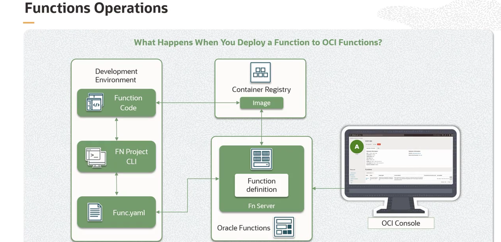
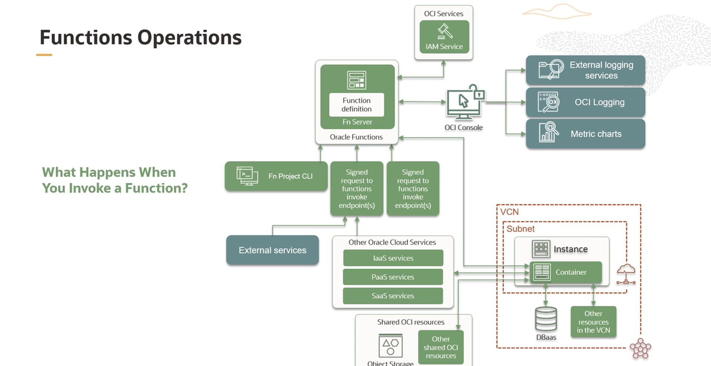

= Operações com Oracle Functions: Deploy e Invocação
:toc:
:icons: font

== O Processo de Deploy de uma Função

O deploy de uma função no OCI Functions segue um fluxo de trabalho estruturado, que transforma o código-fonte em um recurso executável e gerenciável na nuvem.

.Etapas do Processo de Deploy
. *Build da Imagem de Contêiner:*
+
O processo inicia com a construção de uma imagem de contêiner a partir do código da função. Este passo empacota o código e todas as suas dependências, garantindo consistência e portabilidade.
+
. *Definição no `func.yaml`:*
+
Parâmetros de execução são definidos no arquivo `func.yaml`. Este arquivo inclui metadados críticos, como o tempo máximo de execução permitido para a função e a quantidade máxima de memória que ela pode consumir.
+
. *Push para o Registry e Upload de Metadados:*
+
A imagem de contêiner é enviada (push) para o OCI Registry (OCIR). Em seguida, os metadados da função, incluindo as restrições de execução definidas no `func.yaml` e o link para a imagem no OCIR, são enviados para o Fn Server.
+
. *Disponibilização no Console:*
+
A função é adicionada à lista de funções visíveis no console do OCI Functions, permitindo seu gerenciamento e monitoramento através da interface da OCI.

[NOTE]
====
Todo o processo de deploy — build da imagem, push para o registry e registro da função — pode ser executado através de um único comando da CLI do Fn Project, otimizando o fluxo de trabalho do desenvolvedor.
====

== O Processo de Invocação de uma Função

A invocação de uma função desencadeia uma série de ações orquestradas pela plataforma OCI Functions para garantir uma execução segura e eficiente.

.Ciclo de Vida de uma Invocação
. *Métodos de Invocação:*
+
Uma função pode ser invocada através de diversos métodos:
** Fn Project CLI
** OCI SDKs
** Requisições HTTP assinadas para o `invoke endpoint` da função.
** Triggers de outros serviços Oracle Cloud ou fontes externas.
+
. *Autenticação e Autorização:*
+
Quando uma função é invocada, o OCI Functions primeiro verifica a requisição com o serviço de IAM para garantir a autenticação e autorização adequadas.
+
. *Identificação da Imagem:*
+
Após a validação, a requisição é passada ao Fn Server. O servidor utiliza a definição da função para identificar a imagem de contêiner correta no Container Registry.
+
. *Execução do Contêiner:*
+
A função é executada rodando a imagem como um contêiner em uma instância de compute, dentro de uma subnet associada à aplicação da função.
+
. *Interação com outros Recursos:*
+
Durante a execução, a função pode interagir com outros recursos e serviços na mesma subnet (ex: Database as a Service) e também acessar recursos compartilhados, como o Object Storage e outros serviços da OCI.
+
. *Logs e Métricas:*
+
Os logs da função são armazenados no serviço de Logging da OCI ou em um destino externo configurado. Informações sobre as invocações, incluindo métricas de performance, são exibidas em gráficos no console do OCI Functions.
+
. *Ciclo de Vida do Contêiner (Warm/Cold Start e Remoção):*
+
Após a função terminar a execução e permanecer ociosa por um período, o contêiner é removido. No entanto, se outra chamada for recebida antes da remoção, a requisição é roteada para o contêiner existente (warm start), melhorando a performance.
+
. *Escalabilidade Horizontal:*
+
Se necessário, o OCI Functions pode escalar horizontalmente para lidar com múltiplas requisições simultâneas, iniciando novos contêineres da função conforme a demanda.

