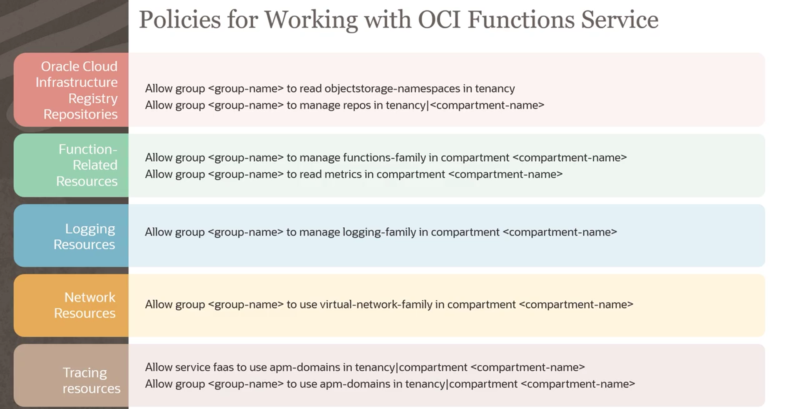
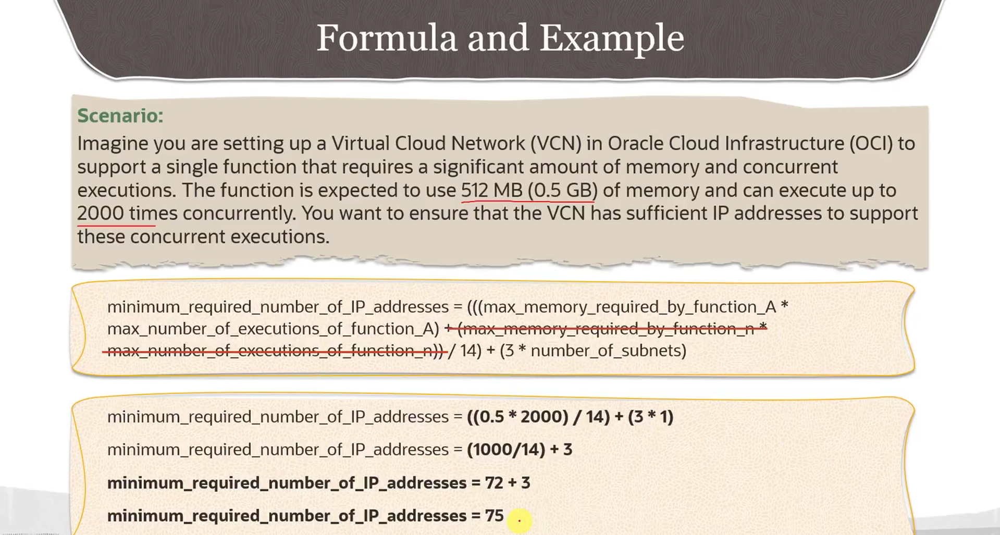

= Pré-requisitos para a Criação de OCI Functions
:toc:
:icons: font

== Limites de Serviço (Service Limits)

Antes de iniciar o desenvolvimento com OCI Functions, é essencial estar ciente dos limites de serviço. Estes limites ditam o número de recursos que podem ser criados por região e variam de acordo com o tipo de conta (método de pagamento).

[options="header", cols="2,2,2"]
|===
| Recurso (Nome do Limite) | Limite (Oracle Universal Credits) | Limite (Pay As You Go / Trial)

| *Aplicações* (`application-count`)
| 20
| 10

| *Funções* (`function-count`)
| 500
| 50

| *Memória Total para Execuções Concorrentes* (`total-concurrency-mb`)
| 60 GB (ou 180 GB para regiões com 3 ADs)
| 60 GB (ou 180 GB para regiões com 3 ADs)

| *Memória Total para Concorrência Provisionada* (`provisioned-concurrency-mb`)
| 40 GB
| 40 GB
|===

[NOTE]
====
.Limite de Payload
Cada função está sujeita a um limite de tamanho de payload fixo e imutável de *6 MB*, tanto para requisições de entrada quanto para respostas de saída.
====

== Configuração de IAM e Compartments

=== Contas de Usuário e Grupos

A responsabilidade primária do administrador da tenancy é criar contas de usuário na OCI e atribuí-las a grupos. Estes grupos são cruciais para gerenciar o acesso e as permissões aos recursos relacionados a funções através de políticas de IAM. Se grupos e usuários adequados já existirem, não é necessário criar novos.

=== Estrutura de Compartments

Antes de os usuários poderem criar e implantar funções, o administrador da tenancy deve criar um ou mais compartments para abrigar os recursos.
* *Compartment de Rede:* Para possuir recursos de rede como VCN, subnets, gateways, etc.
* *Compartment de Funções:* Para possuir recursos relacionados a funções, como Aplicações e Funções.

É possível utilizar o mesmo compartment para ambos os tipos de recursos ou criar compartments separados para uma maior segregação de responsabilidades.

== Configuração de Rede (VCN e Subnets)

Uma VCN (Virtual Cloud Network) com as subnets necessárias deve existir antes que os usuários possam implantar funções. As subnets são onde as funções e aplicações residirão. A VCN deve ter um bloco CIDR com IPs livres suficientes, cujo cálculo é detalhado abaixo.

[TIP]
====
A Oracle recomenda a configuração de Security Lists com regras _stateless_ para facilitar o maior número possível de conexões concorrentes.
====

=== Cálculo do Bloco CIDR (Dimensionamento de IPs)

O número mínimo de IPs livres necessários é determinado pela memória e concorrência esperada de todas as funções na mesma VCN.

.Passos para Calcular os IPs Necessários:
. Para cada função, identifique a memória especificada para sua execução (em GB).
. Determine o número máximo esperado de execuções concorrentes para essa função.
. Multiplique a memória (GB) pela concorrência para obter a *memória total máxima requerida por função*.
. Some a memória total máxima de *todas* as funções na mesma VCN para obter a *memória total máxima geral*.
. Divida a memória total máxima geral por *14* (pois cada 14 GB de uso de memória requer um IP adicional).
. Adicione *3* IPs reservados *por cada subnet* na VCN.
. Some os resultados dos passos 5 e 6 para obter o total mínimo de IPs necessários.

== Políticas de IAM para Usuários e Serviços

Para que os usuários possam utilizar o OCI Functions, administradores devem criar políticas de IAM específicas que controlam o acesso tanto dos usuários quanto do próprio serviço OCI Functions aos recursos necessários.

=== Políticas para Recursos de Rede e Registry
[source,text]
----
# Permite que usuários obtenham o namespace do Object Storage para login no OCIR
Allow group <group_name> to read object-storage-namespace in tenancy

# Permite que usuários gerenciem repositórios de imagens de contêiner
Allow group <group_name> to manage repos in compartment <compartment_name>
----

=== Políticas para Recursos de Functions
[source,text]
----
# Permite que usuários gerenciem aplicações, funções e vejam métricas
Allow group <group_name> to manage functions-family in compartment <compartment_name>
Allow group <group_name> to read metrics in compartment <compartment_name>
----

=== Políticas para Recursos de Logging
[source,text]
----
# Permite que usuários habilitem e gerenciem logs para suas aplicações
Allow group <group_name> to manage logging-family in compartment <compartment_name>
----

=== Políticas para Acesso a Recursos de Rede
[source,text]
----
# Permite que usuários especifiquem VCNs e subnets ao criar aplicações
Allow group <group_name> to use virtual-network-family in compartment <compartment_name>
----

=== Políticas para Tracing (APM)

Para que usuários e funções possam habilitar e visualizar o tracing de execuções no APM Trace Explorer.
[source,text]
----
# Permite que o serviço Functions acesse os APM domains
Allow service FaaS to use apm-domains in compartment <compartment_name>

# Permite que os usuários acessem os APM domains
Allow group <group_name> to use apm-domains in compartment <compartment_name>
----

== Configuração do Ambiente de Desenvolvimento

Existem várias opções para configurar um ambiente de desenvolvimento para OCI Functions.

*`OCI Cloud Shell`*::
A opção altamente recomendada para iniciantes que buscam uma configuração rápida. Permite experimentar a criação e o deploy de funções com poucos comandos executados diretamente do console.

*`Máquina Local (Mac/Linux)`*::
Oferece maior controle e flexibilidade. A autenticação e autorização são gerenciadas via _Oracle Cloud Infrastructure request signing_. Ao criar um novo contexto da CLI do Fn Project, é necessário especificar a flag `--provider oracle`.

*`Instância de Compute OCI`*::
Uma abordagem baseada em nuvem. A autenticação e autorização utilizam _instance principals_ e _dynamic groups_, eliminando a necessidade de gerenciar chaves privadas. Ao criar um novo contexto da CLI do Fn Project, a flag `--provider` deve ser fornecida com o valor `oracle-ip`.
