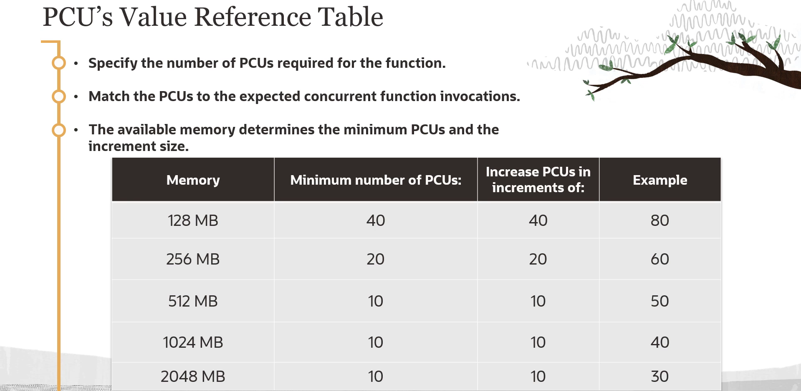

= Gerenciamento de Operações no OCI Functions
:toc:
:icons: font

== Resiliência e Alta Disponibilidade

A resiliência e a disponibilidade são fundamentais para garantir a operação ininterrupta de sistemas. No contexto do OCI Functions, resiliência refere-se à capacidade do sistema de resistir a interrupções, enquanto disponibilidade significa sua capacidade de permanecer acessível aos usuários.

=== Arquitetura Distribuída

A arquitetura do OCI Functions é composta por dois componentes essenciais:
* *Control Plane:* Gerencia as definições das funções.
* *Data Plane:* Executa as funções quando são invocadas.

Para garantir alta disponibilidade, ambos os componentes do Control Plane e do Data Plane são distribuídos entre múltiplos Domínios de Disponibilidade (Availability Domains) e Domínios de Falha (Fault Domains) dentro de uma região. Esta arquitetura distribuída assegura que, em caso de falha em um domínio, o sistema pode alternar para domínios alternativos para manter a operação contínua.

[TIP]
====
.Melhores Práticas de Configuração de Rede
Para maximizar a tolerância a falhas, é recomendado designar uma *subnet regional* para uma aplicação ou utilizar múltiplas subnets específicas de Domínios de Disponibilidade.
====

== Concorrência e Escalabilidade

=== Conceitos Fundamentais

* *Concorrência:* A capacidade de um sistema executar múltiplas operações simultaneamente, utilizando recursos compartilhados.
* *Escalabilidade:* A habilidade de um sistema de ajustar sua capacidade (aumentando ou diminuindo) para atender à demanda.

=== Escalabilidade Horizontal Automática

O OCI Functions lida com múltiplas requisições simultâneas através de um escalonamento horizontal automático. Quando várias chamadas são feitas a uma função em execução, o serviço inicia contêineres adicionais para lidar com a carga.
* *Limite de Concorrência:* Por padrão, este escalonamento ocorre até um limite de *60 GB de RAM* reservada para a execução de funções por Domínio de Disponibilidade.
* *Isolamento de Execuções:* Funções de diferentes aplicações, quando invocadas concorrentemente, são executadas de forma isolada umas das outras, garantindo um ambiente seguro e eficiente.

== Reduzindo Latência com Concorrência Provisionada

=== O Problema do "Cold Start"

Quando uma função é invocada pela primeira vez (um "cold start"), o OCI Functions provisiona a infraestrutura de execução necessária (recursos de computação e rede). Este provisionamento inicial pode levar um tempo variável, potencialmente vários segundos.

Após a infraestrutura estar provisionada, invocações subsequentes ("hot starts") podem reutilizá-la, resultando em tempos de resposta de subsegundos.

=== A Solução: Provisioned Concurrency Units (PCUs)

Para minimizar a latência associada ao provisionamento inicial, o OCI Functions suporta o conceito de *concorrência provisionada*. Este recurso garante que a infraestrutura de execução necessária para um número mínimo de invocações concorrentes esteja sempre disponível. A medida utilizada é a *Provisioned Concurrency Unit (PCU)*.

=== Benefícios da Concorrência Provisionada

A concorrência provisionada oferece vários benefícios:
* Redução da latência de resposta.
* Melhor utilização da infraestrutura de execução.
* Redução de custos ao evitar provisionamentos desnecessários.

=== Limites de Concorrência Provisionada

O OCI Functions possui limites de concorrência provisionada que variam de acordo com o tipo de conta (método de pagamento).

=== Relação entre Memória e PCUs

A quantidade de memória alocada para uma função influencia o número mínimo de PCUs que podem ser especificadas e os incrementos em que podem ser aumentadas.

[options="header", cols="2,3"]
|===
| Memória Alocada na Função | O valor de PCUs deve ser um múltiplo de

| 128 MB
| 40

| 256 MB
| 20

| 512 MB ou mais
| 10
|===

=== Métodos de Configuração

A concorrência provisionada pode ser especificada de duas maneiras:
* Via *Console da OCI*, ao criar uma nova função a partir de uma imagem existente.
* Via *OCI CLI*, ao criar ou atualizar uma função, utilizando a opção `--provisioned-concurrency`.

=== Configuração via OCI CLI

A opção `--provisioned-concurrency` utiliza um formato JSON para definir a estratégia e a contagem.
[source,json]
----
{
  "strategy": "CONSTANT",
  "count": <numero_de_pcus>
}
----

* `strategy`: Indica se a concorrência provisionada será utilizada. Use `CONSTANT` para ativar ou `NONE` para desativar.
* `count`: O número mínimo de invocações concorrentes para as quais a infraestrutura será mantida provisionada. Aplica-se apenas quando a `strategy` é `CONSTANT`.

.Exemplo de criação de uma função com 40 PCUs:
[source,bash]
----
oci fn function create --application-id <app_ocid> --display-name "minha-funcao" --image <imagem_ocir> --memory-in-mbs 128 --provisioned-concurrency '{"strategy":"CONSTANT", "count":40}'
----

.Exemplo de atualização de uma função existente para usar 20 PCUs:
[source,bash]
----
oci fn function update --function-id <funcao_ocid> --provisioned-concurrency '{"strategy":"CONSTANT", "count":20}'
----

[IMPORTANT]
====
O parâmetro `--provisioned-concurrency` deve estar em um formato JSON válido, o que pode exigir aspas e escapes diferentes dependendo do sistema operacional e do shell utilizado.
====

